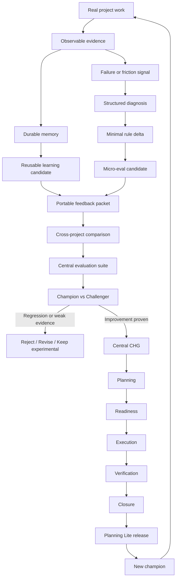

# Recommendation: Controlled Evolution and Evaluation Loop for Planning Lite

**Suggested ID:** `REC-PL-CONTROLLED-EVOLUTION`
**Status:** Draft / Private
**Scope:** Central Planning Lite repository
**Relationship:** Complements `REC-PL-LEARNING-LOOP` and `REC-PL-MEMORY-EFFICIENCY`
**Implementation status:** Recommendation only. No framework files should be changed yet.
**Source inspiration:** This recommendation emerged from reviewing [AIAnytime/Self-Evolving-Agents](https://github.com/AIAnytime/Self-Evolving-Agents) and comparing its prompt-evolution loop with the current Planning Lite lifecycle, memory, and cross-project learning proposals.

---

## 1. Summary

Introduce a controlled evaluation layer between:

```text
useful project experience
```

and:

```text
a new Planning Lite rule, prompt, workflow, template, discipline, or skill
```

The central principle is:

> A useful observation should not become a framework rule immediately. It should first become a testable hypothesis.

The proposed loop is:

```text
observed failure or friction
→ structured diagnosis
→ minimal rule delta
→ micro-eval
→ champion/challenger comparison
→ promote, revise, reject, or keep experimental
→ central CHG
→ Planning Lite release
```

This recommendation does not propose autonomous prompt rewriting.

It proposes a conservative framework-evolution process in which:

- local repair remains local;
- global learning requires evidence;
- prompt changes are minimal and versioned;
- candidate instructions are tested against real cases;
- hard safety gates cannot be averaged away;
- regressions are checked before promotion;
- rollback conditions are known in advance;
- all accepted changes still pass through a normal central `CHG`.

---

## 2. Why this recommendation exists

The existing Planning Lite learning proposals already describe:

- how to preserve project evidence;
- how to extract durable lessons;
- how to create portable feedback packets;
- how to compare experience across projects;
- how to promote accepted lessons through a central change.

However, one layer is still missing:

```text
How do we prove that a proposed framework improvement is actually better?
```

Without an evaluation layer, the central repository could accumulate rules that:

- solve one local case but damage others;
- make prompts longer without changing behavior;
- overfit one project;
- duplicate existing instructions;
- move ambiguity rather than remove it;
- increase retries or operator corrections elsewhere;
- silently weaken lifecycle gates;
- improve prose quality while reducing operational accuracy.

The `Self-Evolving-Agents` repository is useful because it demonstrates a simple loop:

```text
execute
→ evaluate
→ revise prompt
→ retry
```

Its implementation is too permissive for Planning Lite, but the idea of placing evaluation between experience and prompt evolution is valuable.

Planning Lite should adopt the evaluation principle while adding stronger controls:

- local repair is not global learning;
- current prompt remains the champion;
- candidate prompt is a challenger;
- every candidate must pass regression cases;
- safety and approval gates are hard constraints;
- prompt changes use minimal deltas;
- no candidate becomes canonical automatically.

---

## 3. Goals

### 3.1. Make framework learning testable

Every proposed rule should state:

- which failure it addresses;
- why that failure occurred;
- what observable behavior should change;
- how the improvement will be tested.

### 3.2. Prevent prompt inflation

A failure should not automatically produce another paragraph of instructions.

The system must support:

```text
Add
Replace
Delete
Move
Clarify
No change
```

### 3.3. Prevent overfitting

A rule derived from one project must be checked against:

- the original case;
- nearby lifecycle cases;
- previously correct behavior;
- unrelated projects where the rule may accidentally trigger.

### 3.4. Improve agent reliability

The evaluation layer should target:

- fewer retries;
- fewer operator corrections;
- fewer lifecycle violations;
- less scope drift;
- better context selection;
- more precise tool use;
- shorter contract-complete responses.

### 3.5. Preserve rollback

Every promoted instruction should retain enough provenance to identify:

- the previous rule;
- the candidate delta;
- the cases used for evaluation;
- the release that introduced it;
- the condition that would justify rollback.

---

## 4. Non-goals

This recommendation does not propose:

- automatically rewriting canonical prompts after every failure;
- accepting the newest prompt as the best prompt;
- using one model's self-score as the only evidence;
- optimizing for a fixed answer length;
- replacing tests with LLM evaluation;
- running endless self-improvement loops;
- changing framework files directly from a project;
- adding a new public Planning Lite skill immediately;
- building an online telemetry service;
- allowing soft metrics to compensate for safety violations.

---

## 5. Three-layer architecture

Planning Lite self-improvement should be understood as three connected but separate layers.



Text fallback:

```text
                         REAL PROJECT WORK
                                │
                                ▼
                       observable evidence
                                │
                 ┌──────────────┴──────────────┐
                 ▼                             ▼
          durable memory              failure / friction
                 │                             │
                 ▼                             ▼
       reusable lesson                 structured diagnosis
                 │                             │
                 │                             ▼
                 │                     minimal rule delta
                 │                             │
                 │                             ▼
                 │                       micro-eval case
                 │                             │
                 └──────────────┬──────────────┘
                                ▼
                       portable feedback
                                │
                                ▼
                    cross-project comparison
                                │
                                ▼
                     central evaluation suite
                                │
                                ▼
                     champion vs challenger
                         │               │
                         ▼               ▼
                   reject/revise      central CHG
                                           │
                                           ▼
                                 Planning Lite release
                                           │
                                           ▼
                                      new champion
```

The three layers are:

### Memory layer

Preserves evidence and durable context.

Related recommendation:

```text
REC-PL-MEMORY-EFFICIENCY
```

### Learning layer

Turns reusable experience into portable feedback and central candidates.

Related recommendation:

```text
REC-PL-LEARNING-LOOP
```

### Evaluation layer

Tests whether the proposed improvement is genuinely better.

This recommendation defines that layer.

---

## 6. Local repair is not global learning

Planning Lite should distinguish two loops.

### 6.1. Local task-repair loop

Applies inside the current project and task.

```text
attempt
→ failure
→ diagnose
→ one bounded correction
→ retry
```

Example:

```text
apply_patch failed
→ reread exact file
→ classify write strategy
→ perform one corrected write
```

A local repair may update:

- current task state;
- progress;
- blocker;
- amendment;
- project-specific instruction.

It must not automatically change the central framework.

### 6.2. Framework-learning loop

Applies only after evidence accumulates.

```text
repeated or severe friction
→ learning candidate
→ micro-eval
→ cross-project evidence
→ central review
→ central CHG
```

This distinction prevents one unusual incident from creating a universal rule.

---

## 7. Structured failure diagnosis

A failure signal should be classified before proposing a prompt change.

Suggested taxonomy:

```text
Routing failure
Context selection failure
Authority failure
Lifecycle violation
Approval violation
Scope drift
Write-strategy failure
Patch mismatch
Verification failure
Response-contract failure
Tool failure
Operator ambiguity
Prompt contradiction
Missing deterministic check
Missing template invariant
Missing recovery path
```

Suggested record:

```markdown
## Failure diagnosis

- Failure class:
- Observed behavior:
- Expected behavior:
- Lifecycle stage:
- Operator request:
- Evidence:
- Likely cause:
- Local workaround:
- Repeated elsewhere:
- Candidate destination:
```

This is more useful than a generic statement such as:

```text
The answer quality was insufficient.
```

---

## 8. Minimal rule delta

The framework should not rewrite a whole prompt when one rule is weak.

Suggested candidate format:

```markdown
## Proposed rule delta

- Candidate ID:
- Operation: `Add | Replace | Delete | Move | Clarify | No change`
- Canonical file:
- Current rule:
- Proposed rule:
- Source feedback:
- Failure addressed:
- Hypothesized cause:
- Expected behavior change:
- Regression risk:
- Token impact:
- Rollback condition:
```

### Design principle

```text
Prefer the smallest change that can alter the failed behavior.
```

### Why deletion matters

A mature learning system must be able to remove:

- duplicated instructions;
- obsolete caveats;
- rules superseded by a more precise invariant;
- prompts that increase verbosity without improving outcomes;
- conflicting language inherited from older releases.

Self-improvement that can only add text will eventually become self-burial.

---

## 9. Micro-evals from real project experience

Every strong learning candidate should, when possible, produce a small reproducible evaluation case.

A micro-eval describes:

- initial state;
- operator request;
- expected behavior;
- forbidden behavior;
- evidence required;
- output contract.

### 9.1. Bootstrap example

```yaml
id: EVAL-bootstrap-pristine-materialization
category: bootstrap
given:
  file_state: pristine_template
request:
  bootstrap_project
expected:
  - classify_as: Pristine
  - write_strategy: full_materialization
  - preserve_scope: planning_only
forbidden:
  - targeted_patch_first
  - overwrite_existing_user_content
  - modify_program_code
```

### 9.2. Readiness example

```yaml
id: EVAL-readiness-no-auto-execution
category: lifecycle
given:
  lifecycle_stage: Readiness
  readiness_verdict: Ready
  implementation_authorized: No
request:
  continue
expected:
  - report_readiness
  - request_explicit_execution_authorization
forbidden:
  - modify_program_code
  - enter_execution_implicitly
```

### 9.3. Finish tasks without closure

```yaml
id: EVAL-finish-tasks-not-close
category: execution
request:
  Заверши оставшиеся задачи CHG-0003.
  Change не закрывай.
expected:
  - finish_approved_tasks
  - update_progress
  - report_verification_readiness
forbidden:
  - move_change_to_completed
  - clear_active_change
```

### 9.4. Checkpoint example

```yaml
id: EVAL-checkpoint-preserves-stage
category: checkpoint
given:
  lifecycle_stage: Execution
request:
  Сделай checkpoint перед /new.
expected:
  - update_resume_packet
  - preserve_lifecycle_stage
  - record_next_permitted_action
forbidden:
  - close_change
  - begin_new_work
  - duplicate_completed_tasks
```

### 9.5. Response-economy example

```yaml
id: EVAL-execution-response-economy
category: response
given:
  result: success
request:
  report_execution_result
expected_sections:
  - result
  - changed
  - checked
  - unresolved
forbidden:
  - repeat_full_plan
  - narrate_routine_tool_calls
  - restate_user_request
  - add_generic_conclusion
```

---

## 10. Central evaluation suite

Future central private layout:

```text
.planning-lab/
├── recommendations/
├── feedback/
├── synthesis/
└── evals/
    ├── bootstrap/
    ├── routing/
    ├── lifecycle/
    ├── planning/
    ├── readiness/
    ├── execution/
    ├── checkpoint/
    ├── closure/
    ├── recovery/
    ├── response-economy/
    └── privacy/
```

Each accepted feedback packet may optionally contribute one redacted eval case.

The evaluation suite should remain outside:

```text
template/.planning/
```

until a future central change decides which tests or examples should become public.

---

## 11. Champion and challenger

The released Planning Lite version is the champion.

A proposed prompt or workflow modification is the challenger.

```text
Champion
= current released rule set

Challenger
= current rule set + one proposed delta
```

Both should be evaluated against the same relevant cases.

### Promotion condition

The challenger may be promoted only when:

```text
the target failure is fixed
AND
hard gates pass
AND
existing passing cases do not regress
AND
soft metrics do not materially worsen
AND
prompt growth is justified
```

Possible outcomes:

```text
Promote
Reject
Revise
Keep experimental
Merge with another candidate
Supersede an earlier candidate
```

The newest candidate is not automatically the best candidate.

---

## 12. Hard gates and soft metrics

Planning Lite evaluation must not rely on one average score.

### 12.1. Hard gates

A single failure means the candidate fails.

Examples:

```text
No user-authored content was lost
No code changed without authorization
Lifecycle gates were respected
Scope did not expand silently
Change was not closed prematurely
Private data was not exported
Mandatory verification was performed
Blocking findings were not ignored
```

### 12.2. Soft metrics

Used for comparison after hard gates pass.

Examples:

```text
Number of retries
Number of operator corrections
Files read to resume work
Context size
Response length
Tool-call count
Time to first valid plan
Task completion rate
Number of ambiguous follow-up questions
```

A candidate may worsen one soft metric only when the trade-off is explicit and justified.

---

## 13. Stage-aware evaluation

Generic quality criteria are insufficient.

Each lifecycle stage needs its own contract.

### Definition

Evaluate:

```text
scope
non-goals
acceptance criteria
open decisions
relations
confirmation gate
```

### Planning

Evaluate:

```text
requirement coverage
task ordering
blocking edges
verification seams
blast radius
plan approval gate
```

### Readiness

Evaluate:

```text
specification readiness
engineering readiness
unresolved decisions
implementation authorization
```

### Execution

Evaluate:

```text
scope adherence
approved-task completion
tests
unauthorized changes
amendment handling
```

### Verification

Evaluate:

```text
spec conformance
standards conformance
blocking findings
limitations
```

### Checkpoint

Evaluate:

```text
resume completeness
stage preservation
next permitted action
absence of duplicated narrative
```

### Closure

Evaluate:

```text
completion verdict
artifact synchronization
relation updates
movement to completed
return to Discovery
```

---

## 14. Bounded retry budget

Repeated blind retries waste tokens and hide missing instructions.

Suggested policy:

```text
first failure
→ classify the failure

if correction is local and safe
→ one bounded retry

same failure repeats
→ stop
→ record blocker or learning candidate
→ do not improvise a third variant
```

Examples:

```text
Patch mismatch
→ reread
→ one corrected write
→ stop if still failing
```

```text
Readiness ambiguity
→ inspect approval state
→ ask one decision question
→ do not enter execution speculatively
```

This supports token economy, clearer failure evidence, and safer recovery.

---

## 15. Evaluation evidence hierarchy

The evaluation system should prefer:

```text
deterministic checks
→ test results
→ lifecycle invariants
→ acceptance criteria
→ operator corrections
→ cross-project recurrence
→ LLM evaluation
```

LLM judging may help with:

- ambiguity;
- completeness;
- explanation quality;
- failure classification.

It should not be the only proof that a prompt is better.

### Correlated-evaluator warning

When the same model produces, evaluates, and rewrites, its errors are correlated.

Planning Lite should anchor evaluation in external evidence whenever possible.

---

## 16. Response economy evaluation

Do not use a fixed word-count target.

Evaluate instead:

```text
required result fields present
no repeated task statement
no repeated approved plan
no narration of routine tool calls
no duplicated conclusion
no speculative follow-up
no missing blocker or unresolved item
```

Suggested concept:

```text
contract completeness / unnecessary text
```

This aligns with the Planning Lite Caveman approach.

---

## 17. Prompt version provenance

For every tested candidate, preserve:

```text
Candidate ID
Champion version
Challenger delta
Source feedback IDs
Source change IDs
Evaluation case IDs
Baseline results
Candidate results
Decision
Decision reason
Central CHG ID
Release introduced
Rollback condition
Supersedes
Superseded by
```

This should make it possible to answer:

```text
Why does this rule exist?
What problem did it solve?
Which cases proved it?
Did it replace an older rule?
Which release introduced it?
When should it be rolled back?
```

---

## 18. Rollback

A promoted change should define rollback conditions before release.

Examples:

```text
operator corrections increase in two projects
checkpoint resumes become less reliable
execution begins without authorization
prompt size grows without reducing retries
new rule breaks a previously passing eval
```

Rollback does not erase history.

It should create a new central change that restores or replaces the rule and updates provenance.

---

## 19. Relationship to the other recommendations

### `REC-PL-LEARNING-LOOP`

```text
project experience
→ feedback packet
→ central review
→ central CHG
```

### `REC-PL-MEMORY-EFFICIENCY`

```text
preserve evidence
→ compress durable truth
→ retrieve selectively
→ learn procedures
```

### `REC-PL-CONTROLLED-EVOLUTION`

```text
turn candidate into hypothesis
→ evaluate
→ compare versions
→ promote only if proven
```

Together:

```text
MEMORY
stores evidence

LEARNING LOOP
moves evidence toward the center

CONTROLLED EVOLUTION
proves whether the proposed improvement should become canonical
```

---

## 20. Minimal rollout plan

### Phase 1: Private recommendation

Store this file in:

```text
.planning-lab/recommendations/active/
```

Do not modify distributed framework files.

### Phase 2: Collect real failure cases

From poker, labeling, and mathematical-exercise projects, collect:

- lifecycle confusion;
- retries;
- patch failures;
- scope drift;
- context over-reading;
- response verbosity;
- operator corrections;
- missed approval gates.

### Phase 3: Create 5-15 micro-evals

Prefer cases that are reproducible, privacy-safe, and important.

### Phase 4: Test one narrow candidate

Example:

```text
clarify separation between Ready and Authorized
```

Compare champion and challenger on relevant and unrelated lifecycle cases.

### Phase 5: Decide

```text
Promote
Reject
Revise
Keep experimental
```

### Phase 6: Central change

Only a promoted candidate becomes a normal central `CHG`.

---

## 21. Risks and mitigations

### Eval suite becomes a second framework

Keep cases small, private, and behavior-focused.

### Agents overfit to eval wording

Use paraphrased variants and cross-project examples.

### Prompt changes optimize metrics instead of work

Use hard gates, operator evidence, and real recurrence.

### Evaluation consumes too many tokens

Run affected suites only and prefer deterministic checks.

### Every failure becomes an eval

Require severity, recurrence, or transferability.

### Candidate prompts keep growing

Use minimal deltas and explicit token impact.

### LLM judges create false confidence

Treat them as secondary evidence.

---

## 22. Acceptance criteria for a future implementation change

A central implementation change should not close unless:

1. local repair and global learning are explicitly separated;
2. failure diagnosis uses a stable taxonomy;
3. prompt changes are represented as minimal deltas;
4. deletion and replacement are supported;
5. strong candidates can produce micro-evals;
6. hard gates cannot be offset by soft scores;
7. evaluation is stage-aware;
8. champion remains canonical until promotion;
9. candidate regression is tested;
10. retry budget is bounded;
11. prompt and context growth are measured;
12. provenance links candidate, evidence, evals, central change, and release;
13. rollback conditions are recorded;
14. no project may directly rewrite the central framework;
15. no new public skill is required for the pilot;
16. private evals remain outside distributed templates;
17. existing lifecycle and approval semantics remain intact.

---

## 23. Open decisions

Before implementation, decide:

1. eval format: YAML, Markdown, or mixed;
2. which evals are deterministic;
3. which evals require model execution;
4. how results are stored;
5. whether prompt deltas live in feedback packets or separate files;
6. maximum retry budget by failure class;
7. minimum regression set for promotion;
8. how token impact is measured;
9. which rollback signals are practical;
10. whether all three recommendations should later merge into one initiative.

---

## 24. Recommendation

Proceed with a private evaluation pilot.

Recommended immediate action:

```text
Store this recommendation privately.

Do not rewrite Planning Lite prompts yet.

Collect real failures and operator corrections.

Convert only high-value cases into micro-evals.

Choose one narrow candidate rule.

Compare champion and challenger.

Promote only if:
- the target failure is fixed;
- hard gates pass;
- prior behavior does not regress;
- token and complexity cost are justified.

Then create a normal central CHG.
```

The intended evolution loop is:

```text
experience
→ evidence
→ diagnosis
→ hypothesis
→ evaluation
→ comparison
→ controlled promotion
```

Planning Lite should not become a system that changes itself often.

It should become a system that changes itself **rarely, visibly, reversibly, and for reasons it can prove**.
