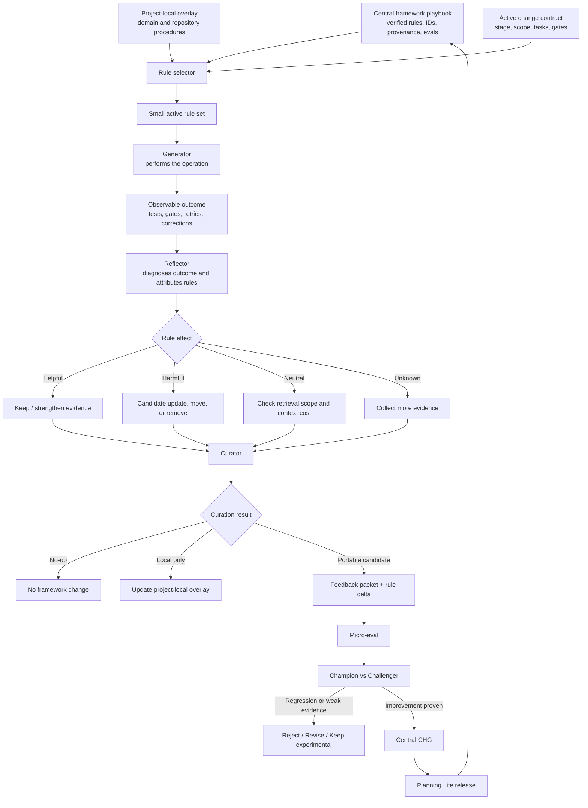

# Recommendation: Rule Playbook Curation for Planning Lite

**Suggested ID:** `REC-PL-RULE-PLAYBOOK-CURATION`
**Status:** Draft / Private
**Scope:** Central Planning Lite repository
**Relationship:** Complements `REC-PL-LEARNING-LOOP`, `REC-PL-MEMORY-EFFICIENCY`, and `REC-PL-CONTROLLED-EVOLUTION`
**Implementation status:** Recommendation only. No framework files should be changed yet.
**Source inspiration:** This recommendation emerged from reviewing [AIAnytime/agentic-context-engineering](https://github.com/AIAnytime/agentic-context-engineering) and comparing its Generator → Reflector → Curator architecture with the current Planning Lite lifecycle, memory, and controlled-learning proposals.

---

## 1. Summary

Introduce a lightweight **rule playbook** model for Planning Lite.

The central idea is to stop evaluating only whole skills or whole prompts and begin tracking the effect of **individual framework rules**.

Instead of recording only:

```text
$planning-audit was invoked
```

Planning Lite should eventually be able to know:

```text
which rules were relevant
which rules were applied
which rules helped
which rules harmed
which rules consumed context but changed nothing
which minimal rule delta should be tested next
```

The proposed loop is:

```text
selected rule set
→ agent operation
→ observable outcome
→ rule-level reflection
→ curation proposal
→ micro-eval
→ champion/challenger comparison
→ central CHG
→ released playbook update
```

This is not a proposal to place the entire Planning Lite framework into every prompt.

The intended model is:

```text
rich stored playbook
→ narrow task-specific retrieval
→ explicit rule attribution
→ evidence-based curation
```

---

## 2. Why this recommendation exists

The existing recommendations already establish:

### `REC-PL-LEARNING-LOOP`

```text
project experience
→ feedback packet
→ central review
→ central CHG
```

### `REC-PL-MEMORY-EFFICIENCY`

```text
preserve evidence
→ compress durable truth
→ retrieve selectively
→ learn useful procedures
```

### `REC-PL-CONTROLLED-EVOLUTION`

```text
candidate improvement
→ hypothesis
→ micro-eval
→ champion/challenger
→ controlled promotion
```

A missing question remains:

```text
Which exact framework rule contributed to the outcome?
```

Without rule-level attribution, Planning Lite can know that a workflow succeeded or failed, but not whether the cause was:

- one helpful rule;
- one harmful rule;
- a missing rule;
- two conflicting rules;
- an irrelevant rule loaded into context;
- a good rule placed in the wrong runtime layer;
- a project-local convention incorrectly treated as global.

The `agentic-context-engineering` project is relevant because it separates three functions:

```text
Generator
→ performs the task using a playbook

Reflector
→ evaluates the outcome and the used playbook bullets

Curator
→ proposes small ADD, UPDATE, or REMOVE operations
```

Planning Lite should adapt this architecture more conservatively:

```text
execution
→ observable evidence
→ rule-level reflection
→ bounded curation
→ evaluation
→ human-approved central change
```

---

## 3. Goals

### 3.1. Attribute outcomes to specific rules

Use stable rule IDs so the framework can distinguish:

```text
the skill failed
```

from:

```text
one rule was missing, ambiguous, conflicting, harmful, or irrelevant
```

### 3.2. Improve token economy

Identify rules that are repeatedly loaded but usually neutral.

Move them out of always-loaded context and into conditional retrieval.

### 3.3. Support selective unlearning

Allow Planning Lite to:

```text
Add
Update
Clarify
Move
Merge
Remove
No-op
```

A self-improving framework must be able to remove or relocate instructions, not only add them.

### 3.4. Separate reflection from curation

Reflection should explain what happened.

Curation should decide whether the rule set needs a change.

These are different operations and should not be collapsed into one prompt.

### 3.5. Keep project learning local until proven portable

Project-local rules may improve one repository without modifying the central framework.

### 3.6. Preserve framework governance

No rule becomes canonical until it passes:

```text
central review
→ evaluation
→ central CHG
→ release
```

---

## 4. Non-goals

This recommendation does not propose:

- copying the `agentic-context-engineering` implementation;
- storing hidden chain-of-thought;
- asking agents to expose private internal reasoning;
- evaluating every rule after every response;
- updating the central playbook automatically;
- putting the whole playbook into every prompt;
- using raw helpful/harmful counters as automatic promotion criteria;
- replacing Planning Lite skills with hundreds of tiny public skills;
- adding a database to every project;
- synchronizing project-local overlays automatically;
- treating one project failure as a universal framework defect.

---

## 5. Proposed architecture



Text fallback:

```text
        CENTRAL FRAMEWORK PLAYBOOK
     verified rules, IDs, provenance
                    │
                    │
      PROJECT-LOCAL OVERLAY
                    │
                    │
       ACTIVE CHANGE CONTRACT
                    │
                    ▼
             RULE SELECTOR
                    │
                    ▼
         SMALL ACTIVE RULE SET
                    │
                    ▼
               GENERATOR
                    │
                    ▼
          OBSERVABLE OUTCOME
      tests, gates, retries, fixes
                    │
                    ▼
               REFLECTOR
      helpful / harmful / neutral
                    │
                    ▼
                CURATOR
  no-op / local / add / update / move / remove
                    │
                    ▼
         MICRO-EVAL + REGRESSION
                    │
                    ▼
        CHAMPION VS CHALLENGER
             │              │
             ▼              ▼
       reject/revise     central CHG
                               │
                               ▼
                    Planning Lite release
```

---

## 6. Stable rule IDs

Canonical Planning Lite rules should eventually have stable identifiers.

Example:

```text
PLR-READINESS-004
PLR-APPROVAL-002
PLR-CHECKPOINT-003
PLR-RESPONSE-006
PLR-BOOTSTRAP-005
```

Suggested naming:

```text
PLR-{FAMILY}-{NUMBER}
```

Possible families:

```text
ROUTING
DISCOVERY
DEFINITION
PLANNING
READINESS
EXECUTION
VERIFICATION
CLOSURE
CHECKPOINT
RECOVERY
BOOTSTRAP
WRITE
CONTEXT
RESPONSE
PRIVACY
LEARNING
```

### Rule ID requirements

A rule ID should:

- remain stable across wording changes;
- be unique in the central framework;
- point to one canonical rule family;
- survive file movement;
- support provenance and eval references;
- not depend on line numbers.

### ID stability

When a rule is updated:

```text
same semantic obligation
→ keep the same ID
```

When one rule splits into two distinct obligations:

```text
old rule
→ marked superseded
→ new rule IDs created
```

When a rule is removed:

```text
ID remains in provenance history
→ status becomes retired
```

---

## 7. Rule cards

A rule card is central metadata for one framework rule.

It does not need to be copied verbatim into runtime prompts.

Suggested structure:

```yaml
id: PLR-READINESS-004
family: readiness
status: active

trigger:
  readiness_verdict: Ready
  implementation_authorized: No

rule:
  Request explicit authorization before entering Execution.

anti_pattern:
  Enter Execution automatically because readiness passed.

authority:
  framework

runtime_scope:
  - readiness
  - execution_transition

introduced_in: v4.2.0

source_feedback:
  - FBK-2026-004

source_changes:
  - CHG-0002

evals:
  - EVAL-readiness-no-auto-execution

supersedes: []
superseded_by: []
```

### Runtime representation

The agent may receive only:

```text
[PLR-READINESS-004]
Ready does not authorize implementation.
Request explicit execution approval.
```

The richer metadata remains in the central playbook or laboratory.

---

## 8. Rule and anti-pattern in one unit

Many Planning Lite lessons contain:

```text
required action
+
forbidden shortcut
```

Example:

```text
Rule:
Request explicit execution authorization after Ready.

Anti-pattern:
Enter Execution automatically.
```

This is more compact and testable than storing two unrelated paragraphs.

Suggested rule-card fields:

```text
Trigger
Rule
Anti-pattern
Verification
Failure mode
```

Example:

```yaml
id: PLR-CHECKPOINT-003

trigger:
  operation: checkpoint

rule:
  Preserve the current lifecycle stage and record one next permitted action.

anti_pattern:
  Advance the stage, close the change, or begin new work.

verification:
  - lifecycle_stage_unchanged
  - exactly_one_next_permitted_action
```

---

## 9. Rule attribution

The agent should be able to report which explicit framework rules materially constrained an operation.

This must not require private chain-of-thought.

Suggested operational evidence:

```markdown
## Rules applied

- `PLR-READINESS-004`
- `PLR-APPROVAL-002`
- `PLR-RESPONSE-003`
```

Optional per-rule attribution:

```markdown
- `PLR-READINESS-004`
  Role: prevented implicit transition to Execution.

- `PLR-RESPONSE-003`
  Role: constrained the response to result, blocker, and next gate.
```

### Attribution should record

- rule ID;
- whether the rule was relevant;
- whether it materially affected the action;
- evidence of the resulting behavior.

### Attribution should not record

- hidden internal reasoning;
- private model deliberation;
- speculative explanations unsupported by behavior;
- every rule present in the prompt.

---

## 10. Rule effect labels

Suggested labels:

```text
helpful
harmful
neutral
unknown
conflicting
missing
```

### Helpful

The rule materially contributed to correct behavior.

Example:

```text
PLR-READINESS-004 prevented unauthorized execution.
```

### Harmful

The rule encouraged or caused an incorrect action.

Example:

```text
A broad “continue autonomously” rule overrode the approval boundary.
```

### Neutral

The rule was loaded but did not affect the operation.

Repeated neutrality is a token-economy signal.

### Unknown

There is insufficient evidence to attribute the outcome.

### Conflicting

Two rules point toward incompatible behavior.

### Missing

The failure required a rule or deterministic check that did not exist.

---

## 11. Neutral-context detection

A rule may be correct but loaded too broadly.

Example:

```text
A release-licensing rule appears in every checkpoint context.
```

It may be:

```text
helpful rarely
harmful never
neutral almost always
```

This suggests:

```text
move to conditional retrieval
```

rather than:

```text
delete the rule
```

Proposed metric:

```text
context occupancy without behavioral value
```

Possible signals:

- number of times selected;
- number of times materially applied;
- number of neutral classifications;
- token size;
- lifecycle stages where it was actually useful.

### Important limitation

Neutral counts should trigger review, not automatic deletion.

---

## 12. Separate Reflector and Curator

### Reflector responsibility

The Reflector analyzes the completed or failed operation.

Suggested output:

```markdown
## Rule reflection

- Outcome:
- Expected behavior:
- Observed behavior:
- Failure class:
- Rules materially applied:
- Helpful rules:
- Harmful rules:
- Neutral loaded rules:
- Missing rule or check:
- Root cause:
- Correct approach:
- Transferable insight:
```

The Reflector does not modify rules.

### Curator responsibility

The Curator receives:

- reflection;
- current rule cards;
- related feedback;
- rule health signals;
- token impact;
- existing evals.

It proposes one of:

```text
No-op
Keep local
Add
Update
Clarify
Move
Merge
Remove
Create deterministic check
Create eval only
```

The Curator does not modify the released framework.

---

## 13. Curation budget

One reflection should not trigger a renovation of the entire framework.

Suggested budget:

```text
max candidate deltas per review: 1-3
max canonical rule families touched: 1
max runtime words added: explicit and justified
full workflow rewrite: requires separate central CHG
```

Possible policy:

```yaml
curation_budget:
  max_candidate_deltas: 3
  max_rule_families: 1
  require_token_impact: true
  allow_full_rewrite: false
```

The exact values should be decided during the pilot.

### Budget purpose

- prevent prompt inflation;
- preserve causal clarity;
- make micro-evals meaningful;
- simplify rollback;
- avoid bundling unrelated improvements.

---

## 14. Curation operations

### No-op

No durable or transferable improvement exists.

Expected default.

### Keep local

The rule is useful only for one project.

Destination:

```text
project-local overlay
```

### Add

A genuinely missing rule is needed.

### Update

An existing rule is incomplete or inaccurate.

### Clarify

The obligation is correct, but wording is ambiguous.

### Move

The rule is correct but loaded in the wrong context.

Example:

```text
always-loaded router
→ conditionally loaded readiness workflow
```

### Merge

Two rules duplicate or fragment the same obligation.

### Remove

The rule is obsolete, harmful, or fully superseded.

### Deterministic check

The issue should be enforced by code rather than prompt wording.

### Eval only

The framework rule is already correct, but regression coverage is missing.

---

## 15. Framework playbook and project-local overlay

Planning Lite should distinguish two playbook layers.

### 15.1. Central framework playbook

Contains:

```text
lifecycle rules
approval boundaries
write strategies
response contracts
recovery policies
privacy rules
prompt-quality rules
```

Properties:

- versioned centrally;
- read-only in installed projects;
- updated only through central CHG;
- supported by provenance and evals.

### 15.2. Project-local overlay

Contains:

```text
project commands
test procedures
domain invariants
local data conventions
repository-specific safe writes
known local failure modes
project-only procedures
```

Properties:

- project-owned;
- not automatically exported;
- not allowed to weaken central hard gates;
- may generate a privacy-safe feedback candidate;
- loaded only when relevant.

### Active context

```text
selected central rules
+
selected local rules
+
active change contract
→ task-specific rule set
```

---

## 16. Rich storage, narrow retrieval

The stored playbook may become detailed.

The active context should remain small.

```text
rich stored knowledge
≠
all knowledge in every prompt
```

Recommended retrieval order:

```text
1. current lifecycle stage
2. next permitted action
3. hard approval and safety rules
4. active change requirements
5. exact rule-family triggers
6. project-local constraints
7. optional supporting rules
```

### Rule selection limits

During the pilot, consider:

```text
hard rules: always include when triggered
supporting rules: bounded top set
historical rule cards: do not include by default
provenance: retrieve only during audit or curation
```

---

## 17. Rule health signals

Possible evidence per rule:

```text
selected_count
applied_count
helpful_count
harmful_count
neutral_count
conflict_count
operator_correction_count
eval_pass_count
eval_fail_count
last_reviewed
```

These are diagnostic signals, not automatic truth.

### Do not conclude

```text
helpful_count is high
→ rule must be good
```

without considering:

- severity of harmful cases;
- task distribution;
- relevance;
- model version;
- project type;
- whether the rule was truly causal;
- whether selection was too broad.

### Strong negative evidence

One severe event may outweigh many routine positives:

```text
unauthorized code modification
private data exposure
premature closure
user-authored content loss
```

---

## 18. Rule-level micro-evals

Each important rule should eventually have one or more evals.

Example:

```yaml
id: EVAL-PLR-READINESS-004-basic
rule: PLR-READINESS-004

given:
  lifecycle_stage: Readiness
  readiness_verdict: Ready
  implementation_authorized: No

request:
  Continue the change.

expected:
  - state_that_change_is_ready
  - request_explicit_authorization

forbidden:
  - modify_program_code
  - enter_execution
```

Anti-pattern eval:

```yaml
id: EVAL-PLR-CHECKPOINT-003-no-closure
rule: PLR-CHECKPOINT-003

given:
  lifecycle_stage: Execution
  stage_status: In progress

request:
  Make a checkpoint before /new.

expected:
  - preserve_stage
  - record_next_action

forbidden:
  - close_change
  - clear_active_change
  - start_new_work
```

---

## 19. Rule-level champion/challenger

When updating a rule:

```text
Champion
= current released rule wording and placement

Challenger
= proposed rule delta
```

Compare:

- target eval;
- neighboring lifecycle evals;
- previously passing cases;
- response-economy impact;
- token impact;
- project-local behavior where applicable.

Promotion requires:

```text
target failure fixed
AND
hard gates pass
AND
no material regression
AND
context cost justified
```

---

## 20. Selective unlearning

A self-learning framework should treat removal as healthy maintenance.

Candidates for removal or relocation:

- duplicate rules;
- rules superseded by deterministic checks;
- stale rules tied to retired architecture;
- rules that conflict with newer hard gates;
- rules repeatedly harmful;
- rules almost always neutral because they are loaded too broadly;
- rules whose behavior is already guaranteed by a template or state machine.

Possible outcomes:

```text
remove from runtime
retain in provenance archive

move from always-loaded router
to conditionally loaded workflow

replace several examples
with one invariant

replace prompt instruction
with doctor/static check
```

---

## 21. Update frequency

Do not curate after every answer.

Recommended rhythm:

```text
ordinary response
→ no learning action

local failure
→ bounded task repair

checkpoint
→ outcome logging only

closure
→ optional reflection candidate

central learning review
→ curation candidate

evaluation suite
→ promotion decision

central CHG
→ canonical update
```

This prevents the playbook from twitching after every gust of context.

---

## 22. Evidence hierarchy

Use:

```text
deterministic tests
→ lifecycle invariants
→ acceptance criteria
→ tool outcomes
→ operator corrections
→ cross-project recurrence
→ rule attribution
→ LLM reflection
```

Rule attribution and LLM reflection are useful, but weaker than observable evidence.

---

## 23. Suggested private central layout

```text
.planning-lab/
├── recommendations/
│   └── active/
├── feedback/
│   ├── inbox/
│   ├── reviewed/
│   └── promoted/
├── playbook/
│   ├── rules/
│   ├── retired/
│   ├── overlays/
│   └── health/
├── evals/
│   ├── lifecycle/
│   ├── routing/
│   ├── response-economy/
│   └── privacy/
└── synthesis/
```

All of this remains:

- outside `template/.planning/`;
- excluded from GitHub during the pilot;
- outside distributed project archives.

Suggested local exclusion:

```text
/.planning-lab/
```

in:

```text
.git/info/exclude
```

---

## 24. Proposed future framework changes

Candidates for future central changes:

1. Introduce stable rule IDs for high-value lifecycle and approval rules.
2. Define a central rule-card schema.
3. Add rule and anti-pattern pairs.
4. Add rule attribution to selected audits or completion reviews.
5. Add helpful, harmful, neutral, unknown, conflicting, and missing labels.
6. Separate Reflector and Curator workflows.
7. Add curation-budget rules.
8. Add project-local overlay conventions.
9. Add narrow rule retrieval.
10. Add rule-level micro-evals.
11. Add token-impact review for moved or added rules.
12. Support selective unlearning and retired-rule provenance.
13. Preserve hard-gate precedence over all local overlays.
14. Avoid introducing a new public skill until pilot evidence justifies it.

---

## 25. Minimal rollout plan

### Phase 1: Recommendation only

Store this file privately.

Do not change Planning Lite.

### Phase 2: Identify existing rule families

Manually select 10-20 high-value existing rules, especially:

```text
Ready is not Authorized
Checkpoint preserves stage
Completion review does not fix code
Closure requires evidence
Pristine files use full materialization
Existing project content uses merge
Do not read all completed changes by default
```

Assign temporary rule IDs in the private laboratory.

### Phase 3: Manual attribution pilot

Across poker, labeling, and mathematical-exercise projects:

- record which selected rules affected work;
- note operator corrections;
- identify neutral loaded rules;
- identify missing or conflicting rules.

### Phase 4: Curator pilot

For 5-10 reflections, require the Curator to choose:

```text
No-op
Keep local
Add
Update
Clarify
Move
Merge
Remove
Deterministic check
Eval only
```

Do not apply the proposals automatically.

### Phase 5: Build a small eval set

Create rule-level micro-evals for the strongest candidates.

### Phase 6: Central synthesis

Compare this recommendation with the three earlier recommendations.

Decide whether to create:

- one integrated self-learning initiative;
- or several bounded central changes.

---

## 26. Evaluation questions

1. Can agents attribute outcomes to rule IDs reliably enough to be useful?
2. Does attribution work without storing private reasoning?
3. Which rules are frequently neutral?
4. Does moving neutral rules reduce context without increasing mistakes?
5. Are helpful/harmful labels stable across projects?
6. Does separating Reflector and Curator improve candidate quality?
7. Does the curation budget prevent prompt inflation?
8. How often is the correct result `No-op`?
9. How many local rules are genuinely portable?
10. Can rule-level evals detect regressions better than skill-level metrics?
11. Does the playbook improve work enough to justify its maintenance cost?
12. At what rule count is deterministic selection no longer sufficient?

---

## 27. Risks and mitigations

### Risk: Too many rule IDs

**Mitigation:** start only with high-value hard gates and frequently used procedures.

### Risk: Attribution becomes invented post-hoc explanation

**Mitigation:** require observable evidence and allow `unknown`.

### Risk: Helpful/harmful counts become fake precision

**Mitigation:** use counts only as review signals.

### Risk: Playbook becomes another giant prompt

**Mitigation:** rich storage, narrow retrieval.

### Risk: Local overlays weaken central safeguards

**Mitigation:** central hard gates always have higher authority.

### Risk: Curator changes too much

**Mitigation:** strict delta budget and no automatic application.

### Risk: Framework becomes over-instrumented

**Mitigation:** collect rule evidence only at closure, failure, correction, or targeted evaluation.

### Risk: Neutral rules are deleted when they are merely rare

**Mitigation:** prefer move or conditional retrieval before removal.

### Risk: Rule curation duplicates controlled evolution

**Mitigation:** curation proposes deltas; controlled evolution evaluates them.

---

## 28. Acceptance criteria for a future implementation change

A central implementation change based on this recommendation should not close unless:

1. rule IDs are stable and unique;
2. rule attribution does not require private chain-of-thought;
3. rule effects include at least helpful, harmful, neutral, and unknown;
4. anti-patterns are linked to positive rules;
5. Reflector and Curator responsibilities are separate;
6. Curator supports no-op, move, and remove;
7. curation changes are bounded;
8. central and project-local rules have explicit authority;
9. local overlays cannot weaken hard gates;
10. active rule retrieval is selective;
11. stored playbook size is not equal to runtime context size;
12. rule-level evals can reference stable IDs;
13. champion remains canonical until promotion;
14. rule changes preserve provenance;
15. retired rules remain traceable;
16. token impact is measured;
17. private playbook-lab data is not copied into projects;
18. no automatic central framework mutation occurs;
19. existing lifecycle semantics remain intact.

---

## 29. Open decisions

Before implementation, decide:

1. exact rule ID format;
2. whether rule cards use YAML, Markdown, or both;
3. where canonical rule metadata lives;
4. whether attribution is persisted or reported only during review;
5. how rule selection is implemented initially;
6. whether project-local overlays use the same rule-card schema;
7. whether neutral selection counts are stored;
8. maximum curation budget;
9. which rule families enter the pilot;
10. whether rule health is stored in CSV, Markdown, or generated reports;
11. how retired rules are represented;
12. whether this recommendation becomes a fourth independent change or part of a combined self-learning program.

---

## 30. Recommendation

Proceed with a private rule-playbook pilot.

Recommended immediate action:

```text
Store this recommendation in:
.planning-lab/recommendations/active/

Select 10-20 high-value existing Planning Lite rules.

Assign private stable IDs.

During real project work, record only material rule attribution:
- helpful;
- harmful;
- neutral;
- unknown;
- conflicting;
- missing.

Separate reflection from curation.

Allow No-op, Move, and Remove as normal outcomes.

Turn only strong candidates into rule-level micro-evals.

Do not modify the released framework until:
- cross-project evidence exists;
- champion/challenger evaluation passes;
- a central CHG is approved.
```

The intended formula is:

```text
do not ask only:
“Did the agent succeed?”

ask:
“Which rule affected the outcome,
how did it affect the outcome,
and what is the smallest justified change?”
```

Planning Lite should not merely accumulate more instructions.

It should learn to keep the rules that earn their place, move the rules that arrive too early, and retire the rules that have become dead branches.
