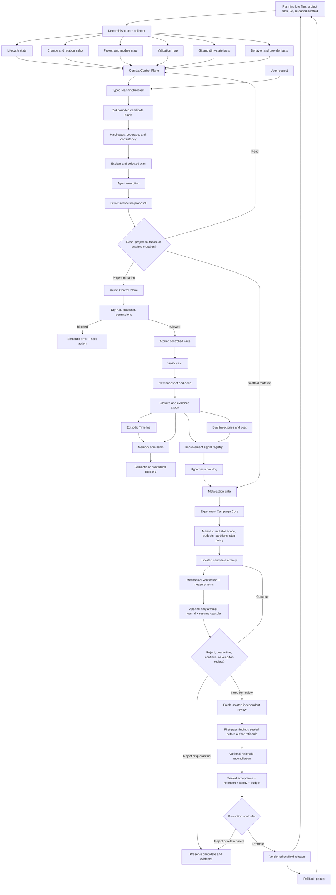

# Planning Lite: Roadmap v3.7

> **v3.7 direction/memory reconciliation (2026-08-14):** documentation/design only. This revision supersedes v3.6.2 current-next-action wording: governed `routing-policy-calibration-001-r3` completed 3/3 VALID production-independent attempts, stopped immutably at sequence 13 after truthful budget-overrun accounting, and has a post-stop `ready_for_independent_review` handoff. `CHG-CAMPAIGN-BUDGET-ADMISSION-001` is validated. New Planning Lite implementation is deferred while Poker resumes. The new Direction Control Plane / Project Spine and recommendation-memory contracts are roadmap candidates, not released implementation claims.

## Direction-Aware Project Control, Token-Efficient Context, Checklist-Guided Skills, Reusable Evaluation, and Verified Scaffold Evolution

**Suggested ID:** `PLAN-PL-LEARNING-CONTEXT-ROADMAP-V3-7`
**Status:** Draft / Private / Living plan
**Scope:** Central Planning Lite repository and manually connected project installations
**Supersedes:** `PLAN-PL-LEARNING-CONTEXT-ROADMAP-V3-6`
**Implementation status:** Living post-release roadmap. Campaign Core is released; the governed R3 routing campaign is complete with 3/3 VALID production-independent attempts and post-stop `ready_for_independent_review` handoff. `CHG-CAMPAIGN-BUDGET-ADMISSION-001` is validated. New Planning Lite implementation work is deferred while immediate project focus returns to Poker. Direction Control Plane, recommendation lineage, direction-indexed memory, deterministic efficiency plumbing, and Context Compiler remain roadmap work until bounded pilots justify implementation.
**Revision note:** v3.7 adds a Project Spine / Direction Control Plane above current-state context, explicit Target State / Capability / Gap / Roadmap lineage, official unanchored recommendations, partial-recommendation and future-seed preservation, direction-aware long-term memory, and deferred deterministic-efficiency work. It also reconciles completed R3 evidence and the validated Campaign budget-admission repair without authorizing new Planning Lite execution.
**Companion:** `CODE-PL-ROADMAP-V3-4` remains the frozen design companion for released Campaign Core contracts. New v3.6 checklist, skill, eval, and distribution contracts are roadmap-level additions and should receive a new implementation companion only when a bounded pilot is selected. No v3.4 or v3.5 source artifact is rewritten.

## Source recommendations

- `REC-PL-LEARNING-LOOP`
- `REC-PL-MEMORY-EFFICIENCY`
- `REC-PL-CONTROLLED-EVOLUTION`
- `REC-PL-RULE-PLAYBOOK-CURATION`

## Additional sources integrated into v3

- [InsForge/InsForge](https://github.com/InsForge/InsForge)
- [InsForge/CLI](https://github.com/InsForge/CLI)
- [InsForge/insforge-skills](https://github.com/InsForge/insforge-skills)
- [InsForge/insforge-agent-benchmark](https://github.com/InsForge/insforge-agent-benchmark)
- InsForge engineering articles on agent-native development, CLI diagnostics, config-as-code, backend branching, and MCPMark benchmarks
- `NirDiamant/Agent_Memory_Techniques`, integrated previously into Roadmap v2
- [angelnicolasc/graymatter](https://github.com/angelnicolasc/graymatter)
- GrayMatter patterns for memory admission, checkpoint separation, doctor checks, managed instruction blocks, consolidation, and local token benchmarks

## Additional source integrated into v3.1

- [VictorTaelin/OptMem](https://github.com/VictorTaelin/OptMem), reviewed again on 2026-07-31 from the live repository;
- its `README.md`, single-file `memo` implementation, `test.py`, installation script, and Windows notes;
- independently adapted ideas only: append-only episodic evidence, rebuildable summary trees, aligned temporal ranges, fixed read budgets, `as_of` read boundaries, bounded transport, concurrency control, and crash-tail repair;
- no OptMem source code or integration prompt is copied into Planning Lite;
- no license file was visible in the reviewed repository root, so implementation must remain independently authored unless a compatible license is later added.


## Additional source integrated into v3.2

- [facebookincubator/axiom](https://github.com/facebookincubator/axiom), reviewed from the live repository on 2026-08-01;
- repository root and optimizer architecture;
- optimizer documentation for partial-plan memoization, join-planning state management, plan-shape versus result-correctness testing, and query-graph visualization;
- read-only system metadata providers and synthetic connector statistics for deterministic optimizer tests;
- independently adapted Planning Lite patterns: a typed problem IR, bounded candidate plans, hard-gate-first selection, consistency checks, explain/analyze records, semantic memo keys, isolated branch state, provider-based introspection, and separate plan-shape evaluation;
- Axiom is Apache-2.0 licensed, but Planning Lite prototypes remain independently authored and domain-specific rather than source-compatible ports.


## Additional sources integrated into v3.3

Primary sources:

- [Self-Improvements in Modern Agentic Systems: A Survey](https://arxiv.org/abs/2607.13104), reviewed from the 97-page v1 PDF and its LaTeX source on 2026-08-01;
- [selfimproving-agent/Awesome-Self-Improving-Agents](https://github.com/selfimproving-agent/Awesome-Self-Improving-Agents), including the taxonomy, paper source, agent-oriented guide, evaluation guidance, and curated scaffold-improvement literature;
- repository license: MIT;
- formal distinctions adapted into Planning Lite:
  - persistent scaffold improvement versus transient execution state;
  - prompt, memory, tool, and control-logic update targets;
  - execution-derived improvement signals;
  - component isolation;
  - fixed-budget learning trajectories;
  - held-out transfer and retention checks;
  - evaluator independence;
  - verifier-gated promotion and rollback;
  - memory CRUD and signal-driven maintenance.

Secondary interpretation:

- [ArXivIQ review](https://arxiviq.substack.com/p/self-improvements-in-modern-agentic), used only as a reading aid and terminology cross-check;
- primary claims and roadmap decisions remain grounded in the paper and repository.

Planning Lite scope:

```text
foundation-model parameters θ
→ fixed in the current roadmap

operational scaffold Σ
→ prompts, memory, tools, control logic,
  behavior maps, validation bindings, and generated projections
```

The repository is a curated research hub and LaTeX manuscript source, not a
drop-in self-improvement runtime. The companion therefore stores independently
authored patterns for later comparison rather than pretending the repository
already supplies a production implementation.


## Additional sources integrated into v3.4

Primary sources reviewed for experiment-loop structure:

- [Shopify Engineering, “Autoresearch isn't just for training models”](https://shopify.engineering/autoresearch), reviewed on 2026-08-04;
- [davebcn87/pi-autoresearch](https://github.com/davebcn87/pi-autoresearch), reviewed as an autonomous coding-experiment loop with persisted prompt, measurement, checks, append-only result logging, keep/revert behavior, recovery, and stopping guards;
- [karpathy/autoresearch](https://github.com/karpathy/autoresearch), reviewed for the minimal fixed-evaluator, fixed-budget, narrow-mutable-scope experiment pattern.

Planning Lite adapts only the general engineering mechanisms:

```text
campaign manifest
fixed mutable scope and off-limits surface
append-only attempt journal
immutable measurement contract
backpressure checks
bounded hypothesis loop
deterministic resume capsule
explicit stop policy
keep/reject lineage
```

Planning Lite does not adopt an endless autonomous loop, scalar keep/discard as a
promotion rule, candidate-controlled measurement, direct commits to the main
project, or self-certification by the authoring session.

Independent-review addition:

```text
candidate author session
≠ independent review session
≠ mechanical verifier
≠ promotion controller
```

A session that creates or substantially changes a scaffold candidate may perform
local self-checks, but it cannot be the sole reviewer and cannot authorize
promotion. The independent reviewer receives frozen requirements, constraints,
diff, and evidence in a fresh isolated session. The author's rationale is
withheld until the reviewer's first-pass findings are sealed, then may be exposed
for reconciliation without rewriting the original review record.


## Additional sources and examples integrated into v3.6

Primary specifications and official product documentation reviewed on 2026-08-12:

- Agent Skills specification and creation guidance:
  - https://agentskills.io/home
  - https://agentskills.io/specification
  - https://agentskills.io/skill-creation/best-practices
  - https://agentskills.io/skill-creation/optimizing-descriptions
- OpenAI Codex plugin, skill, and hook documentation:
  - https://developers.openai.com/plugins/build/plugins
  - https://developers.openai.com/plugins/build/skills
  - https://developers.openai.com/codex/hooks
- OpenAI grader contracts:
  - https://platform.openai.com/docs/api-reference/graders

Primary example repositories reviewed as pattern sources, not copied wholesale:

- `obra/superpowers`, especially:
  - `skills/systematic-debugging/SKILL.md`;
  - `skills/systematic-debugging/CREATION-LOG.md`;
  - repository license: MIT.
- `addyosmani/agent-skills`, especially:
  - `docs/skill-anatomy.md`;
  - `skills/debugging-and-error-recovery/SKILL.md`;
  - `skills/using-agent-skills/SKILL.md`;
  - shared Definition of Done and specialist checklist references;
  - repository license: MIT.

Research evidence relevant to checklist design:

- arXiv:2607.17937, *How Agent Skills Fail under Long Contexts: A White-Box
  Study in Code Auditing*, reviewed for the bounded result that a detailed
  external checklist outperformed a generic self-check in the reported audit
  task. Planning Lite treats this as evidence for checklist pilots, not as a
  universal performance guarantee.

Planning Lite adapts the following patterns independently:

```text
precise skill descriptions for activation routing
positive and negative activation cases
progressive disclosure with conditional reference loading
process skills separated from implementation skills
root-cause debugging before fixes
minimal hypothesis tests
external shared checklists
Definition of Done separated from task-specific acceptance criteria
checklist items with evidence requirements
deterministic graders before model judges where possible
fresh-context independent review
plugin manifest + skills + hooks as a distribution shell
```

External examples are cataloged as provenance-bearing experimental patterns.
Planning Lite does not copy large third-party skill or prompt bodies into the
released scaffold merely because they are publicly available.


## Operational evidence integrated into v3.6

The first production calibration campaign produced an infrastructure incident
that must shape the generic evaluation contract.

Observed campaign:

```text
campaign_id       routing-policy-calibration-001
attempt_id        routing-policy-calibration-001-a01
journal terminal  campaign_stopped
stop reason       infrastructure_invalid_attempt_no_llm_execution
hypothesis        HYP-ROUTER-001
hypothesis result not_evaluated
fresh LLM evidence none
```

All nine internal suite runs terminated with `WorkspacePreparationError` before
a workspace, run record, metrics artifact, or LLM execution was created. The
campaign was stopped without `attempt_completed`.

Roadmap consequence:

```text
execution validity
≠
task outcome
```

A generic eval result must distinguish at least:

```text
execution_status:
  valid
  infrastructure_error
  invalid_environment
  interrupted

evaluation_status:
  pass
  fail
  inconclusive
  not_evaluated
```

A semantic experiment attempt must not begin until environment preflight passes:

```text
freeze inputs
→ verify source identity
→ verify environment and permissions
→ verify isolation
→ verify evaluator availability
→ THEN attempt_started
→ execute
→ evaluate
```

An infrastructure failure before model execution must not be counted as evidence
against the candidate or hypothesis.


## Operational evidence integrated into v3.6.2

The replacement calibration sequence exposed a second class of validity failure:
the source bundle can be intact and reproducible while still being semantically
inadmissible for the eval case.

Observed lineage:

```text
routing-policy-calibration-001
→ attempt_started before source/environment validity was established
→ WorkspacePreparationError
→ 0 LLM executions
→ stopped / not_evaluated

routing-policy-calibration-001-r1
→ campaign initialized and candidate registered
→ execution rehearsal before attempt_started
→ Git commit 379920a did not freeze ignored project-owned .planning surfaces
→ stopped pre-attempt / not_evaluated

routing-policy-calibration-001-r2
→ ignored historical surfaces frozen and materialized in an isolated worktree
→ frozen-8c8b1cdd31f8df45 was internally valid as a stale-snapshot scenario bundle
→ current Harness raw-docs qualification derived Planning / In progress,
  not Discovery / Ready
→ read-only search qualified all 4 preserved frozen-source bundles at commit 379920a
→ 0 / 4 reproduced the canonical Discovery / Ready fixture from raw .planning
→ 0 LLM executions
→ stopped pre-attempt / not_evaluated
```

The routing hypothesis therefore remains unevaluated:

```text
hypothesis_id  HYP-ROUTER-001
candidate_id   status-sufficient-routing-v1
semantic result not_evaluated
fresh routing evidence none
```

Two distinct invariants are now required:

```text
source identity
≠
fixture admissibility
```

and:

```text
frozen input
≠
qualified eval input
```

Experiment source identity must account for all material surfaces:

```text
ExperimentSourceIdentity
=
tracked revision
+ ignored/untracked material surfaces
+ generated/precomputed artifacts that participate in the case
+ tool/runtime identity
```

But exact identity is only the first gate. Before campaign initialization, a
candidate eval source must also prove that its canonical raw state reproduces
the semantic projection required by the case.

The new pre-campaign qualification chain is:

```text
assemble source candidate
→ content-freeze exact bytes and provenance
→ deterministic canonical-state projection
→ compare with ExpectedSemanticProjection
→ derive fresh snapshot from the same canonical source
→ compare derived snapshot with the same ExpectedSemanticProjection
→ prepare all required eval arms
→ issue FixtureQualificationReceipt
→ only the exact qualified bytes become eligible_for_campaign
→ campaign-init
```

For lifecycle routing, a stored snapshot matching the expected fixture is not
proof that the canonical raw source matches it.

This requires explicit eval artifact roles:

```text
CanonicalSourceBundle
→ authoritative raw material state used to derive semantics

DerivedArtifact
→ snapshot, index, summary, cache, or other rebuildable product of canonical state

ScenarioOverlay
→ intentional mutation used to test stale, missing, conflicting, blocked, or
  otherwise adversarial conditions

ExpectedSemanticProjection
→ the semantic contract the canonical source must deterministically reproduce

FixtureQualificationReceipt
→ evidence binding source hashes, derivation/verifier versions, expected
  projection, arm-preparation results, and admissibility verdict
```

A `ScenarioOverlay` must never be silently promoted to `CanonicalSourceBundle`.
A `DerivedArtifact` must never serve as the sole proof of canonical source
semantics.

The preferred first Phase 1A recovery fixture is a controlled-realistic Planning
Lite lifecycle fixture. It should use real Planning Lite file formats and real
deterministic status derivation, while keeping the project state intentionally
stable and independent of the live Poker checkout. The controlled fixture must
be designed from lifecycle semantics, not reverse-engineered to make one routing
candidate win.

The `r1`/`r2` evidence also demonstrates the intended Checklist Control Layer
feedback loop:

```text
CHK-EXEC-PREFLIGHT v0.1
→ source commit identity only
→ learned: ignored material surfaces were not frozen

CHK-EXEC-PREFLIGHT v0.2
→ frozen ignored surfaces + isolated materialization
→ learned: scenario bundle can be exact yet inadmissible as canonical baseline

proposed v0.3
→ pre-campaign canonical-source admissibility
→ source/derived/overlay role separation
→ deterministic semantic reproduction
→ fresh-derived snapshot agreement
→ all required arms prepare before campaign-init
```

The exact v0.3 schema is not released by this roadmap revision. The evidence is
recorded here so the next bounded implementation can be designed from observed
failures rather than from hypothetical completeness.


## Explicit exclusions

Roadmap v3.6 retains the following exclusions from v3.5:

- multi-agent shared memory;
- vector databases;
- SQL databases for Planning Lite memory;
- managed memory services;
- autonomous rewriting of canonical Planning Lite rules;
- age-based deletion of approved decisions or evidence;
- a universal architecture detector that pretends to understand every repository;
- one gigantic metadata payload containing the entire project;
- automatic decay or pruning of canonical project memory;
- retrieval frequency or last-access time as a proxy for authority;
- raw LLM output as a fallback semantic-memory record;
- direct agent mutation of canonical durable memory;
- byte-exact `old_string/new_string` patches inside long-lived planning documents;
- a fully automated behavior handbook for every project before a small pilot proves value;
- behavior summaries that remain active after their source anchors stop resolving.
- unconditional loading of a large memory transcript before every task;
- age-only ranking for approved decisions, requirements, constraints, or procedures;
- direct promotion of agent-authored event notes into semantic or procedural memory;
- treating a temporal summary tree as the authority layer;
- silent participation of external memory tools in benchmark arms;
- destructive replacement of raw episodic evidence by summaries;
- copying OptMem code or prompt text without an explicit compatible license.
- exhaustive search over a large combinatorial plan space;
- a learned or opaque cost model before deterministic baselines exist;
- choosing a cheaper plan before correctness, authorization, and coverage gates pass;
- treating plan-shape correctness as a substitute for outcome correctness;
- a mutable global planning memo shared across unrelated snapshots;
- caching final LLM answers as though they were reusable planning subproblems;
- hard-coding repository files into the semantic identity of a task;
- allowing an optimizer to infer missing implementation authorization;
- requiring every trivial local edit to enumerate multiple candidate plans.
- autonomous promotion of self-authored scaffold updates;
- allowing an update candidate to change the verifier that accepts the same update;
- claiming self-improvement from one repeated example or one successful rerun;
- evaluating a candidate only on examples used to design it;
- hiding human edits, cherry-picking, or review time from the improvement budget;
- combining prompt, memory, tool, and control-logic changes in the first attribution pilot;
- reducing correctness, safety, transfer, regression, and cost to one opaque weighted score;
- using a mutable LLM judge without pinned model, prompt, rubric, evidence, and budget;
- using the same judge configuration to generate updates and certify final gains;
- deleting immutable evidence to make memory or regression metrics look better;
- treating retrieval co-occurrence as proof that a memory item caused success;
- age-only or access-frequency-only forgetting of admitted knowledge;
- full-scaffold self-rewriting before component-scoped update gates are proven;
- automatic parameter fine-tuning or distillation of Planning Lite behavior;
- unbounded improvement iterations without checkpoints, stopping rules, and rollback.
- promotion based only on the authoring session's self-review;
- using the same session lineage to create a candidate, perform the only semantic review, and authorize release;
- exposing the author's rationale or expected verdict before an independent reviewer's first-pass findings are sealed;
- allowing green tests written or modified by the candidate to serve as the only evidence of correctness;
- treating an append-only experiment journal as canonical project memory or release authority;
- direct candidate commits to the released scaffold or the user's primary working tree;
- an endless “never stop” campaign policy without a finite hypothesis backlog, budget, and explicit stop reasons;
- collapsing mechanical verification, independent review, sealed evaluation, and promotion into one agent verdict.

---


Roadmap v3.6 additionally does not plan:

- automatically rewriting stable skill bodies whenever a checklist changes;
- treating checklist self-report as sufficient evaluation evidence;
- letting the candidate edit the checklist or grader that certifies the same candidate;
- exposing every held-out eval gate to the authoring agent;
- counting infrastructure errors as task failures or candidate regressions;
- recording `attempt_started` before environment, source, and isolation preflight succeeds;
- turning the Planning Lite-specific Context Eval Harness into the generic eval core by renaming it;
- coupling reusable eval contracts to `.planning`, lifecycle-status, Poker, Git worktrees, or one agent runtime;
- making exact model names mandatory inside reusable production skills when an execution profile is sufficient;
- assuming a sub-agent is independent merely because it has another process ID;
- making Codex plugins the canonical Planning Lite core or project-state store;
- moving project-owned `.planning/project`, change history, or evidence into a shared plugin;
- making plugin packaging a prerequisite for checklist, skill, or eval pilots;
- automatically promoting checklist changes from production-derived cases without held-out evaluation and independent review;
- treating a content-frozen source bundle as automatically eligible for an eval case;
- treating a stored or precomputed snapshot as sufficient proof of canonical raw-source semantics;
- using a `ScenarioOverlay` as the canonical baseline merely because its derived artifact matches fixture expectations;
- changing fixture expectations, verifier logic, or canonical source bytes in-place to rescue an already initialized campaign;
- manufacturing historical `.planning` state that is not supported by preserved evidence;
- initializing a new calibration campaign before the exact fixture/source bytes have a passing qualification receipt;
- coupling a controlled routing fixture to the current live Poker checkout when the eval does not require live-project semantics.


## Post-release reconciliation: 2026-08-10

Current released baseline:

```text
Planning Lite               v4.3.0
release commit              0e66941d33e192938ab848e3c046699cf5ab92a2
integration commit          67aa0145ee9206ac58103b87c84d87a4e7553670
Campaign Core CLI           planning-lite-campaign
Campaign Core status        production capability
automatic promotion         forbidden
```

What v4.3.0 makes production:

- immutable self-hashed campaign manifests with frozen-input verification;
- append-only hash-linked campaign journal and deterministic resume capsule;
- budgets, stop policy, locks, tamper detection, and campaign status inspection;
- balanced-suite campaign adapter where one full suite is one campaign attempt;
- deterministic candidate review after independent completed attempts;
- review receipt and handoff capsule;
- explicit independent-review decision gate;
- campaign completion seal and release handoff;
- a separate opt-in `planning-lite-campaign` CLI;
- hard separation between experiment acceptance, campaign completion, and release promotion.

What remains experimental or outside Campaign Core:

- candidate generation;
- PlanningProblem / CandidatePlan implementation;
- automated scaffold mutation;
- autonomous release promotion;
- generalized verifier generation;
- persistent memory admission or forgetting policy.

Roadmap consequence:

- the Campaign Core subset of Phase 0 is **complete and released**;
- the broader Phase 0 benchmark/memory/fuzz backlog is **not declared complete**;
- Phase 1A remains the next active experimental workstream;
- the original governed campaign `routing-policy-calibration-001` is historical infrastructure-incident evidence and is **stopped / not evaluated**;
- later 2026-08-12 reconciliation evidence supersedes the then-current replacement wording: `r1` and `r2` are also stopped pre-attempt / not-evaluated, and fixture qualification must precede any `r3` initialization;
- roadmap v3.4 remains immutable historical design evidence.

Historical first production campaign decision:

```text
campaign_id       routing-policy-calibration-001
hypothesis_id     HYP-ROUTER-001
candidate_id      status-sufficient-routing-v1
question          Can status-sufficient snapshot routing become the calibrated
                  baseline for lifecycle-status without correctness loss?
maximum decision  keep-for-independent-review
project mutation  forbidden during experiment
release promotion forbidden during experiment
```

This campaign is not a Campaign Core smoke test. Its result decides whether the
existing lifecycle-status routing evidence is admitted as the calibrated baseline
for Phase 1A and therefore constrains later CandidatePlan search.


## v3.6.2 campaign-state and fixture-governance addendum: 2026-08-12

The routing calibration hypothesis has still not been semantically evaluated.

Historical campaign lineage:

```text
routing-policy-calibration-001
status = stopped
attempt boundary = crossed too early
failure = infrastructure_invalid_attempt_no_llm_execution
LLM executions = 0
hypothesis outcome = not_evaluated
disposition = historical incident; never resume

routing-policy-calibration-001-r1
status = stopped
attempts started/completed = 0/0
failure = pre_attempt_input_incomplete_frozen_ignored_surfaces_missing
LLM executions = 0
hypothesis outcome = not_evaluated
disposition = historical pre-attempt source-identity evidence; never resume

routing-policy-calibration-001-r2
status = stopped
attempts started/completed = 0/0
failure = pre_attempt_baseline_unrecoverable_no_admissible_historical_source
LLM executions = 0
historical qualification = 0 / 4 preserved bundles admissible
hypothesis outcome = not_evaluated
disposition = historical fixture-governance evidence; never resume
```

The semantic lineage remains:

```text
hypothesis_id  HYP-ROUTER-001
candidate_id   status-sufficient-routing-v1
hypothesis semantic change = NONE
candidate semantic change = NONE
```

No routing-quality conclusion may be drawn from the three stopped campaigns.

The next permitted Phase 1A step is not `campaign-init`.

It is:

```text
design controlled-realistic canonical lifecycle fixture
→ qualify canonical raw source deterministically
→ derive and qualify fresh snapshot
→ prove raw-docs / snapshot / snapshot-skill prepare successfully
→ freeze QualificationReceipt + exact qualified bytes
→ only then build and initialize a replacement campaign
```

If a replacement identity is used, `routing-policy-calibration-001-r3` is only a
recommended future identity. It is not active and must not be initialized until
fixture qualification succeeds.

The pre-attempt boundary is therefore strengthened:

```text
content_frozen
is necessary but not sufficient

fixture_qualified
is required before
campaign_initialized

campaign preflight_passed
is required before
attempt_started
```

The Campaign Core v4.3.0 state machine remains released history. This roadmap
does not retroactively rewrite production journal semantics. Fixture
qualification belongs initially in the eval/adapter evidence layer and may be
promoted into a more generic contract only after the bounded lifecycle-routing
pilot proves the design.


---

# v3.7 Direction / Recommendation / Memory addendum

# Planning Lite Roadmap v3.7 — Direction Control Plane, Recommendation Lineage, and Direction-Indexed Memory

**Status:** Draft / Private / Living roadmap revision
**Date:** 2026-08-14
**Revision type:** documentation/design only
**Base:** `PLAN-PL-LEARNING-CONTEXT-ROADMAP-v3.6.2.ru.md`
**No production mutation:** this revision does not change released Planning Lite code, stopped Campaign journals, experiment evidence, Poker files, or promotion state.

---

## 1. Why v3.7 exists

Planning Lite already has strong lower-level control planes for current state, context, planning, action, evidence, memory admission, evaluation, and governed scaffold evolution. A repeated weakness across real projects is higher-level direction:

```text
project can be understood locally
but
project may not have an explicit target state / roadmap / gap model
```

Without a durable direction spine, an agent can perform locally useful work while drifting globally. Recommendations also accumulate as a flat list: some are implemented, some partly implemented, some contain useful future seeds, some duplicate one another, and some are forgotten when a linked change is closed.

Roadmap v3.7 adds a new cross-cutting layer:

```text
Direction Control Plane / Project Spine
```

Its job is to answer:

```text
What should become true?
What is true now?
What is missing?
Why is this the next change?
What earlier ideas, decisions, and evidence are relevant?
```

The design deliberately does **not** require autonomous project rewriting, a graph database, embeddings, or a large always-loaded memory transcript.

---

## 2. New top-level architecture

Planning Lite should distinguish two complementary control planes:

```text
Direction Control Plane
→ what should become true and why

Context Control Plane
→ what is true now
```

The core navigation loop becomes:

```text
TARGET STATE
    ↓
CAPABILITY MODEL
    ↓
CURRENT STATE
    ↓
GAP MAP
    ↓
ROADMAP
    ↓
RECOMMENDATIONS / DISCOVERIES / DECISIONS
    ↓
NEXT GOVERNED CHANGE
    ↓
EXECUTION + EVIDENCE
    ↓
RECONCILIATION
    ↙              ↘
CURRENT STATE      TARGET / GAP / ROADMAP / RECOMMENDATIONS
```

Planning must therefore evolve from:

```text
What should I do next?
```

to:

```text
What is this project trying to become,
where is it now,
what is the most important validated gap,
and what is the smallest governed change that closes part of that gap?
```

---

## 3. Canonical Project Spine

### 3.1. Target State, not “perfect implementation”

Human-facing language may use “ideal picture”, but the canonical artifact should use `TargetState` / `ProjectNorthStar`.

The target is not an infinite wishlist. It describes the properties that must become true for the project to fulfill its intended purpose well enough.

Minimum target dimensions:

```text
purpose
core user journeys
capabilities
success / fitness criteria
quality attributes and invariants
explicit non-goals
```

A capability describes what the system can reliably do, not which file or class implements it.

Example:

```text
bad:
  add export.py

better:
  CAP-EXPORT-001
  users can export a stable, versioned result
  and verify that the exported representation is complete
```

### 3.2. Target-State Explorer mode

The user may not know every relevant dimension in advance. Planning Lite should therefore support an interactive exploration mode rather than asking only “what should the finished project do?”.

Suggested mode:

```text
planning direction explore
```

Perspective sweep:

```text
PURPOSE
USER JOURNEYS
FUNCTION
CORRECTNESS / VERIFIABILITY
FAILURE MODES
DATA / SOURCE OF TRUTH
SAFETY / SECURITY
RECOVERY
OBSERVABILITY
COST / PERFORMANCE
OPERABILITY
EVOLUTION / EXTENSIBILITY
HUMAN CONTROL
NON-GOALS
```

The agent should first inspect existing project evidence, infer what appears known, and ask only about material blind spots. It should not force a long generic questionnaire when repository evidence already answers a dimension.

Agent-inferred target claims remain `DRAFT` until accepted by the user or another explicit project authority.

### 3.3. Bootstrap rule for “analyze project”

Project analysis should begin with direction discovery:

```text
locate target / vision / roadmap / plans / recommendations
→ assess freshness and authority
→ inspect repository
→ reconcile CURRENT_STATE
→ compare CURRENT ↔ TARGET
→ reconcile GAP_MAP
→ reconcile ROADMAP
→ reconcile RECOMMENDATIONS
→ only then recommend next work
```

If no roadmap exists:

```text
roadmap absent
→ target exists?
    yes → derive draft gap map + roadmap
    no  → infer TARGET_STATE_DRAFT from repository/docs/tests/user journeys
          + run Target-State Explorer for missing dimensions
          + require user acceptance before treating it as canonical
```

Suggested bootstrap mode:

```text
planning direction bootstrap
```

---

## 4. Gap Map

`GapMap` is not a task list. It is the explicit delta between current and target capabilities.

Example:

```text
CAP-LABEL-001
current = partial
missing:
  GAP-LABEL-007 unknown-class handling
  GAP-LABEL-011 calibrated confidence

CAP-VALIDATE-001
current = absent
missing:
  GAP-VALIDATE-001 deterministic validation surface
```

Useful gap states:

```text
candidate
validated
active
partially_closed
closed
superseded
invalidated
blocked
```

A closed gap keeps compact lineage to the changes/decisions/evidence that closed it. Full evidence is archived and loaded only on demand.

---

## 5. Roadmap as direction and durable memory index

The roadmap should remain outcome/capability-oriented rather than becoming a giant task list.

Recommended three horizons:

```text
NOW
→ approved/current changes

NEXT
→ validated gaps and capabilities selected for work

LATER
→ target-state outcomes whose implementation is not yet committed
```

Each roadmap item should minimally contain:

```text
roadmap_id
target_capability_ids
gap_ids
desired_outcome
status
one-line completion outcome
recommendation_refs
decision_refs
change_refs
evidence_refs
archive_refs
```

The roadmap is a **routing table for memory**, not the memory warehouse itself.

Default context should show compact lineage only. Old changes, long recommendations, receipts, logs, and incident evidence are fetched only when a current gap/decision requires them.

Principle:

```text
archive != forgotten
archive = retained but not injected by default
```

---

## 6. Discoveries and recommendations are different objects

A discovery records an observed fact or learned condition:

```text
DISC-018
A governed attempt can be admitted when the remaining token budget
is lower than the likely attempt cost.
```

A recommendation proposes a change:

```text
REC-061
Add pre-attempt budget reservation/admission.
```

One discovery may produce several recommendations. One recommendation may be supported by several discoveries.

Do not convert every discovery directly into a task.

---

## 7. Official unanchored recommendations (“безродные”)

An idea is allowed to exist before it has a roadmap parent.

This is not malformed state. It is a valid discovery/ideation state:

```text
anchor_status = unanchored
```

Example:

```text
REC-042
status: draft
anchor_status: unanchored
idea: visualize cluster structure and uncertainty
origin: human observation
```

Planning Lite should support low-friction idea capture first and formalization later.

Suggested mode:

```text
planning recommendations triage
```

Triage stages:

```text
1. semantic consolidation
   duplicates / overlaps / contradictions / subsets

2. perspective enrichment
   function / correctness / failure / security / compatibility /
   performance / operability / future evolution

3. directional anchoring
   target capability / gap / roadmap / local tactic / future seed
```

Possible outcomes:

```text
ROADMAP_DERIVED
ROADMAP_REFINEMENT
NEW_GAP
TARGET_STATE_SIGNAL
LOCAL_TACTIC
DEFERRED_UNANCHORED
REJECTED
SUPERSEDED
MERGED
```

No recommendation should be forcibly attached to a roadmap item merely to make the registry look tidy.

---

## 8. Recommendation is a container, not an atomic completion bit

A recommendation may contain several independently meaningful pieces. Therefore `change completed` must **never** imply `recommendation completed`.

Model a recommendation as a container of `RecommendationUnit` objects.

Suggested unit schema:

```text
unit_id
statement
kind
status
anchor_refs
implemented_by
carried_forward_to
depends_on
future_trigger
source_refs
notes
```

Useful unit kinds:

```text
current_action
future_seed
constraint
quality_requirement
followup_question
implementation_option
```

Useful unit states:

```text
open
implemented
deferred
future_seed
rejected
superseded
carried_forward
needs_reframe
```

Container states:

```text
draft
triaged
accepted
partially_realized
closed_with_carryforward
completed
superseded
rejected
```

### 8.1. Partial recommendation rule

If a change implements only part of a recommendation:

```text
REC
  unit A → implemented by CHG-X
  unit B → still open
  unit C → future_seed
```

then the recommendation becomes:

```text
partially_realized
```

not `completed`.

### 8.2. Future-seed rule

If a recommendation contains a useful “later” idea, such as visualization that is not part of the current change, completion must preserve it explicitly.

Allowed outcomes:

```text
keep the future_seed unit in the parent recommendation
or
split it into REC-NEW with:
  split_from = REC-PARENT
  source_unit = REC-PARENT/U-C
```

A parent may be archived as `closed_with_carryforward` only after every nonterminal unit has an explicit surviving identity.

### 8.3. No silent residue invariant

For every recommendation touched by a completed change:

```text
all source units
=
implemented
+ rejected
+ superseded
+ carried_forward
+ still_open
```

No unit may disappear merely because the linked change closed.

---

## 9. Recommendation reconciliation mode

After change completion, Planning Lite should run or offer:

```text
planning recommendations reconcile --change CHG-X
```

The reconciliation should answer:

```text
Which recommendation units did this change actually implement?
Which remain open?
Which became obsolete?
Which future seeds should survive?
Which new discoveries emerged?
Does the roadmap/gap map need flow-back?
```

Suggested output:

```text
implemented_units
remaining_units
future_seeds
new_recommendations
new_discoveries
roadmap_updates
closed_gaps
partially_closed_gaps
unresolved_residue
```

Hard guard:

```text
recommendation may become completed
ONLY IF
unresolved_residue = 0
AND
all future seeds are preserved or explicitly rejected/superseded
```

This reconciliation is a separate lifecycle from change closure.

---

## 10. Recommendation convergence and cemetery recovery

Planning Lite should periodically inspect the recommendation registry without loading every recommendation into normal task context.

Suggested command:

```text
planning recommendations converge
```

Checks:

```text
accepted recommendation with no roadmap/gap anchor
partially_realized recommendation with stale residue
future seed whose trigger is now true
recommendation marked completed with unaccounted source units
merged recommendation whose source lineage is missing
superseded recommendation with no successor
old unanchored recommendation never triaged
roadmap item whose supporting recommendation was accidentally archived
```

This allows old useful ideas to “wake up” when the project reaches a relevant capability or phase.

---

## 11. Direction convergence and orphan detection

Suggested mode:

```text
planning direction converge
```

Compare:

```text
TARGET
↕
CURRENT
↕
GAPS
↕
ROADMAP
↕
RECOMMENDATIONS / DISCOVERIES
↕
ACTIVE + COMPLETED CHANGES
```

Example findings:

```text
roadmap item appears implemented but remains open
accepted recommendation has no directional anchor
active change traces to no validated gap or recommendation
closed gap has no evidence lineage
target capability has no fitness criterion
repository now exposes a capability absent from target state
future-seed trigger became true
recommendation completion lost an unimplemented unit
```

The purpose is not to make all graphs perfectly connected. The purpose is to make intentional disconnection explicit.

---

## 12. Direction-aware long-term memory

Roadmap v3 already uses multi-resolution context and memory admission. v3.7 makes Project Spine the deterministic routing layer over that memory.

Suggested memory speeds:

```text
TARGET STATE
→ slowest / months-years

ROADMAP
→ durable directional memory / weeks-months

GAP MAP
→ active divergence memory / days-weeks

ACTIVE CHANGES
→ working memory / hours-days

COMPLETED CAPSULES + EVIDENCE
→ archived durable memory
```

Default retrieval order:

```text
1. deterministic lineage traversal
2. bounded L3/L2 direction/context view
3. L1 capsules for selected lineage
4. L0 raw evidence only when needed
5. semantic retrieval only when lineage is insufficient
```

This reduces the burden on generic semantic memory retrieval.

Example:

```text
current GAP-019
→ RM-05
→ CAP-008
→ related REC-031 / REC-046
→ prior DEC-008
→ prior CHG-011
```

The Context Compiler can then build a minimal agent work packet from this subgraph.

---

## 13. Visibility decay, not information decay

Planning Lite should preserve the earlier rule that approved decisions/evidence are not deleted merely because they are old.

Instead use visibility tiers:

```text
active
compact-visible
archived-indexed
raw-evidence
```

Completed changes can leave default context after roadmap/gap reconciliation while remaining reachable through lineage.

Do not use age or access frequency as authority.

---

## 14. Context Compiler / Agent Work Packet

The R3 lifecycle-routing experiment produced a stable signal favoring the `snapshot` arm across three valid independent attempts. This does not prove a universal context policy, but it justifies a future bounded `Context Compiler` hypothesis.

Potential pipeline:

```text
canonical project sources
→ Direction + Context Control Plane
→ relevant lineage subgraph
→ deterministic compiler
→ AGENT_WORK_PACKET
→ LLM/agent
```

Suggested packet:

```text
task
current state
target capability
gap / roadmap position
relevant constraints
allowed actions
open questions
canonical evidence refs
acceptance / verification schema
```

This should be evaluated, not assumed.

---

## 15. Deterministic efficiency backlog

The agent-efficiency review adds four deferred capability families.

### PL-EFF-001 — Canonical Boundary Capsules

Avoid manually duplicating hashes, IDs, function contracts, and parent boundaries across sequential gates.

```text
upstream artifact
→ canonical machine-readable boundary capsule
→ downstream consumes capsule
```

Goal: remove deterministic transcription drift.

### PL-EFF-002 — Governed deterministic orchestration

Keep small stages, but automate transitions that require no semantic/human decision.

Human stops only at material boundaries such as:

```text
expensive LLM execution
project/scaffold mutation
destructive cleanup
promotion
human adjudication
```

### PL-EFF-003 — Structured exception / adjudication artifacts

Separate generic code from case-specific human resolution:

```text
EXCEPTION
→ HUMAN ADJUDICATION
→ scoped reusable decision
```

Avoid encoding historical one-off facts into runners.

### PL-EFF-004 — Context Compiler / Agent Work Packet

Use Project Spine + Context Plane to minimize the context the agent must reconstruct itself.

---

## 16. New roadmap phase: Phase 1B — Project Spine / Direction Control Plane pilot

**Priority:** Deferred until Poker work resumes; validate project-locally before Planning Lite Core implementation.
**Risk:** Medium.
**First validation target:** Poker.

The pilot should not begin as a generic framework rewrite.

Project-local prototype:

```text
TARGET_STATE_DRAFT
CAPABILITY MODEL
CURRENT_STATE reconciliation
GAP_MAP_DRAFT
ROADMAP reconciliation
recommendation/discovery triage
lineage links
```

Measure whether this improves real project work:

```text
next-change selection quality
roadmap drift
forgotten recommendation rate
unanchored recommendation recovery
partial-recommendation residue preservation
resume after pause
historical files loaded per task
context tokens before meaningful action
frequency of irrelevant work
```

Promotion criterion:

```text
only if Poker evidence shows the Project Spine reduces drift/context cost
without creating unacceptable maintenance overhead
```

Do not delay Poker implementation in order to build the generic Project Spine first.

---

## 17. Phase 4A — Direction-indexed memory

Extend the existing semantic/procedural/code-quality memory phase with:

```text
Project Spine as deterministic memory index
roadmap/gap/change/recommendation lineage
visibility decay without deletion
archive references from closed roadmap items
recommendation residue preservation
future-seed wake-up rules
lineage-first retrieval before semantic retrieval
```

Success criteria:

```text
project direction survives long pauses
completed history leaves default context without becoming unreachable
old decisions/evidence remain retrievable by lineage
recommendation future seeds are not lost at change closure
semantic retrieval handles residual discovery rather than basic project navigation
```

---

## 18. New central change families

These are roadmap candidates, not authorization to mutate released Planning Lite now.

### Central CHG N — Project Spine / Direction bootstrap pilot

Scope:

```text
Target-State Explorer
capability model
gap map
roadmap lineage
project bootstrap when roadmap is absent
Poker pilot
```

### Central CHG O — Recommendation / Discovery lifecycle and residue reconciliation

Scope:

```text
unanchored recommendation state
RecommendationUnit model
partial realization
future seeds
triage
change-to-recommendation reconciliation
convergence / residue audit
```

### Central CHG P — Direction-aware memory lineage

Scope:

```text
roadmap/gap/recommendation/change/evidence refs
L3/L2 default views
archive visibility tiers
lineage-first retrieval
Context Compiler integration boundary
```

### Central CHG Q — Deterministic efficiency plumbing

Scope:

```text
canonical boundary capsules
governed deterministic orchestrator
structured exception/adjudication artifacts
```

### Central CHG R — Context Compiler experiment

Scope:

```text
Project Spine + Context Plane → minimal Agent Work Packet
raw-docs vs snapshot vs compiled-packet evaluation
correctness + cost + file-read metrics
```

---

## 19. Current prioritization after R3 closeout

The previous v3.6.2 statements that `routing-policy-calibration-001-r3` is future work are historical and superseded by completed governed evidence.

Current R3 state:

```text
campaign_id                  routing-policy-calibration-001-r3
Campaign terminal            campaign_stopped / sequence 13 / immutable
attempts                     3/3 completed
scientific evidence          3/3 VALID + production-independent
scientific disposition       keep-for-independent-review
recommended arm              snapshot
post-stop handoff            ready_for_independent_review
new experiment required      no
candidate promotion          not authorized
```

The authorized budget-lifecycle repair `CHG-CAMPAIGN-BUDGET-ADMISSION-001` has been validated. Future strict Campaigns may require explicit attempt budget admission/reservation; truthful already-incurred completion accounting must remain recordable even after overrun.

Current project priority:

```text
Planning Lite new implementation work
→ DEFERRED

immediate project focus
→ Poker
```

The Project Spine concept should first be exercised as a **small project-local Poker pilot**, not as a reason to postpone Poker for another Planning Lite rewrite.

---

## 20. Updated principles

Roadmap v3.7 adds these principles:

```text
1. Direction before local optimization.
2. Target state is accepted intent, not agent-inferred truth.
3. Current state and target state are separate authorities.
4. Gap map diagnoses; roadmap prioritizes.
5. Recommendations may be unanchored without being invalid.
6. Change completion never silently closes recommendation residue.
7. Future seeds must survive change closure with explicit identity.
8. Roadmap is a memory index, not a history dump.
9. Archive means not injected, not forgotten.
10. Deterministic lineage retrieval precedes semantic memory retrieval.
11. Small stages do not require many manual handoffs.
12. Canonical facts should not be recopied between gates.
13. Discoveries describe; recommendations propose.
14. Direction flow-back is allowed but must be reconciled explicitly.
15. Generic Planning Lite features should be promoted from bounded real-project evidence.
```

---

## 21. Explicit non-goals for this revision

v3.7 does not authorize:

```text
rewriting Planning Lite Core now
starting a new R3 experiment
autonomous Target State acceptance
automatic roadmap mutation without review
automatic deletion of old recommendations
a graph database
embeddings as the primary project navigation mechanism
loading all recommendations on every task
automatically closing recommendations when a change closes
silently dropping future seeds
forcing every idea to have a roadmap parent immediately
turning Poker into a Planning Lite research project
```

The immediate operational goal remains to return to Poker with Planning Lite in a stable closeout state.

---

# 1. Executive conclusion

Roadmap v2 established **what Planning Lite should remember** and how memory should be stored at several resolutions.

Roadmap v3 adds an operational layer:

> Planning Lite should be able to produce a small, deterministic, machine-readable view of the project state, so the agent does not repeatedly reconstruct it from many Markdown files.

The new central concept is:

```text
Planning Lite Context Control Plane
```

It sits between project files and the coding agent.

```text
project files + Git + Planning Lite artifacts
→ deterministic state collector
→ bounded context snapshot
→ stage-specific context pack
→ agent work
→ structured verification
→ snapshot delta
```

This is where the largest near-term token savings may come from.

Roadmap v3.1 adds a lower episodic layer beneath admitted memory:

```text
immutable episodic evidence
→ rebuildable temporal summaries
→ bounded as-of view
→ targeted zoom or exact search
→ memory admission
→ semantic or procedural promotion
```

This layer answers a different question from semantic memory:

```text
Episodic Timeline
→ what happened, in what order, and what evidence exists?

Semantic / Procedural Memory
→ what has enough authority and durability to guide future behavior?
```

The timeline is useful for long histories, eval runs, corrections, incidents, and
completed-change evidence. It must never make an old binding rule weaker merely
because the rule is old. Recency controls temporal detail, while authority
controls durable retrieval.


Roadmap v3.2 adds a typed planning layer between current-state retrieval and
technical action:

```text
user request
→ typed PlanningProblem
→ behavior and context graph
→ 2–4 bounded candidate plans
→ hard-gate and coverage checks
→ cost comparison
→ plan consistency
→ explain / dry-run
→ execution
→ explain-analyze
```

This prevents Planning Lite from jumping directly from prose to tools.

The typed problem describes **what must be achieved**, not which files must be
opened. Different context and execution plans may satisfy the same problem.

```text
bad semantic identity
→ read ACTIVE.md, ROADMAP.md, and AUDIT.md

better semantic identity
→ determine lifecycle stage, authorization, blocker,
  next permitted action, and required evidence
```

Correctness and safety are hard constraints. Cost becomes relevant only after a
candidate satisfies required outputs, lifecycle gates, evidence coverage, and
validation obligations.


Roadmap v3.3 closes the learning loop without turning Planning Lite into an
autonomous self-rewriter:

```text
execution evidence
→ improvement signal
→ component-scoped scaffold candidate
→ held-out acceptance
→ retention and regression checks
→ promote, reject, quarantine, or rollback
→ versioned scaffold
```

The agent configuration is treated as:

```text
A_t = (θ_t, Σ_t)

θ_t
→ foundation-model parameters

Σ_t
→ prompts
  + memory and retrieval policies
  + tools and interfaces
  + routing, scheduling, gates, and validation logic
```

For the current roadmap:

```text
θ_t is fixed
Σ_t may change only through governed, versioned scaffold updates
```

A temporary context window, conversation history, or one successful execution is
not a durable improvement. Improvement requires a persistent change that
survives task boundaries and demonstrates benefit on independent tasks.

The update loop therefore has two distinct operators:

```text
E
→ execute the current scaffold and produce evidence or learning signals

U_Σ
→ propose, evaluate, and possibly commit a scaffold update
```

Planning Lite narrows this broad formalism to a safe engineering loop:

```text
one target component per pilot candidate
frozen baseline and verifier versions
detached candidate workspace
fixed improvement budget
held-out acceptance suite
retention suite for previously solved behavior
explicit human-supervision ledger
atomic promotion
immediate rollback path
```

The framework should explore quickly in explicit scaffold artifacts and
consolidate slowly. A prompt, memory rule, tool wrapper, or routing policy may be
easy to change, but ease of mutation is not evidence of improvement.


Roadmap v3.5 makes that loop operational through one shared subsystem rather than
adding a separate “Autoresearch phase”:

```text
Experiment Campaign Core
```

The core is a bounded execution and evidence layer used by the benchmark harness,
read-only planning calibration, manual hypothesis curation, and verified scaffold
evolution:

```text
campaign manifest
→ frozen parent, evaluator, partitions, budget, mutable scope, and stop policy
→ one candidate attempt
→ mechanical verification and measurements
→ append-only attempt journal
→ keep-for-review, reject, quarantine, or continue
→ deterministic resume capsule
```

It does not itself authorize release.

Promotion uses a separate outer gate:

```text
mechanically admissible candidate
→ fresh isolated reviewer session
→ sealed first-pass findings without author rationale
→ optional rationale reconciliation
→ sealed acceptance and retention evidence
→ promotion controller
→ promote, reject, quarantine, or retain parent
```

This prevents a self-confirming loop in which the same conversational context
creates the solution, explains why it is good, interprets the tests, and certifies
its own success.

The target is not fewer documents on disk. The target is:

```text
fewer documents opened
less repeated state reconstruction
fewer speculative tool calls
fewer retries caused by missing context
smaller repeated payloads
```

The key lesson from InsForge is not “use their cloud” or “use MCP.”

It is:

```text
surface authoritative state before the agent acts
```

InsForge's vendor-run Sonnet 4.6 benchmark reports 2.4× fewer tokens than the compared Supabase MCP workflow on the tested database tasks. That result is not a guaranteed Planning Lite outcome, but it supports a measurable hypothesis: better structured state can reduce token-heavy guessing and correction loops.

GrayMatter adds an equally important correction: memory must be selective before writing, temporary state must stay separate from durable knowledge, and the framework must verify that the agent is actually wired to use the context surface. Otherwise a clever memory layer becomes either an ignored tool or a warehouse of transient noise.

Roadmap v3 therefore combines:

```text
context control
+ memory admission
+ retention by authority
+ behavioral wiring checks
+ correctness-aware token evaluation
```

Harness Handbook adds a second operational view beside the Context Control Plane:

```text
Context Control Plane
→ what is true now

Behavior Map
→ where a behavior is implemented across prompts, state, tools,
  templates, code, validation, and documentation

Technical Plan
→ how to change that behavior and prove coverage
```

This matters because Planning Lite itself is a harness. A change such as
`Ready does not authorize Execution` is not owned by one file. It may span a
prompt, state field, action gate, recovery path, checkpoint, doctor check,
operator guide, and regression eval.

Roadmap v3 therefore inserts a new step before technical planning:

```text
behavior delta
→ behavior localization
→ live-source verification
→ coverage matrix
→ technical plan
```

The handbook is derived and rebuildable. Canonical files and live source remain
authoritative.


---

# 2. What changed from Roadmap v2

## Added

- a deterministic Context Control Plane;
- compact `status`, `context`, `inspect`, `evidence`, and `verify` contracts;
- bounded JSON payloads with truncation and continuation;
- snapshot IDs and state fingerprints;
- snapshot deltas instead of repeated full context;
- stale-context protection before mutations;
- a strict separation between read plane and action plane;
- declarative `export → plan → apply`;
- dry-run for lifecycle and framework mutations;
- semantic exit codes and `next_action`;
- a unified diagnostic surface;
- progressive instruction loading modeled as root router plus narrow child packs;
- one canonical skill source plus generated agent-specific projections;
- drift checks for mirrored instructions;
- a benchmark matrix comparing raw documents, stage packs, snapshots, and snapshots plus skills;
- memory-admission and retention rules;
- a behavioral `doctor` that verifies the complete context-use chain;
- idempotent managed instruction blocks;
- correctness-aware memory metrics and fuzz targets;
- conservative three-way diff ideas for managed Planning Lite files;
- new harmful-pattern guardrails derived from InsForge's strengths and weaknesses;
- a behavior-centric map between requests and distributed implementation sites;
- state-register views for reads, writes, resets, and forbidden inference paths;
- behavior localization before technical planning;
- live verification of every source anchor;
- `verified`, `stale`, `frozen`, `unmapped`, and `needs-review` handbook states;
- a behavior-coverage matrix used by Planning and Readiness;
- incremental invalidation of derived behavior cards after repository diffs;
- localization quality and handbook break-even metrics.

## Strengthened

- multi-resolution memory;
- code-quality context packs;
- deterministic-first validation;
- context evaluation;
- prompt/token accounting;
- version and provenance capture.

## Still deferred

- automatic rule curation;
- IDs for every rule;
- semantic retrieval;
- embeddings;
- databases;
- automatic background learning.

---


# 3. Unified target architecture



Text fallback:

```text
PROJECT + PLANNING FILES + GIT + RELEASED SCAFFOLD
              ↓
DETERMINISTIC STATE COLLECTOR
              ↓
CONTEXT CONTROL PLANE
              ↓
TYPED PLANNING PROBLEM
              ↓
BOUNDED CANDIDATE PLANS
              ↓
HARD GATES / COVERAGE / CONSISTENCY
              ↓
EXECUTION
    ├── read
    ├── controlled project mutation
    └── governed scaffold-candidate campaign
              ↓
EXPERIMENT CAMPAIGN CORE
    ├── frozen manifest and mutable scope
    ├── isolated attempts
    ├── mechanical checks and measurement
    ├── append-only journal
    ├── budget and stop policy
    └── deterministic resume capsule
              ↓
KEEP-FOR-REVIEW CANDIDATE
              ↓
FRESH INDEPENDENT REVIEW SESSION
    ├── frozen requirements and evidence
    ├── no author rationale on first pass
    └── sealed findings before reconciliation
              ↓
SEALED ACCEPTANCE / RETENTION / PROMOTION CONTROLLER
              ↓
VERSIONED RELEASE OR PRESERVED REJECTION / ROLLBACK
```

## 3.1. Two complementary maps

Planning Lite should keep module and behavior representations separate.

```text
Module map
→ ownership, files, interfaces, symbols, package boundaries

Behavior map
→ runtime behavior, shared state, cold paths, and all implementation sites
```

The two views answer different questions:

```text
Where does this code belong?
→ module map

Where must this behavior change?
→ behavior map
```

Neither view replaces live-source inspection.

## 3.2. Handbook naming

The memory-resolution labels remain:

```text
L3 → IDs and relations
L2 → one-line outcome
L1 → capsule
L0 → evidence
```

The behavior handbook must not reuse those labels. Use:

```text
B0 System overview
B1 Behavior card
B2 Implementation unit
B3 Source anchor
```

This prevents two unrelated resolution systems from colliding in prompts,
schemas, and diagnostics.


---


## 3.3. Planning representations

Planning Lite should separate four representations:

```text
Request
→ human wording and desired outcome

PlanningProblem
→ resolved task semantics, constraints, required outputs, and gates

CandidatePlan
→ one bounded way to gather context, act, and validate

ExecutionTrace
→ what actually happened, with observed costs and deviations
```

The same `PlanningProblem` may be satisfied by several plans:

```text
lifecycle-status

Plan A
→ status only

Plan B
→ status + bounded context

Plan C
→ canonical-file fallback
```

Only candidates that meet hard constraints enter cost comparison.

The system must preserve:

```text
problem identity
≠
plan identity
≠
execution identity
```

This separation enables safe memoization, explainability, and evaluation.


## 3.4. Improvement and campaign representations

Planning Lite should keep improvement artifacts distinct from ordinary planning,
execution, review, and release artifacts.

```text
ExecutionTrace
→ what happened in one run

ImprovementSignal
→ normalized evidence of a recurring failure, cost, or opportunity

HypothesisRecord
→ one falsifiable explanation and predicted improvement

ScaffoldUpdateCandidate
→ one proposed persistent change to one scaffold component

CampaignManifest
→ frozen parent, mutable scope, off-limits surface, partitions, budgets,
  verifier versions, session policy, and stopping rules

ExperimentAttempt
→ one isolated candidate materialization, execution, measurement, and decision

ExperimentJournal
→ append-only history of all accepted, rejected, crashed, and quarantined attempts

ResumeCapsule
→ deterministic reconstruction of remaining budget, last decision,
  hypothesis backlog, and verifier identity

IndependentReview
→ fresh-session first-pass findings, reconciliation, and unresolved objections

PromotionDecision
→ promote, reject, quarantine, continue experiment, retain parent, or rollback

ScaffoldVersion
→ immutable released configuration with parent and evidence lineage
```

Identity boundaries:

```text
run_id
≠ signal_id
≠ hypothesis_id
≠ update_id
≠ attempt_id
≠ campaign_id
≠ author_session_id
≠ review_session_id
≠ promotion_decision_id
≠ scaffold_version
```

A signal may aggregate several runs.

One hypothesis may address several compatible signals.

One candidate may implement one hypothesis for one primary target component.

One campaign may compare several candidates against one frozen parent.

A released scaffold version must have exactly one parent in the first pilot.

Update targets use the survey's scaffold decomposition:

```text
prompt
memory
tool
control_logic
full_scaffold
```

Planning Lite adds `behavior_map` and `validation_binding` as explicit governed
artifacts, but they remain part of the operational scaffold rather than a new
model-parameter channel.

The first attribution pilot permits one primary target component per candidate.
Cross-component updates are deferred until single-component effects can be
measured reliably.


## 3.5. Experiment Campaign Core

The Experiment Campaign Core is a shared bounded runtime, not a new autonomous
agent and not a second evaluation system.

It is used by:

```text
Phase 0
→ defines the reusable campaign runtime and evidence contracts

Phase 1A
→ calibrates read-only planning and routing candidates

Phase 5
→ curates signals, hypotheses, known confounders, and attempt history

Phase 6
→ materializes and evaluates component-scoped scaffold candidates

Central CHG E
→ runs, measures, verifies, records, aggregates, and resumes

Central CHG I
→ proposes, materializes, independently reviews, promotes, rejects, and rolls back
```

Core invariants:

```text
one frozen parent per campaign
one primary mutable component per first-pilot candidate
explicit mutable scope
explicit off-limits surface
frozen mechanical verifier and task partitions
append-only attempt journal
finite budget and finite hypothesis backlog
explicit stop reasons
no direct writes to the released scaffold
no candidate-controlled evaluator change
no self-review promotion
```

Candidate attempt decisions are operational, not release decisions:

```text
keep-for-review
reject-correctness
reject-safety
reject-retention
reject-budget
quarantine
continue-experiment
```

`keep-for-review` means only that the candidate may enter the independent outer
promotion gate.

Independent-review invariant:

```text
author_session_id != review_session_id
```

The reviewer receives the problem, frozen requirements, constraints, candidate
diff, mechanical evidence, and allowed canonical context. The first-pass review
must not receive the author's rationale, development conversation, candidate
selection score, or expected verdict. Those may be disclosed only after the
first-pass findings are sealed and hashed.

The promotion controller must preserve separately:

```text
author claim
mechanical evidence
independent reviewer findings
author response or rationale reconciliation
sealed acceptance and retention evidence
final adjudication
```


## 3.6. Checklist Control Layer

Planning Lite should treat checklists as first-class, versioned scaffold
artifacts rather than loose Markdown reminders.

Core distinction:

```text
Skill
→ how to perform a workflow

Checklist
→ what must be true, evidenced, or not forgotten for the workflow to count as good

Eval
→ how checklist obligations are verified

Campaign
→ how a candidate checklist version is compared and governed
```

A skill may remain unchanged across several checklist revisions.

Preferred mutation order for recurring quality failures:

```text
Can a checklist item prevent or detect the failure?
  yes → checklist candidate first
  no  → can a conditional reference help?
          yes → reference candidate
          no  → skill-body candidate
```

Checklist identity should include:

```text
checklist_id
version
parent_version
scope
applies_when
items
severity
evidence requirements
evaluator binding
source/provenance
introduced_by
supersedes
status
```

A checklist item should be independently addressable:

```yaml
id: RCA-ENV-003
requirement: Verify source identity before experiment execution begins.
severity: hard
applies_when:
  - experiment_execution
evidence:
  - source_head
  - requested_commit
evaluator:
  type: deterministic
```

Checklist composition must remain bounded. One workflow may select:

```text
one primary workflow checklist
+ zero or more conditional specialist checklists
+ one project-wide Definition of Done where applicable
```

Do not load the entire checklist registry into every task.

### Operational and evaluation projections

The same canonical checklist may have two projections.

Operational projection:

```text
visible to the working agent
→ reminder, ordering, required evidence, stop conditions
```

Evaluation projection:

```text
deterministic check
model-judge rubric criterion
human review criterion
trace check
artifact check
```

Held-out gates may add checks not disclosed to the candidate to reduce gaming.
The canonical checklist is therefore a major quality specification, not the
entire acceptance system.

### Checklist evolution

Production-derived failures may create checklist improvement signals, but not
automatic checklist edits.

```text
real failure or omission
→ candidate eval case
→ checklist delta hypothesis
→ held-out eval
→ independent review
→ promote / reject / retain parent
```

The initial pilot should prefer checklist evolution over stable skill-body
rewrites when the workflow is correct but the quality bar is incomplete.


## 3.7. Skill Engineering contract

Planning Lite should distinguish at least two skill families:

```text
capability skill
→ teaches a specialized capability or domain mechanism

workflow/policy skill
→ defines how Planning Lite expects a class of work to be performed
```

The first new workflow/policy pilot should be a root-cause debugging skill.

Description contract:

```text
what the skill does
when it should activate
representative use cases
when it must not activate
```

The description is a routing surface, not a compressed copy of the workflow.

Skill body contract:

```text
workflow
decision points
authority boundaries
checklist routing
reference routing
exit conditions
```

Conditional reference routing should be explicit:

```text
if a root-cause hypothesis must be formed
→ read hypothesis-testing reference

if the bug crosses ownership boundaries
→ read cross-boundary debugging reference

if environment drift is suspected
→ read environment-diagnostics reference
```

Detailed material should remain out of the main skill until a condition requires
it.

### Root-cause debugging pilot

The pilot workflow should be evidence-first:

```text
minimal reproducer or deterministic probe
→ facts separated from assumptions
→ at least two plausible hypotheses when the search space is genuinely ambiguous
→ minimal tests of hypotheses
→ reject disproven hypotheses
→ no production fix without an evidenced cause
→ minimal fix
→ regression evidence
→ checklist verification
```

A failing unit test is preferred where appropriate, but deterministic probes,
integration reproductions, environment checks, or fixtures are valid
reproducers for infrastructure/configuration failures.

### Execution profiles

Reusable skills should prefer semantic profiles:

```text
normal
deep-debug
independent-review
```

rather than hard-coding one model name into every stable skill.

Concrete eval runs must still freeze:

```text
model
reasoning effort
runtime
tool permissions
skill version
checklist version
reference versions
judge version
```

### Independent review

A sub-agent is not automatically independent.

Independent review requires:

```text
fresh execution identity
fresh context
sealed input bundle
no author conversation history
no expected verdict
first-pass findings sealed before rationale reconciliation
```


## 3.8. Reusable Prompt/Eval Core boundary

Planning Lite should build skill eval as the first consumer of a reusable
evaluation core, not as a one-off skill tester.

The reusable core must not know Planning Lite-specific lifecycle semantics.

Generic artifact model:

```text
ArtifactUnderTest
→ ArtifactVersion
→ ChangeReason
→ Hypothesis
→ EvalCaseSet
→ ExecutionProfile
→ Run
→ Evidence
→ VerifierResult
→ AggregateResult
→ ExperimentDecision
```

Supported artifact kinds should be extensible:

```text
prompt
prompt_combination
skill
checklist
routing_policy
agent_workflow
memory_rule
tool_policy
control_logic
```

Planning Lite-specific behavior belongs in adapters:

```text
Reusable Eval Core
├── Planning Lite Skill Eval adapter
├── Planning Lite Checklist Eval adapter
├── Prompt Eval adapter
└── future project-specific adapters
```

This is a PromptOps reuse requirement, not a Planning Lite scope change.

The old Prompt Garden problem can later consume the same core:

```text
prompt registry
+ versions
+ change reason
+ hypothesis
+ cases
+ results
+ lineage
```

The generic result schema must separate execution validity from task outcome.

### Eval case families

Skill and checklist pilots should include:

```text
positive activation cases
negative activation cases
production-derived cases
held-out acceptance cases
retention/regression cases
```

Exact counts are pilot-specific. `5 + 5 + 10` is a useful starting heuristic,
not a framework law.

### Verifier stack

Prefer the cheapest reliable verifier:

```text
deterministic artifact/trace check
→ structured grader
→ model judge
→ human review
```

A checklist item may bind to one or more verifier types.

Model judges require frozen:

```text
model
reasoning
prompt
rubric
evidence policy
budget
```


## 3.8A. Fixture Qualification and Canonical Source governance

Reusable eval infrastructure must distinguish artifact reproducibility from case
admissibility.

Core roles:

```text
CanonicalSourceBundle
DerivedArtifact
ScenarioOverlay
ExpectedSemanticProjection
FixtureQualificationReceipt
```

The roles are semantic, not merely directory names.

### CanonicalSourceBundle

A canonical source bundle contains the authoritative material state from which
the eval case derives its expected semantics.

For a Planning Lite lifecycle fixture this may include:

```text
tracked project revision or controlled project skeleton
project-owned .planning material
required project-local skills or policy files
other ignored/untracked inputs that affect deterministic lifecycle derivation
source manifest with path / size / SHA-256
tool/runtime identities required for deterministic derivation
```

The bundle must not rely on the live project's current ignored files after
qualification.

### DerivedArtifact

A derived artifact is rebuildable from canonical state:

```text
status snapshot
context snapshot
index
summary
cache
precomputed projection
```

A derived artifact may be frozen for reproducibility, but it is not the
authority for canonical source semantics.

### ScenarioOverlay

A scenario overlay intentionally perturbs a qualified base fixture.

Examples:

```text
stale snapshot
missing context
conflicting active change
blocked approval
corrupted or incomplete derived artifact
```

Scenario overlays must declare:

```text
base_canonical_source_id
overlay_id
overlay_version
mutated_paths
intended semantic perturbation
expected verifier behavior
```

They must not be reused as the base canonical source unless independently
re-qualified as a new canonical fixture.

### Qualification contract

Before a fixture becomes campaign-eligible:

```text
1. assemble exact candidate source bytes;
2. content-freeze source manifest and provenance;
3. run the deterministic semantic oracle/collector on canonical raw source;
4. require equality with ExpectedSemanticProjection;
5. derive a fresh snapshot from exactly the same source;
6. require the fresh snapshot to represent the same ExpectedSemanticProjection;
7. run prepare/materialization checks for every required arm;
8. verify isolation and cleanup behavior;
9. issue FixtureQualificationReceipt bound to all hashes and verifier versions;
10. allow only those exact qualified bytes into a CampaignManifest.
```

A qualification receipt should include at least:

```text
fixture_id
fixture_version
canonical_source_bundle_id
canonical_source_manifest_sha256
expected_projection_sha256
deterministic_collector_version
derived_artifact_versions
required_arms
arm_prepare_results
scenario_overlay_id or null
qualification_status
qualified_at
qualifier_version
```

Lifecycle:

```text
designed
→ content_frozen
→ qualified
→ eligible_for_campaign
→ referenced_by_campaign
```

`content_frozen` without `qualified` is intentionally a valid state.

### Controlled-realistic fixtures

The first recovery fixture for Phase 1A should be controlled-realistic:

```text
real Planning Lite canonical file formats
real deterministic collectors
real Harness preparation mechanics
stable intentionally selected lifecycle semantics
no dependency on live Poker .planning
no candidate-specific shortcuts
```

The fixture should be authored from lifecycle semantics and normal Planning Lite
structure. It must not be simplified specifically to make
`status-sufficient-routing-v1` appear cheaper or more correct.

The first case may remain:

```text
CASE-LIFECYCLE-DISCOVERY-READY
```

but the fixture architecture should support later cases such as:

```text
Discovery / Ready
Planning / In progress
Readiness / Blocked
Execution with active change
stale derived snapshot
incomplete derived snapshot
conflicting overlay
```

This keeps routing-policy calibration separate from accidental phases of one
live project.


## 3.9. Execution environment contract

Planning Lite should distinguish prose policy from enforced environment
constraints.

```text
Skill policy
→ what the agent is instructed to do

Execution environment
→ what the runtime physically permits
```

An execution contract may specify:

```text
readable paths
writable paths
forbidden paths
Git capabilities
network access
tool allowlist
mutation authorization
execution profile
```

The environment preflight must complete before semantic lifecycle transitions
that consume experimental or mutation budget.

General invariant:

```text
environment_preflight_pass
→ then semantic attempt/mutation transition
```

Scripts should be used for routine deterministic work and should return bounded,
machine-readable summaries. Script computation does not itself consume model
tokens; only the model's decision to call the script and the script output added
to context consume model context.


## 3.10. Distribution architecture and Plugin Readiness

Plugin packaging should be treated as a target distribution architecture, but
not as the canonical Planning Lite core.

Target ownership boundary:

```text
Planning Lite Core
→ host-neutral deterministic engine
→ Campaign Core
→ future Eval Core
→ validators and migrations

Planning Lite skills/checklists
→ mostly portable agent-facing workflows and quality contracts

Codex plugin
→ host-specific distribution shell
→ manifest
→ skills
→ references/checklists
→ hooks
→ optional connectors/runtime helpers

Project state
→ project-owned
→ .planning/project
→ changes
→ decisions
→ evidence
```

A plugin is not a Docker-like runtime boundary. It is an installable extension
package whose capabilities execute under host sandbox and permission policy.

Plugin Readiness should influence ownership now:

```text
generic skills/checklists/references
→ must not require copying into every target repository forever

project-owned state
→ must not move into a shared plugin

core engine
→ must remain host-neutral
```

Version handshake should eventually distinguish:

```text
plugin_version
core_api_version
project_state_schema_version
```

A future plugin may become the user-facing installation front door while still
delegating deterministic operations to a host-neutral core.


# 4. Context Control Plane

The Context Control Plane is the highest-priority addition in v3.

It is not a memory database and not another agent.

It is a small deterministic interface over canonical files.

## 4.1. Read-plane operations

Initial conceptual commands:

```text
planning status --json
planning context --stage execution --json
planning inspect change CHG-0012 --level L2 --json
planning inspect module parser --json
planning relations CHG-0012 --json
planning evidence CHG-0012 --section verification --json
planning verify --scope current-task --json
```

The exact command names are not yet decisions.

The contracts are more important than the CLI spelling.

Prototype schemas are in:

- `CODE-PL-ROADMAP-V3-4`, §1.1
- `CODE-PL-ROADMAP-V3-4`, §1.2
- `CODE-PL-ROADMAP-V3-4`, §1.6

## 4.2. Status snapshot

A status snapshot should answer only:

```text
What is true now?
What is authorized?
What is blocked?
What is the current task?
What may happen next?
What small set of context is required?
What validation is relevant?
```

It should not narrate the full change history.

Required fields should include:

```text
framework version
lifecycle stage
active change
stage status
readiness
implementation authorization
current task
next permitted action
blockers
Git head and dirty state
selected required context
recommended validation
snapshot ID
```

See `CODE-PL-ROADMAP-V3-4`, §1.1.

## 4.3. Bounded payloads

One “complete metadata” command can become another token swamp.

Every response should support:

```text
item limit
token or character budget
truncated flag
omitted count
next level
continuation cursor
```

Resolution rules:

```text
L3
→ many tiny entries

L2
→ bounded one-line outcomes

L1
→ only a few capsules

L0
→ explicit deep read
```

See `CODE-PL-ROADMAP-V3-4`, §1.2.

## 4.4. Snapshot and delta

The first call may return a full bounded snapshot.

Later calls should support:

```text
planning context --since <snapshot-id>
```

The delta should report:

- changed state;
- added or removed blockers;
- task transition;
- verification changes;
- changed authoritative context;
- unchanged pinned context by ID only.

See:

- `CODE-PL-ROADMAP-V3-4`, §1.3
- `CODE-PL-ROADMAP-V3-4`, §1.4

This can reduce repeated context in long sessions.

## 4.5. Stable fingerprint

A snapshot fingerprint should ignore irrelevant noise.

Canonicalization should:

- sort dictionary keys;
- sort semantically unordered lists by stable IDs;
- omit timestamps that do not affect behavior;
- preserve lifecycle, approval, task, blocker, relation, and Git facts;
- use explicit schema versioning.

This is adapted from InsForge's use of stable, fine-grained fingerprints for three-way diff.

See `CODE-PL-ROADMAP-V3-4`, §1.3.

## 4.6. Authority remains outside the snapshot algorithm

A snapshot is a view, not a new source of truth.

```text
canonical Markdown and Git evidence
→ source of truth

snapshot
→ derived context product
```

If snapshot generation fails, the framework falls back to canonical files.


## 4.7. Behavioral wiring doctor

A working context command is not enough.

```text
context tool installed
≠
agent actually uses the context tool
```

A Planning Lite `doctor` should verify the complete chain:

```text
framework installation
→ canonical files
→ snapshot generation
→ schema validation
→ root instruction wiring
→ stage-pack availability
→ payload budget
→ action-plane stale-context guard
→ validation-command availability
```

The doctor should distinguish `installed`, `configured`, `behaviorally wired`, and `healthy`.

Suggested checks:

1. framework version resolves;
2. `ACTIVE.md` and the active change agree;
3. status snapshot generation succeeds;
4. snapshot schema is supported;
5. root instructions direct the agent to `status/context` first;
6. the current stage pack exists;
7. context output remains inside its budget;
8. action commands require an expected snapshot;
9. referenced validation commands exist;
10. managed instruction markers are valid.

See:

- `CODE-PL-ROADMAP-V3-4`, §1.8
- `CODE-PL-ROADMAP-V3-4`, §3.8
- `CODE-PL-ROADMAP-V3-4`, §3.9

## 4.8. Visible failure and safe degradation

```text
read plane unavailable
→ fall back to canonical files

action plane unavailable
→ remain read-only and report a blocker

snapshot stale
→ refresh once

same write failure repeats
→ stop

memory extraction unavailable
→ preserve evidence, do not create semantic memory
```

A degraded mode must be explicit. It must not silently claim that the structured context surface was used.

See `CODE-PL-ROADMAP-V3-4`, §1.9.

## 4.9. Schema stability

Public context contracts should include:

```text
schema_version
stable field meanings
additive evolution by default
explicit migration for breaking changes
```

This applies to snapshots, context payloads, diagnostics, feedback packets, memory candidates, and benchmark metadata.

# 4A. Behavior Localization and Harness Handbook

The Behavior Handbook is a derived operational representation that connects
requested behavior to current source.

It should first be built for the central Planning Lite framework, not
automatically for every installed project.

## 4A.1. Pilot scope

Start with 10–20 critical Planning Lite behaviors:

```text
Readiness versus implementation authorization
Checkpoint and resume
Closure
Bootstrap write strategy
Context selection
Framework upgrade
Bounded retry
Recovery
Memory admission
Code-review completion
```

A behavior qualifies for the pilot when at least one is true:

- it spans several files or artifact types;
- it depends on shared state;
- it includes a cold or recovery path;
- keyword search is likely to miss relevant sites;
- incomplete localization would create a lifecycle or safety failure.

## 4A.2. Behavior-card model

A behavior card should describe:

```text
purpose
trigger
required behavior
forbidden behavior
inputs
outputs
state registers
implementation units
source anchors
cold paths
verification
coverage status
```

Planning Lite source anchors may point to:

```text
file path
code symbol
Markdown heading
prompt section
template field
test case
operator-guide section
```

See `CODE-PL-ROADMAP-V3-4`, §7.1–§7.3.

## 4A.3. State-register view

For each high-value state field, record:

```text
writers
readers
resets
transitions
dependent behaviors
verification sites
must-never-be-inferred-from
```

Example:

```text
implementation_authorized

writers:
- explicit operator authorization
- verified recovery restoration

readers:
- execution gate
- status snapshot
- checkpoint
- doctor
- completion workflow

resets:
- change closure
- new change activation

must never be inferred from:
- readiness verdict
- completed planning
```

This view is especially valuable for detecting remote sites and cold paths.

## 4A.4. Behavior-Guided Progressive Disclosure

For a non-trivial change:

```text
1. Restate the behavior delta.
2. Select candidate B1 behavior cards.
3. Expand through relevant state registers.
4. Select B2 implementation units.
5. Resolve B3 source anchors against the current repository.
6. Exclude frozen or unresolved anchors from evidence.
7. Expand through explicit call, state, and artifact relations.
8. Produce a bounded evidence set.
9. Build a behavior-coverage matrix.
10. Only then write the technical plan.
```

See `CODE-PL-ROADMAP-V3-4`, §7.5 and §7.6.

## 4A.5. Static facts and LLM responsibilities

Deterministic code owns:

```text
paths
symbols
headings
line or region locators
signatures
call edges when resolvable
state-field references
hashes and fingerprints
Git diffs
anchor validity
```

The LLM may help with:

```text
behavior naming
stage or behavior grouping
purpose summaries
cold-path interpretation
request-to-behavior matching
coverage explanation
```

The LLM must not invent unresolved call targets or silently repair broken
locators.

## 4A.6. Anchor status

Use:

```text
verified
→ locator resolves to current source

stale
→ source changed and the card requires revalidation

frozen
→ locator no longer resolves; exclude from localization

unmapped
→ source unit exists but has no trusted behavior assignment

needs-review
→ mapping is plausible but not approved
```

Unknown must remain explicit. A gap is safer than a confident fiction.

See `CODE-PL-ROADMAP-V3-4`, §7.7.

## 4A.7. Planning and Readiness coverage

Planning should include a compact matrix:

```text
Behavior/state
Source anchor
Why affected
Planned action
Verification
Coverage status
```

Readiness should block when:

- a selected critical behavior has no verified anchor;
- a relevant state register has unexamined write/reset sites;
- a required cold path is omitted;
- a plan relies on a frozen or stale locator;
- the plan claims completeness without coverage evidence.

## 4A.8. Incremental synchronization

After a non-empty diff:

```text
changed source
→ affected anchors
→ affected behavior cards
→ affected state registers
→ affected parent summaries
```

Only derived handbook entries are regenerated.

Trigger a full rebuild when:

- the stage skeleton changes materially;
- many units become unmapped;
- anchor churn exceeds a defined threshold;
- schema or artifact layout changes invalidate the current adapter.

See `CODE-PL-ROADMAP-V3-4`, §7.8.

## 4A.9. Activation policy

Do not invoke handbook localization for every edit.

Use it for:

```text
cross-file changes
state-coupled changes
search-hostile requests
harness or lifecycle changes
cold-path or recovery changes
changes with incomplete ownership
```

Skip or use a lightweight mode for an isolated local edit with an obvious
owner and no shared-state effect.

See `CODE-PL-ROADMAP-V3-4`, §7.10.

## 4A.10. Derived, not canonical

The behavior handbook guides reading.

It does not override:

```text
live source
approved decisions
current Planning Lite state
tests
Git evidence
```

Every active anchor must be revalidated before it enters the planning evidence
set.


---

# 4B. Episodic Timeline and Temporal Summary Tree

The Episodic Timeline is a derived read surface over immutable event evidence.

It is not semantic memory, not a checkpoint, and not a replacement for Planning
Lite files.

```text
event evidence
→ append-only journal
→ rebuildable temporal range tree
→ bounded temporal cover
→ exact search or range expansion
```

The design is independently adapted from the observable behavior of OptMem,
without copying its implementation or prompt text.

## 4B.1. Scope and ownership

The first pilot should cover only evidence whose natural meaning is chronological:

- eval-run events and rollout boundaries;
- operator corrections;
- framework incidents and recovery attempts;
- completed-change milestones;
- closure outcomes;
- diagnostic events;
- feedback packet history.

Do not put these directly into the temporal journal as canonical truth:

- approved decisions;
- requirements;
- architectural contracts;
- implementation authorization;
- durable user or project preferences;
- procedures that have passed admission and review.

Those belong in canonical files or admitted semantic/procedural memory.

## 4B.2. Immutable L0 event journal

Each event receives a monotonically increasing sequence number.

The journal should be:

```text
append-only
ordered
hashable
recoverable after a partial trailing write
safe under concurrent writers
readable without loading the full file
```

Required event fields:

```text
event_id
sequence
timestamp_utc
event_type
source
source_ref
summary_hint
payload_hash
previous_event_hash
```

The journal is L0 evidence. It is never rewritten by summarization.

Derived indexes may be deleted and rebuilt.

## 4B.3. Rebuildable temporal range tree

Derived summary nodes cover aligned half-open ranges:

```text
[0, 1)
[1, 2)
[0, 2)
[2, 4)
[0, 4)
...
```

A node stores:

```text
range ID
child references
source hashes
summary text
summary schema version
build status
validation status
```

The tree must preserve these invariants:

1. every node names an exact event interval;
2. every parent is derived only from its two children;
3. raw events remain reachable;
4. a summary may be invalidated without touching the journal;
5. invalidating a child invalidates every ancestor that depends on it;
6. missing or corrupt nodes remain explicit rather than being guessed.

The representation is a cache. The journal remains authoritative.

## 4B.4. Budgeted temporal cover

A read operation should cover the entire range `[0, T)` with no gaps or overlaps
while staying within a line or character budget.

Selection policy:

```text
recent events
→ finer detail

older events
→ larger summary ranges

explicitly requested range
→ expand regardless of age
```

The cover algorithm must be deterministic and property-tested.

Correctness requirements:

- complete coverage;
- no overlap;
- stable range IDs;
- output count within budget;
- finer or equal detail toward the present;
- verbatim events when the complete range already fits.

Recency controls only the resolution of episodic history. It must not rank the
authority of decisions or rules.

## 4B.5. As-of reads and stable pagination

A multi-part read must freeze an `as_of_sequence`.

```text
first page
→ resolves T

later pages
→ reuse the same T
```

Events appended after `T` must not shift page boundaries or silently remove
previously selected evidence.

Every page should contain:

```text
view_id
as_of_sequence
part
parts_total
continuation
truncated
event_range
payload_hash
```

Transport limits are separate from memory limits.

The caller may increase or decrease the read budget without rebuilding the
journal or summaries.

## 4B.6. Concurrency and crash recovery

Writers must serialize sequence assignment and append.

Minimum guarantees:

- no duplicate sequence IDs;
- no acknowledged event lost after `fsync`;
- a partial final record is detected and removed before the next append;
- derived summary writes are atomic;
- repeated submission of an already-built summary is an idempotent no-op;
- out-of-order summary publication is rejected;
- filesystem errors surface as structured failures, not as missing memory.

These behaviors require deterministic tests with parallel writers and simulated
torn writes.

## 4B.7. Summary generation contract

Summary generation may use an LLM, but the tree shape and source selection are
deterministic.

A summary candidate must:

- describe only the supplied child ranges;
- preserve durable outcomes, decisions made at the time, failures, reversals,
  unresolved issues, and causal links;
- preserve uncertainty and disagreement;
- avoid converting an event into an approved rule;
- avoid copying secrets or private details into a broader visibility class;
- keep source range IDs;
- fit a strict output budget;
- fail closed when source evidence is unavailable.

The summary is derived evidence, not admitted memory.

## 4B.8. Bridge to memory admission

Temporal summarization and memory admission are separate operations.

```text
episodic event
→ temporal summary
→ candidate extraction
→ evidence and authority checks
→ admission decision
→ semantic / procedural / discard
```

A frequently repeated or frequently retrieved event does not gain authority.

Promotion requires:

- identifiable evidence;
- sufficient authority;
- durability;
- self-contained wording;
- behavior-changing value;
- applicability conditions;
- confirmation that the fact is not already canonical.

## 4B.9. External-memory isolation in benchmarks

The eval harness must record whether another memory surface participated in a run.

Required metadata:

```text
external_memory.detected
external_memory.provider
external_memory.startup_instructions_detected
external_memory.tool_calls
external_memory.bytes_injected
```

A workflow result is invalid when an undeclared external memory surface changes
the prompt, tools, or context.

External-memory experiments should use explicit arms rather than silently
contaminating `raw-docs`, `snapshot`, or `snapshot-skill`.

## 4B.10. Activation policy

Do not load the Episodic Timeline for every lifecycle-status request.

Use it when the request asks about:

- what happened across many runs or sessions;
- prior attempts and operator corrections;
- incident chronology;
- repeated failures;
- long completed-change history;
- evidence behind a memory candidate;
- comparison of old and recent outcomes.

Prefer exact Context Control Plane state for narrow current-state questions.

---


# 4C. Typed Planning Problem and Bounded Plan Optimization

The Context Control Plane answers:

```text
what is true now?
```

The Planning Problem layer answers:

```text
what must this task achieve under the current state?
```

The Action Control Plane answers:

```text
which verified plan may be applied?
```

This layer is inspired by Axiom's separation between a fully resolved logical
plan, an intermediate query graph, alternative physical plans, and execution.

Planning Lite does not need a general-purpose optimizer. The initial goal is a
small deterministic planner that considers two to four candidates.

## 4C.1. `PlanningProblem` IR

A `PlanningProblem` is a schema-versioned, immutable description of the task.

It should include:

```text
task type
lifecycle and authorization snapshot
required outputs
affected boundaries
required behaviors
forbidden actions
evidence requirements
validation requirements
quality constraints
cost budget
problem fingerprint
```

It must not contain:

```text
an unverified technical solution
byte-exact patches
a guessed repository architecture
implementation authorization inferred from readiness
```

A problem is resolved only when ambiguous names, lifecycle state, and required
outputs are explicit.

## 4C.2. Semantic problem identity

The fingerprint should describe the subproblem rather than one way of solving it.

Include:

```text
task type
required outputs
affected behavior and ownership boundaries
authorization state
evidence and validation obligations
relevant snapshot and schema versions
```

Exclude when possible:

```text
incidental command spelling
temporary worktree path
exact order of equivalent read operations
generated session IDs
final prose answer
```

This makes memoization useful across equivalent task formulations while still
invalidating on meaningful state change.

## 4C.3. Bounded candidate plans

For a non-trivial task, generate at most two to four candidates.

Common candidates:

```text
status-only fast path
status + bounded context
status + behavior localization
canonical-file fallback
read-only diagnosis
dry-run mutation plan
```

Do not enumerate alternatives for a trivial local edit with one obvious owner.

Each candidate should state:

```text
required context
planned tools
expected outputs
coverage claim
required gates
validation plan
estimated cost
known uncertainty
```

## 4C.4. Hard constraints before cost

A candidate is ineligible when any hard condition fails:

- required lifecycle or authorization gate is closed;
- required output is missing;
- critical behavior coverage is incomplete;
- a source anchor is frozen or unresolved;
- file ownership is ambiguous;
- validation cannot be performed;
- the snapshot is stale;
- the plan requires a forbidden action;
- external memory participation violates the workflow contract.

Only eligible plans are ranked by cost.

Initial cost dimensions:

```text
estimated input tokens
estimated files opened
estimated tool calls
latency class
validation cost
context-construction cost
risk class
```

Do not collapse every dimension into one opaque number until local evidence
supports the weighting.

## 4C.5. Plan consistency checker

Before explain, dry-run, or execution, validate the plan itself.

Checks should include:

```text
every required step has its inputs
every referenced path or anchor resolves
outputs satisfy downstream input contracts
validation commands exist
mutation steps carry expected_snapshot_id
write ownership is known
no circular step dependency exists
no mutually exclusive actions coexist
hard gates are preserved
cost and coverage fields are internally consistent
```

Consistency failure returns a structured blocker and one primary next action.

## 4C.6. Plan-shape versus outcome correctness

Planning Lite should evaluate four dimensions separately:

```text
outcome_correctness
→ did the run produce the right result?

plan_shape_correctness
→ did it use the intended planning surface and avoid redundant work?

negative_safety
→ did it avoid forbidden reads, writes, or lifecycle violations?

efficiency
→ what did the valid run cost?
```

A correct answer produced through a broad unsafe workflow is not an optimized
success.

A neat-looking workflow that returns the wrong answer is not a correct success.

Plan-shape assertions should verify only the behavior under test. Overly exact
command sequences create brittle evals.

## 4C.7. Explain and explain-analyze

`explain` should expose the selected plan before execution:

```text
resolved PlanningProblem
candidate plans considered
hard-gate results
coverage results
selected plan and reason
rejected alternatives
estimated cost
planned validation
known gaps
```

`explain-analyze` should compare estimates with the execution trace:

```text
estimated versus actual tokens
estimated versus actual file reads
planned versus actual tools
expected versus actual retries
expected versus actual validation
unexpected context
verification outcome
calibration delta
```

This creates evidence for future cost-model refinement.

## 4C.8. Planning-subproblem memo

The memo stores previously solved planning subproblems, not final answers.

A memo entry should bind:

```text
problem fingerprint
snapshot compatibility
framework and schema versions
candidate-plan set
selected plan
coverage evidence
actual metrics
verification outcome
```

A cache hit may skip repeated candidate enumeration only when:

- the current snapshot is compatible;
- source anchors still resolve;
- authorization state matches;
- provider and schema versions match;
- the previous plan passed outcome, shape, and safety verification.

Memo entries are derived and disposable.

## 4C.9. Isolated branch state

Candidate exploration must not mutate shared planning state.

Use immutable branch objects or explicit save/restore:

```text
base state
→ candidate branch A
→ discard or retain result

base state
→ candidate branch B
→ discard or retain result
```

Context selected by a rejected candidate must not leak into the winner.

For mutation candidates, use worktrees or staged workspaces.

## 4C.10. Provider-based introspection

Expose typed read-only metadata through provider interfaces:

```text
LifecycleProvider
BehaviorMapProvider
SkillRegistryProvider
ValidationProvider
GitProvider
RunMetricsProvider
MemoryProvider
CapabilityProvider
```

The public schema defines what Planning Lite needs.

Project-specific adapters define how those facts are obtained.

This keeps the planner independent from Markdown layout, Git command spelling,
or one agent runtime.

## 4C.11. Synthetic planning fixtures

Allow plan-selection tests without copying a real repository.

A fixture may define:

```text
lifecycle state
authorization
available context surfaces
coverage supplied by each surface
estimated costs
available validators
expected selected plan
forbidden plan shapes
```

Synthetic fixtures test deterministic planner behavior.

Repository fixtures remain necessary for end-to-end correctness.

## 4C.12. Graph views

Provide rebuildable visualizations for:

```text
task dependency graph
context and evidence graph
candidate-plan graph
selected action plan
actual execution trace
```

DOT or Graphviz output is sufficient for the first version.

The graph is a diagnostic representation, not a new source of truth.

## 4C.13. Activation policy

Use bounded candidate planning when any is true:

- more than one context surface could satisfy the task;
- the task crosses module or behavior boundaries;
- shared state or authorization is involved;
- there is a meaningful cost versus coverage trade-off;
- a fallback plan may be needed;
- mutation requires dry-run and validation selection.

Skip candidate enumeration when:

- the operation is a trivial deterministic read;
- `status_sufficient` already proves completeness;
- one local edit has an obvious owner and validation path;
- the request is blocked before planning.

# 5. Read plane and action plane

Planning Lite should separate inspection from mutation.

## 5.1. Read plane

Properties:

- read-only;
- deterministic;
- safe to invoke repeatedly;
- bounded output;
- structured JSON;
- no lifecycle transition;
- no file mutation.

Operations:

```text
status
context
inspect
relations
evidence
verify-map
diagnose
```

## 5.2. Action plane

Operations may include:

```text
checkpoint
update task state
apply approved amendment
close change
upgrade framework
materialize pristine file
```

Every action should check:

```text
lifecycle stage
authorization
expected snapshot ID
managed-file policy
dry-run result
required verification
```

See `CODE-PL-ROADMAP-V3-4`, §1.7 and §2.1.

## 5.3. Stale-context protection

Mutation requests should include:

```text
expected_snapshot_id
```

When current state differs, return:

```text
status: stale_context
next_action: refresh_context
```

Do not apply the change.

This prevents work based on an old plan or old approval state.

See `CODE-PL-ROADMAP-V3-4`, §1.7.

---


## 5.4. Planning plane

Between read and action planes, Planning Lite should expose a read-only planning
surface:

```text
resolve problem
enumerate bounded candidates
check consistency
explain selected plan
```

The planning plane may produce plans and diagnostics, but it must not mutate the
project.

A mutation enters the Action Control Plane only after:

```text
PlanningProblem resolved
candidate selected
consistency passed
required authorization confirmed
expected snapshot attached
dry-run available
```


## 5.5. Meta-action plane for scaffold updates

Routine project mutation and scaffold mutation are not equivalent.

```text
project mutation
→ changes the user's project under current Planning Lite behavior

scaffold mutation
→ changes the prompts, memory policies, tools, routing,
  validation bindings, or framework logic that shape future behavior
```

A scaffold candidate requires all ordinary Action Control Plane checks plus:

```text
parent_scaffold_version
target_component
source_signal_ids
update hypothesis
frozen proposer version
frozen verifier versions
held-out acceptance suite
retention suite
resource budget
human-supervision budget
rollback target
lineage hashes
```

The candidate proposer cannot modify, disable, or replace the verifier that
decides the same candidate's acceptance.

Verifier changes use a separate change and campaign.

The authoring session may run local self-checks, explain its hypothesis, and
respond to reviewer findings. It cannot be the sole semantic reviewer and cannot
authorize promotion.

Required session separation:

```text
author session
→ candidate creation and local self-check

mechanical verifier
→ frozen executable gates and measurements

fresh isolated review session
→ first-pass semantic and architectural review

promotion controller
→ final decision from sealed evidence
```

The independent review packet must exclude author rationale and expected verdict
until first-pass findings are sealed. Rationale may then be opened for a recorded
reconciliation pass; it must not rewrite the original findings.

First-pilot policy:

```text
propose automatically
materialize in isolation
evaluate mechanically
journal every attempt
keep only for independent review
review in a fresh isolated session
run sealed acceptance and retention
recommend a decision
promote only after explicit controlled authorization
```

A candidate that fails safety, retention, or verifier-integrity checks is
rejected regardless of token savings.

# 6. Declarative export, plan, and apply

InsForge's `config export`, `config plan`, and `config apply` pattern is directly useful.

## 6.1. Framework upgrades

Potential flow:

```text
planning framework export-state
planning framework plan-update <bundle>
planning framework apply-update <plan-id>
```

The plan should show:

- managed files to create or replace;
- project-owned files left untouched;
- merge candidates;
- ambiguous conflicts;
- expected framework version;
- validation to run.

## 6.2. Closure

Potential flow:

```text
planning close CHG-0012 --dry-run
planning close CHG-0012 --apply --expected-snapshot <id>
```

The dry-run should show:

- verdict;
- blockers;
- files to update;
- active-to-completed move;
- `ACTIVE.md` change;
- relation/index updates;
- whether a feedback packet exists;
- required post-write checks.

See:

- `CODE-PL-ROADMAP-V3-4`, §2.1
- `CODE-PL-ROADMAP-V3-4`, §2.2
- `CODE-PL-ROADMAP-V3-4`, §2.6

## 6.3. Three-way diff for managed content

For framework-managed files, compare:

```text
T0
= version originally installed or last synchronized

Project now
= current local state

Framework candidate
= incoming version
```

Decision logic:

```text
project unchanged, framework changed
→ safe update

project changed, framework unchanged
→ keep project

both changed identically
→ no-op

both changed differently
→ conflict, stop
```

See `CODE-PL-ROADMAP-V3-4`, §2.3.

## 6.4. Explicit mergeability policy

Different Planning Lite artifacts need different strategies:

```text
always_replaceable
conditionally_mergeable
append_only
project_owned
never_automatic
```

Example:

```text
pristine managed template
→ always_replaceable after verified fingerprint

project glossary
→ project_owned

progress log
→ append_only

ambiguous existing project instructions
→ never_automatic
```

See `CODE-PL-ROADMAP-V3-4`, §2.4.

## 6.5. Conservative conflict handling

Do not auto-resolve a semantically ambiguous conflict merely because text can be merged.

Rules:

```text
conflict
→ structured report
→ no partial apply
→ preserve current state
→ human or explicit repair change
```

See `CODE-PL-ROADMAP-V3-4`, §2.5.

---


## 6.6. Declarative scaffold-update lifecycle

Scaffold evolution should reuse the same declarative discipline as framework
upgrades and closure:

```text
planning scaffold export
planning improve propose
planning improve plan
planning improve materialize
planning improve evaluate
planning improve promote
planning improve reject
planning improve rollback
```

The candidate transition is:

```text
Σ_t
→ proposed patch Δ_t
→ isolated candidate Σ~_{t+1}
→ verifier and campaign
→ Σ_{t+1} or Σ_t
```

Promotion is an atomic publication of:

```text
scaffold artifacts
version manifest
parent pointer
verifier versions
campaign result
rollback pointer
source signal IDs
```

Rejection preserves:

```text
candidate patch
evaluation evidence
failure classes
cost
reason
```

Rejected candidates are useful experimental evidence and must not be silently
discarded.

Rollback republishes a prior verified scaffold version. It does not rewrite
history or delete the failed release evidence.

# 7. Semantic errors and `next_action`

A stack trace or vague prose forces the model to rediscover the workflow.

Planning Lite commands should return:

```text
status
failure_class
message
evidence
allowed_actions
forbidden_actions
next_action
exit_code
```

Example:

```text
failure_class: approval_violation
message: Ready does not imply implementation authorization.
next_action: request_implementation_authorization
forbidden_actions:
  - modify_program_code
```

See:

- `CODE-PL-ROADMAP-V3-4`, §1.5
- `CODE-PL-ROADMAP-V3-4`, §4.1
- `CODE-PL-ROADMAP-V3-4`, §4.5

## 7.1. Proposed semantic exit-code families

```text
0  success
2  invalid request
3  project not bootstrapped
4  resource not found
5  permission or authorization denied
6  lifecycle gate blocked
7  verification failed
8  conflict detected
9  ambiguous ownership
10 unsupported operation
11 payload budget exceeded
12 stale context
13 internal collector failure
```

The exact numbers are provisional.

---

# 8. Progressive instruction loading

InsForge separates a root development skill from narrow package skills.

Planning Lite should use the same architecture.

## 8.1. Minimal root router

The root instruction should contain only:

- determine lifecycle stage;
- determine affected project boundary;
- load the narrowest matching workflow or discipline;
- preserve hard gates;
- select minimal validation;
- report evidence compactly.

See `CODE-PL-ROADMAP-V3-4`, §3.1.

## 8.2. Child packs

Possible child packs:

```text
lifecycle stage pack
code-quality discipline
project module pack
data or domain pack
release or recovery pack
```

A child pack should include:

```text
trigger
scope
allowed operations
forbidden shortcuts
project conventions
validation
reporting contract
```

See `CODE-PL-ROADMAP-V3-4`, §3.2.

## 8.3. Context sequence

```text
minimal root
→ current stage
→ affected module
→ one quality discipline
→ one or two project examples
→ deep reference only if needed
```

This replaces broad prompt loading with progressive disclosure.

---


## 8.4. Conditional reference and checklist routing

Progressive disclosure should operate at three levels:

```text
description
→ route to the correct skill

skill body
→ route to the correct workflow branch and checklist

checklist item / workflow branch
→ route to the minimum required reference
```

Do not encode every rare branch directly in `SKILL.md`.

Recommended pattern:

```yaml
reference_routes:
  - when: environment_drift_suspected
    read:
      - references/environment-diagnostics.md

checklist_routes:
  - when: bug_or_unexpected_behavior
    apply:
      - CHK-DEBUG-RCA
```

The exact runtime representation may remain Markdown in the first pilot. The
important requirement is stable IDs and deterministic/inspectable routing, not
premature schema machinery.


# 9. One canonical source for instructions

InsForge maintains similar skill files for different agent environments.

A useful negative finding is that the currently visible `.agents`, `.claude`, and `.codex` copies are not perfectly identical.

This demonstrates a real risk:

```text
mirrored instructions
→ silent drift
→ different agents receive different framework behavior
```

Planning Lite should therefore use:

```text
one canonical source
→ generated agent-specific projections
→ drift check in CI
```

Do not manually edit mirrors.

See:

- `CODE-PL-ROADMAP-V3-4`, §3.6
- `CODE-PL-ROADMAP-V3-4`, §3.7

## 9.1. Projection rules

Agent-specific files may differ only through explicit adapters:

```text
tool syntax
installation path
supported frontmatter
agent-specific invocation language
```

Normative lifecycle and quality rules should come from one source.

---


# 9A. Memory admission, retention, and consolidation

GrayMatter's strongest rule for Planning Lite is:

```text
store conclusions, not conversations
```

## 9A.1. Memory admission gate

Before semantic or procedural memory is created, ask:

1. Is this a conclusion rather than a transcript or event narration?
2. Is it supported by identifiable evidence?
3. Is it understandable without the original conversation?
4. Will it change a future decision or action?
5. Is it already canonical elsewhere?
6. Are its applicability conditions known?
7. Is its authority known?
8. Is it durable enough to outlive the current task?

Possible destinations:

```text
semantic memory
procedural candidate
episodic evidence only
checkpoint only
discard
```

See `CODE-PL-ROADMAP-V3-4`, §6.3–§6.4.

## 9A.2. Hard boundary between state and knowledge

```text
checkpoint
→ temporary exact state

episodic evidence
→ what happened

semantic memory
→ approved durable truth

procedural memory
→ reviewed repeatable method
```

Current file names, unfinished step numbers, transient errors, and speculative next moves must not become semantic memory.

## 9A.3. Retention and retrieval states

Planning Lite should retain by authority and reconstructability, not popularity
or age.

Authority and reconstructability class:

```text
Canonical
→ never deleted automatically

Supersedable
→ retained until explicitly superseded

Derived
→ may be regenerated or replaced

Ephemeral
→ may expire

Rejected candidate
→ archived with its decision

Diagnostic cache
→ may be deleted safely
```

Retrieval state is orthogonal:

```text
active
→ eligible for default retrieval

demoted
→ preserved but excluded from default retrieval

quarantined
→ preserved and blocked pending review

superseded
→ preserved for lineage, replaced for current guidance

compacted
→ represented by a validated derived item with back-links

deleted
→ allowed only for rebuildable cache or corrupt derived output
```

Changing retrieval state is not the same as destroying evidence.

See `CODE-PL-ROADMAP-V3-4`, §10.11–§10.13.

## 9A.4. Retrieval count is not authority

Do not create a self-reinforcing loop:

```text
record retrieved
→ access time refreshed
→ record ranks higher
→ record retrieved again
```

Retrieval telemetry may be stored for diagnosis, but must not increase authority. Keep `retrieval_count`, `verified_useful_count`, and `operator_correction_count` separate.

## 9A.5. Non-destructive consolidation

```text
L0 evidence
→ preserved

L1 capsule
→ derived and replaceable

L2 one-line outcome
→ derived and replaceable

L3 index
→ derived and rebuildable
```

A new capsule should be validated and published atomically, but it must never delete the completed-change evidence from which it was derived.

See `CODE-PL-ROADMAP-V3-4`, §6.6.

---


## 9A.6. Signal-driven memory maintenance

Memory improvement should be treated as adaptive CRUD over an external scaffold:

```text
Create
→ admit a compact supported object

Read
→ select relevant context under a budget

Update
→ refresh, consolidate, supersede, or correct

Delete
→ demote, quarantine, or remove only rebuildable derived data
```

A memory decision should state its signal:

```text
retrieval failure
contradiction
operator correction
verified utility
capacity pressure
staleness of applicability
superseding authority
poisoning suspicion
```

Do not infer utility from retrieval alone.

```text
item was retrieved
+
run succeeded
≠
item caused success
```

Causal evidence may come from:

```text
matched ablation
randomized retrieval
replay with and without the item
held-out task transfer
repeated independent runs
```

## 9A.7. Memory utility ledger and active forgetting

Each admitted or candidate item may accumulate a diagnostic ledger:

```text
retrieved_in_runs
task_classes
supported_correct_runs
associated_failures
operator_corrections
conflicts
token_cost
ablation_delta
transfer_delta
authority
current_retrieval_state
```

The ledger informs decisions but does not automatically change authority.

Initial forgetting policy:

```text
KEEP ACTIVE
→ supported benefit and acceptable cost

DEMOTE
→ negligible demonstrated benefit with non-zero retrieval cost

QUARANTINE
→ conflicting, poisoned, or insufficiently understood

SUPERSEDE
→ newer authoritative record replaces current guidance

COMPACT
→ redundant items become one validated representation with source links

DELETE
→ rebuildable cache or corrupt derived artifact only
```

Immutable episodic evidence remains available for audit and reconstruction.

# 10. Compact code-quality context

InsForge's internal development instructions contain several high-value, low-token engineering rules.

Planning Lite should incorporate the principles, not copy the repository-specific wording.

## 10.1. Core code-quality pack

```text
1. Identify the ownership boundary before editing.
2. Put code in the narrowest correct layer.
3. Change shared contracts before consumers.
4. Preserve established repository conventions.
5. Run the smallest validation that gives sufficient confidence.
6. Expand validation when the change crosses boundaries.
7. Report what changed, what was validated, and what remains unvalidated.
```

See `CODE-PL-ROADMAP-V3-4`, §3.3.

## 10.2. Why this matters

These rules compress several larger concepts:

```text
ownership boundary
→ locality

narrowest layer
→ encapsulation and blast radius

contract first
→ interface discipline

smallest sufficient validation
→ token and compute economy

cross-boundary escalation
→ risk-adjusted verification
```

## 10.3. Project-specific child packs

Each project may define:

```text
module boundary map
canonical contract locations
layer order
forbidden shortcuts
validation matrix
approved examples
```

The central framework should not guess arbitrary architecture.

## 10.4. Few-shot examples

For an affected dimension, load:

```text
one approved local example
one anti-pattern
one boundary case only when necessary
```

Use source pointers first. Open code only when needed.

See `CODE-PL-ROADMAP-V3-4`, §3.4.

## 10.5. Behavior-aware planning contract

For handbook-eligible work, the plan should contain:

```text
behavior delta
selected behavior cards
affected state registers
verified source anchors
coverage gaps
technical change steps
verification per behavior
```

Planning should not contain byte-exact replacement blocks.

Use:

```text
source anchor
behavioral intent
contract delta
verification
```

Execution reopens the current source, checks the snapshot, and constructs the
minimal patch against live content.


---

# 11. Validation selection

“Run all tests” after every small edit can waste time and tokens.

“Run only one tiny test” can miss cross-boundary breakage.

Planning Lite should encode a validation ladder.

```text
isolated internal change
→ focused unit tests and local static checks

public contract change
→ producer and consumer checks

cross-package or routing change
→ broader typecheck, tests, build

release boundary
→ mandatory full release gate
```

The agent should state why the selected validation is sufficient.

See `CODE-PL-ROADMAP-V3-4`, §3.4.

---

# 12. Unified diagnostics

InsForge uses one diagnostic entry point with narrower checks beneath it.

Planning Lite should adopt this pattern.

Potential surface:

```text
planning diagnose
planning diagnose lifecycle
planning diagnose context
planning diagnose change
planning diagnose Git
planning diagnose validation
planning diagnose memory
```

## 12.1. Diagnostic finding

Each finding should contain:

```text
id
rule ID when available
severity
category
title
description
affected object
evidence
recommendation or next action
resolved state
```

See `CODE-PL-ROADMAP-V3-4`, §4.1.

## 12.2. Diagnose before repair

A diagnostic workflow should locate and classify the problem.

It should not immediately produce broad repair advice.

Sequence:

```text
observe
→ classify
→ identify evidence
→ select one repair path
→ one bounded retry
```

See:

- `CODE-PL-ROADMAP-V3-4`, §4.3
- `CODE-PL-ROADMAP-V3-4`, §4.4

---

# 13. Benchmark and evaluation harness

InsForge's public benchmark harness is as useful to Planning Lite as the product itself.

It uses a small lifecycle:

```text
prepare
→ run agent
→ verify
→ attack or negative check
→ cleanup
→ structured result
```

Planning Lite should build a smaller local version.

## 13.1. Workflow arms

Compare:

```text
A. raw Planning Lite documents
B. stage packs only
C. status/context snapshot
D. snapshot + progressive skill
```

Later:

```text
E. snapshot delta
F. candidate framework version
```

## 13.2. Task package

Each eval should contain:

```text
metadata
natural-language request
initial project fixture
deterministic verifier
negative or forbidden-behavior checks
cleanup or reset
```

See `CODE-PL-ROADMAP-V3-4`, §5.1.

## 13.3. Metrics

Track:

```text
success
hard-gate compliance
input tokens
cache-read and cache-write tokens when available
output tokens
turn count
tool or command count
files opened
files reopened
time
operator correction
failure category
```

## 13.4. Reliability

Use:

```text
pass@1
pass@k
pass^k
```

`pass^k` matters because Planning Lite needs repeated reliability, not occasional luck.

See `CODE-PL-ROADMAP-V3-4`, §5.4.

## 13.5. Reproducibility metadata

Freeze or record:

```text
framework version
model
agent runtime
permission mode
Git commit and dirty state
skill commit
context snapshot schema
project fixture version
allowed tools
```

See `CODE-PL-ROADMAP-V3-4`, §5.2.

## 13.6. Context-efficiency hypothesis

The first benchmark target should be modest and measurable:

```text
20–30% lower input context on resume and stage transition

30–50% fewer files opened before first meaningful action

fewer retries and operator corrections

no reduction in lifecycle accuracy
```

Do not promise a 2.4× saving.

Test it.

## 13.7. Behavior-localization metrics

Measure:

```text
required source-anchor recall
anchor precision
file-level recall and precision
symbol or heading-level recall and precision
coverage of state reads, writes, and resets
frozen-anchor hits
unmapped gaps
plan coverage
implementation outcome
```

Localization success is not enough by itself. Continue the eval through:

```text
plan
→ implementation
→ tests
→ code review
→ token and maintenance cost
```

See `CODE-PL-ROADMAP-V3-4`, §7.9.

## 13.8. Handbook cost and break-even

Track:

```text
initial construction tokens and time
static-analysis time
LLM organization cost
resynchronization cost
planner-token savings
localization failures avoided
rework avoided
number of uses
```

The handbook should be promoted only when cumulative savings and avoided errors
justify its construction and maintenance cost.


---

## 13.9. Episodic and transport controls

Before the AgentRunner is added to the current Context Eval Harness, extend each
run record with:

```text
turn_id
start_event_index
end_event_index
as_of_event_count
raw_rollout_sha256
output_truncated
parts
continuation_required
external_memory detection
```

The raw rollout is immutable L0 evidence.

Derived files such as `run.json`, `metrics.json`, `verification.json`, and
`summary.md` may be regenerated from it.

Later memory-oriented workflow arms may compare:

```text
flat episodic journal
temporal summary tree
authority-indexed admitted memory
hybrid temporal + authority retrieval
```

The comparison must measure:

- required-event recall;
- old-but-binding fact recall;
- forbidden and superseded hits;
- summary distortion;
- number of range expansions;
- prompt tokens;
- construction and synchronization cost;
- reliability across repeated runs.


## 13.10. Plan-shape and calibration metrics

Add plan-level metrics beside outcome metrics:

```text
required planning surface used
forbidden planning surface avoided
candidate count
selected candidate ID
hard-gate failures
consistency-check findings
estimated versus actual tokens
estimated versus actual files
estimated versus actual tool calls
unexpected context reads
plan-shape pass
```

A workflow comparison is valid only when:

```text
outcome_correctness passes
negative_safety passes
plan_shape_correctness is reported
```

Efficiency comparisons should prefer plans that pass all three.

Do not over-specify plan shape. Match the optimization being tested, not every
incidental command.


## 13.11. Experiment campaigns, task partitions, and information partitions

A scaffold-improvement claim requires more than rerunning the example that
revealed the failure.

Use explicit task partitions:

```text
D_discovery
→ failures and opportunities that generate signals

D_development
→ examples used to design or tune a candidate

D_accept
→ held-out tasks used for promotion decisions

D_retain
→ previously solved tasks that must not regress

D_sealed
→ optional private or temporally shifted final audit
```

No task instance may silently move from development into acceptance.

Also preserve information partitions:

```text
candidate-author view
→ discovery, development, mutable scope, constraints, local checks

independent-review view
→ frozen requirements, constraints, diff, mechanical evidence,
  allowed canonical context

sealed-gate view
→ private acceptance labels, retention labels, and final audit evidence
```

The reviewer does not receive author rationale, development critiques, candidate
selection scores, or expected verdict before first-pass findings are sealed.

An experiment campaign must pin:

```text
parent scaffold version
campaign manifest hash
hypothesis backlog version
candidate and attempt IDs
mutable scope
off-limits paths and capabilities
model and reasoning
session lineage policy
task manifests and visibility
random seeds
execution and human-review budget
judge budget
verifier versions
stopping rules
resume-capsule algorithm
rollback target
```

Report the full trajectory across attempts under a fixed cumulative budget, not
only the best terminal score.


## 13.12. Component isolation, attempt journal, replay, and attribution

The first scaffold-evolution pilot changes one primary component per candidate:

```text
prompt
memory
tool
control_logic
```

Every attempt is materialized in a detached workspace and appended to an
immutable journal, including rejected, crashed, duplicated, and quarantined
attempts.

Required attempt fields include:

```text
attempt_id
candidate_id
parent version
hypothesis_id
source_signal_ids
changed files and diff hash
mechanical result
acceptance and retention result
resource delta
human intervention
operational decision
rejection or quarantine reason
next hypothesis
```

Attribution methods:

```text
component ablation
matched replay with a frozen environment
candidate swap under the same task and seed
with-versus-without memory retrieval
old-versus-new tool wrapper
old-versus-new routing policy
```

Required outputs:

```text
capability delta
new failure surfaces
regression delta
cost delta
confidence or run variance
known confounders
failed idea family
hypothesis-space status
```

A multi-component candidate may be studied later, but it should not be used to
claim that one specific component caused the gain.


## 13.13. Mechanical verifier, independent reviewer, and human-supervision governance

Prefer deterministic executable checks when available.

The evaluation pipeline has distinct roles:

```text
candidate author
→ proposes and edits the candidate

mechanical verifier
→ executes frozen checks and measurements

independent reviewer
→ reviews in a fresh isolated session

promotion controller
→ combines sealed evidence and authorizes no writes by itself
```

No-self-review promotion rule:

> A session that created or substantially changed a scaffold candidate may
> perform local self-checks, but it cannot be the sole reviewer and cannot
> authorize promotion.

Hard session gate:

```text
author_session_id != review_session_id
```

When an LLM or agent judge is necessary, record:

```text
judge model and exact version
judge prompt
rubric
evidence exposed to the judge
whether author rationale was visible
tool and context permissions
judge token and tool budget
aggregation method
calibration subset
session and lineage identifiers
```

The update-driving critic, independent first-pass reviewer, and final reporting
evaluator should be independent configurations or isolated sessions with
non-overlapping role prompts and evidence policies.

Review protocol:

```text
1. freeze requirements, constraints, diff, and mechanical evidence;
2. start a fresh ephemeral review session;
3. hide author rationale and expected verdict;
4. seal and hash first-pass findings;
5. expose rationale only for reconciliation;
6. preserve original findings and responses separately;
7. resolve blocking findings before promotion;
8. run sealed acceptance and retention gates.
```

Reliability methods may include:

```text
repeated judging
multiple judge instances
orthogonal rubrics
calibration against deterministic examples
targeted human review
```

Human intervention is part of the budget:

```text
minutes
actions
edited artifacts
decision type
whether the intervention affected generation, evaluation, review, or promotion
```

A verifier may evolve only in a separate governed change. Early verifier
evolution should be monotone, such as adding tests, not deleting inconvenient
checks.


## 13.14. Promotion verdict, stop policy, and improvement trajectory

Do not begin with one weighted utility score.

Use a lexicographic decision:

```text
1. technical validity
2. outcome correctness
3. negative safety and authorization
4. verifier integrity and unchanged sealed gates
5. independent-review completion and unresolved blockers
6. reliability
7. held-out transfer
8. retention and regression
9. resource budget
10. efficiency comparison
```

A candidate is promotable only when every hard gate passes.

The inner campaign loop may emit:

```text
keep-for-review
reject
quarantine
continue-experiment
retain-parent
```

Only the outer promotion controller may emit:

```text
promote
reject
quarantine
retain-parent
rollback
```

Stop reasons are first-class results:

```text
promotable-candidate
no-improvement
budget-exhausted
hypothesis-space-exhausted
consecutive-rejection-limit
repeated-regression
verifier-integrity-failure
operator-review-required
```

Report:

```text
baseline capability
capability at each attempt
held-out transfer
retention score
regression rate
tail failures
safety violations
tokens, tools, time, and human input
candidate-generation overhead
evaluation and review overhead
first-pass reviewer findings
rationale reconciliation
promotion, rejection, or stop reason
```

`pass@3` and `pass^3` remain useful local reliability measures, but they are not
by themselves proof of durable scaffold improvement.


## 13.15. Reusable eval artifact and version contract

Every reusable eval should be able to identify:

```text
artifact_id
artifact_kind
artifact_version
parent_version
change_reason
observed_problem
hypothesis
intended_effect
known_regression_risks
case_set_version
execution_profile
verifier_versions
canonical_source_bundle_id where applicable
fixture_qualification_receipt where applicable
scenario_overlay_id where applicable
```

This contract should work for a skill, checklist, prompt, routing policy, or
other scaffold component.

Prompt and skill registries should therefore not invent separate run-lineage
formats unless their domain genuinely requires additional fields.


## 13.16. Execution validity before evaluation outcome

A terminal process is not automatically a valid evaluated sample.

Before scoring task quality, determine:

```text
Was the environment valid?
Was the source identity correct?
Was isolation established?
Did the model/agent actually execute?
Do required artifacts exist?
Is the sample scoreable?
```

Only then evaluate:

```text
pass
fail
inconclusive
```

Otherwise record:

```text
not_evaluated
```

Infrastructure-invalid runs remain evidence about the harness and environment,
not about the candidate.

Campaign budgets should distinguish:

```text
attempt reservation
valid evaluated attempt
infrastructure-invalid attempt
retry/recovery work
```

The first implementation may preserve v4.3.0 campaign semantics and add this
classification in the Eval adapter/evidence layer before considering a Campaign
Core schema change.


## 13.16A. Fixture qualification before campaign eligibility

Execution validity starts before `attempt_started`, but fixture validity starts
even earlier.

A reusable eval case should distinguish:

```text
source_integrity
→ are the bytes/provenance exact?

fixture_admissibility
→ do the canonical bytes deterministically reproduce the semantic case?

execution_validity
→ can this qualified case execute in the requested runtime/isolation?

evaluation_outcome
→ did the artifact under test pass, fail, or remain inconclusive?
```

Recommended status model:

```text
source_status:
  exact
  drifted
  incomplete

fixture_status:
  qualified
  rejected
  not_qualified

execution_status:
  valid
  infrastructure_error
  invalid_environment
  interrupted

evaluation_status:
  pass
  fail
  inconclusive
  not_evaluated
```

Campaign initialization for a governed calibration case should require:

```text
source_status = exact
fixture_status = qualified
```

and `attempt_started` should additionally require valid execution preflight.

For cases with canonical raw state and derived views:

```text
semantic_projection(canonical_raw_source)
==
ExpectedSemanticProjection

semantic_projection(fresh_derived_artifact)
==
ExpectedSemanticProjection
```

before any scenario overlay is applied.

An intentionally stale or conflicting overlay is evaluated relative to a
qualified canonical base and must carry its own overlay identity.


## 13.17. Skill and checklist eval profile

A skill eval should measure at least:

```text
activation recall
activation precision
workflow compliance
required evidence
forbidden behavior
reference/checklist routing
token/context cost
```

A checklist eval should measure:

```text
item applicability
item completion
evidence sufficiency
deterministic check agreement
judge agreement where used
task outcome
regression
gaming/held-out failures
```

The same checklist item may provide an operational reminder and an eval
criterion, but held-out checks must remain possible.


## 13.18. Production-derived case admission

Real work is an important source of new eval cases.

Admission flow:

```text
production/work failure or unusually good outcome
→ preserve raw evidence
→ classify failure/opportunity
→ sanitize and freeze a candidate case
→ human/curator admission decision
→ development or held-out partition
→ regression corpus
```

Do not let every production event automatically become a benchmark case.

Case provenance should include:

```text
source incident/run
sanitization record
admission rationale
target artifact/checklist
partition
introduced_in
```


# 14. Harmful patterns and guardrails

| Harmful pattern | Risk | Roadmap v3 guardrail |
|---|---|---|
| One giant metadata response | Same token bloat in JSON clothing | Budgets, levels, truncation, continuation |
| Snapshot treated as canonical | Derived summary can be wrong | Files and Git remain source of truth |
| Snapshot without version | Agent mutates stale state | `snapshot_id` and expected-state check |
| Read and write tools mixed casually | Inspection may mutate project | Separate read and action planes |
| `--yes` or auto-approve used by default | Gates disappear | Explicit authorization and dry-run first |
| Automatic conflict resolution | Semantically invalid merged state | Three-way diff and conservative stop |
| Partial apply | Half-updated lifecycle | Atomic transaction-like write set |
| Full skill loaded for every task | Skill becomes permanent token tax | Root router plus narrow child packs |
| Manually maintained skill mirrors | Agent-specific drift | Canonical source plus generated projections |
| Generic framework guesses project architecture | False confidence | Explicit project module map only |
| Diagnostics immediately prescribe fixes | Wrong repair before root cause | Diagnosis and repair are separate |
| Full test suite after every small action | High latency and cost | Smallest sufficient validation |
| Tiny validation after cross-boundary change | Hidden regression | Validation escalates with blast radius |
| Vendor benchmark treated as guarantee | Unrealistic roadmap promises | Local Planning Lite benchmark |
| Tool payload lacks `next_action` | Agent spends tokens interpreting failure | Semantic errors and permitted actions |
| Every context call repeats full state | Repeated token burn | Snapshot delta |
| Fingerprint includes noisy timestamps | False stale-state conflicts | Canonicalized stable fields |
| Agent writes canonical memory directly | Drift and unsafe self-learning | Central CHG and evaluation |
| Tool schemas or skills duplicated across environments | Inconsistent behavior | Generated adapters and drift CI |
| Raw LLM output stored when extraction fails | Semantic memory fills with unreviewed prose | Preserve as episodic evidence; create no durable record |
| Access time or retrieval count boosts authority | Retrieval becomes self-reinforcing | Authority and validity outrank popularity |
| Automatic decay of approved facts | Rare but binding constraints disappear | Retention classes and explicit supersession |
| Consolidated summary deletes evidence | Audit and correction become impossible | Non-destructive multi-resolution publication |
| Temporary task state stored as durable memory | Checkpoint noise contaminates semantic memory | Hard state/knowledge boundary |
| Tool installed but not wired into instructions | Agent ignores the token-saving surface | Behavioral doctor checks root instructions |
| Managed block has only one marker | Duplicate or conflicting instruction blocks | Fail as ambiguous; do not append another block |
| Token saving measured without recall correctness | Shorter context may omit required facts | Pair token metrics with required/forbidden recall |
| Summary replaces raw event history | Lost auditability and irreversible distortion | Raw journal is immutable; summary tree is rebuildable |
| Old means unimportant | Binding but old constraints disappear | Temporal resolution and authority retrieval remain separate |
| Multi-part output has no frozen boundary | Concurrent events shift pages and drop evidence | Freeze `as_of_sequence` for the whole view |
| Memory budget is treated as storage budget | Reconfiguration triggers unnecessary rebuilds | Reading budget changes without rewriting memory |
| External memory silently affects an eval | Workflow comparison becomes invalid | Detect and declare every memory surface per run |
| Agent notes become durable truth immediately | Unreviewed episodic claims guide later work | Admission gate before semantic or procedural promotion |
| User prose goes directly to tools | Ambiguity becomes accidental execution | Resolve a typed `PlanningProblem` first |
| Cheapest plan wins before safety checks | Token savings bypass gates or evidence | Hard constraints before cost ranking |
| Plan shape substitutes for answer correctness | Elegant workflow returns a wrong result | Test outcome and plan shape separately |
| Exact command transcript used as plan matcher | Harmless implementation changes break evals | Match only behavior relevant to the hypothesis |
| Memo key encodes file paths and commands | Equivalent tasks miss the cache | Fingerprint semantic subproblem requirements |
| Final LLM answer stored in planning memo | Stale prose is reused as a plan | Memoize candidate plans and verified routing only |
| Rejected candidate leaks selected context | Cost and coverage comparisons become biased | Immutable branch state or explicit save/restore |
| Estimated cost is never compared with actuals | Cost model drifts without evidence | `explain-analyze` calibration records |
| Planner depends directly on Markdown layout | Project adapters and framework logic entangle | Provider-based typed metadata surface |
| Full candidate search for every edit | Planning overhead exceeds benefit | Activation policy and 2–4 candidate cap |
| One successful rerun called self-improvement | The system may only have memorized one example | Require persistent update plus held-out transfer |
| Candidate evaluated on its design examples | Local overfitting appears as progress | Separate discovery, development, acceptance, and retention sets |
| Prompt, memory, tool, and routing changed together | Credit assignment becomes impossible | One primary component per first-pilot candidate |
| Same critic proposes and accepts the change | Self-confirming loop and reward hacking | Governed, independent verifier configuration |
| Candidate changes its own verifier | The gate can be optimized away | Separate verifier change and freeze acceptance versions |
| Final score reported without trajectory | Plateaus and regressions disappear | Report every iteration under a fixed cumulative budget |
| Human review omitted from cost | Autonomy and efficiency are overstated | Human-supervision ledger |
| Authoring session is the only reviewer | Candidate inherits its own narrative and blind spots | Fresh isolated review session before promotion |
| Reviewer sees author rationale before first pass | Review is anchored toward confirmation | Seal first-pass findings before rationale reconciliation |
| Green candidate-written tests are the only proof | Candidate can encode its own assumptions into the evaluator | Frozen mechanical gates plus sealed acceptance and retention |
| Campaign loops until something passes | False progress through repeated sampling and overfitting | Finite hypothesis backlog, cumulative budget, and explicit stop reasons |
| Operational `keep` equals release | A locally promising attempt bypasses independent review | Use `keep-for-review`; promotion remains an outer controlled decision |
| Memory success inferred from retrieval co-occurrence | Correlation is mistaken for causal utility | Ablation, replay, and randomized retrieval |
| Forgetting destroys raw evidence | Audit and recovery become impossible | Demote or quarantine; delete only rebuildable data |
| Cheapest candidate promoted despite regression | Efficiency displaces correctness | Lexicographic hard gates before cost |
| Rejected candidates discarded | Negative evidence is lost and mistakes repeat | Preserve candidate lineage and campaign result |
| Full scaffold evolves before component pilots | Search space and risk explode | Prompt, memory, tool, or control candidates first |
| Corrupt derived summary appears as missing evidence | Framework invents or hides state | Structured corruption error and rebuild path |

---

# 15. Prioritized roadmap v3.6

## Phase 0. Baseline, benchmark skeleton, and Experiment Campaign Core

**v4.3.0 reconciliation status:** Campaign Core runtime and governance slice released; remaining baseline/benchmark/memory/fuzz actions stay open unless separately evidenced.

**Priority:** Immediate
**Risk:** Low-medium

Phase 0 owns one reusable campaign runtime. It does not generate scaffold
changes by itself and does not authorize promotion.

Baseline actions:

1. inventory always-loaded and stage-loaded material;
2. measure current token or word size;
3. record files opened during representative sessions;
4. classify repeated operator corrections;
5. define 5–10 representative eval fixtures;
6. create the benchmark task lifecycle;
7. record reproducibility metadata;
8. add memory-admission and retrieval-correctness evals;
9. define fuzz targets for context, markers, fingerprints, and round-trips;
10. freeze task-bounded rollout ranges before parsing shared session logs;
11. preserve raw rollout JSONL as immutable L0 evidence;
12. record output truncation, pagination, and continuation metadata;
13. detect undeclared external-memory instructions and tool calls;
14. add parallel-writer and torn-write fixtures for future episodic storage;
15. pin verifier versions independently from agent versions;
16. reserve separate fixture manifests for discovery, development, acceptance,
    retention, and sealed evaluation;
17. record human intervention and manual artifact edits in benchmark metadata.

Campaign Core actions:

18. define a schema-versioned `CampaignManifest` with frozen parent, hypothesis,
    mutable scope, off-limits surface, task partitions, budgets, verifier hashes,
    session policy, rollback target, and stopping rules;
19. define `HypothesisRecord`, `ExperimentAttempt`, and append-only
    `ExperimentJournal` contracts;
20. materialize each candidate attempt in a detached workspace and prevent direct
    writes to the released scaffold or primary project worktree;
21. define an operational decision taxonomy: `keep-for-review`, typed rejection,
    quarantine, continue, and retain-parent;
22. build a deterministic budget ledger for tokens, tools, wall time, failed
    calls, human minutes, and review overhead;
23. build an explicit stop-policy evaluator with finite candidate count,
    consecutive rejection limit, repeated-regression stop, budget exhaustion,
    hypothesis-space exhaustion, and verifier-integrity stop;
24. derive a deterministic `ResumeCapsule` from the manifest and journal rather
    than from free-form LLM memory;
25. record author, reviewer, verifier, and promotion-controller session lineage;
26. define information partitions for author, reviewer, and sealed final gate;
27. add a no-self-review promotion gate and delayed-rationale review protocol;
28. make campaign evidence exportable to Phase 5 and Phase 6 without creating a
    second memory or evaluation subsystem.

Companion references:

- §5.1–§5.8
- §10.2–§10.10
- §10.24–§10.27

Deliverables:

```text
baseline context map
baseline workflow results
initial task fixtures
failure taxonomy
task-bounded rollout contract
immutable raw-run evidence
external-memory isolation report
transport truncation metadata
CampaignManifest schema
HypothesisBacklog schema
append-only ExperimentJournal
candidate workspace lifecycle
budget ledger
stop-policy evaluator
deterministic ResumeCapsule
session-lineage and information-partition policy
no-self-review promotion gate
```

Success criteria:

```text
campaigns are resumable without conversation memory
all attempts remain auditable after rejection or rollback
candidate and verifier write surfaces are separated
budgets and stop reasons are deterministic
no candidate can promote itself
```

---

## Phase 1. Deterministic Context Control Plane

**Priority:** Highest
**Risk:** Low-medium

Implement only read-plane prototypes:

```text
status
context
inspect change
relations
verify map
```

Add:

- bounded JSON;
- L3/L2/L1/L0;
- snapshot IDs;
- canonical fingerprint;
- delta responses;
- semantic errors;
- behavioral doctor checks;
- schema-versioned payloads;
- explicit read-only fallback;
- managed root-instruction block with malformed-marker detection.
- stable `as_of` boundaries for multi-part reads;
- explicit transport pagination and continuation;
- immutable raw evidence plus rebuildable derived views;
- range and payload hashes for reproducible context delivery.

Companion references:

- §1.1–§1.9
- §3.8–§3.9
- §4.1
- §4.5
- §7.1–§7.7

Success criteria:

```text
smaller resume context
fewer file reads
correct lifecycle and approval facts
no project mutation
```

---


## Phase 1A. Typed Planning Problem, plan consistency, and calibration campaign

**v4.3.0 / v3.6.2 reconciliation status:** NEXT ACTIVE EXPERIMENTAL WORKSTREAM, currently at PRE-CAMPAIGN FIXTURE QUALIFICATION. `routing-policy-calibration-001`, `-r1`, and `-r2` are historical stopped / not-evaluated evidence and must not be resumed. Do not initialize `routing-policy-calibration-001-r3` until a controlled-realistic canonical lifecycle fixture has a passing `FixtureQualificationReceipt`. Do not begin persistent planner/scaffold adoption until a valid replacement calibration campaign is concluded and independently reviewed if it proposes a retained candidate.

**Priority:** High after the lifecycle-status benchmark is run
**Risk:** Medium

Pilot only read-only planning:

```text
resolve PlanningProblem
enumerate 2–4 context candidates
apply hard gates
select candidate
check plan consistency
render explain
measure estimate versus actual
```

This phase is the first safe user of the Experiment Campaign Core. It does not
modify prompts, memory, tools, project files, or released scaffold artifacts.

Initial fixture set:

```text
controlled canonical lifecycle-status fast path
context-required current-state task
behavior-localization task
blocked mutation task
canonical-file fallback
stale or incomplete snapshot routing as overlays on qualified canonical bases
```

Pre-campaign recovery sequence for the first lifecycle case:

```text
controlled-realistic canonical source
→ deterministic lifecycle projection
→ expected-projection equality
→ fresh snapshot derivation
→ derived-projection equality
→ raw-docs prepare PASS
→ snapshot prepare PASS
→ snapshot-skill prepare PASS
→ FixtureQualificationReceipt
→ only then replacement campaign manifest/init
```

Actions:

1. define `PlanningProblem` schema and fingerprint;
2. define `CandidatePlan` and multi-dimensional cost vector;
3. implement hard-gate-first selector;
4. implement plan consistency checks;
5. add `explain` JSON;
6. separate plan-shape, outcome, safety, routing, and efficiency eval results;
7. define `CanonicalSourceBundle`, `DerivedArtifact`, `ScenarioOverlay`,
   `ExpectedSemanticProjection`, and `FixtureQualificationReceipt` for the
   lifecycle-routing pilot;
8. create a controlled-realistic `CASE-LIFECYCLE-DISCOVERY-READY` source from
   lifecycle semantics using normal Planning Lite structures;
9. qualify canonical raw semantics and a fresh derived snapshot before campaign
   initialization;
10. require all required Harness arms to prepare successfully against the exact
    candidate fixture before it becomes `eligible_for_campaign`;
11. create additional synthetic deterministic planner fixtures only after the
    first qualified lifecycle case proves the contract;
12. capture estimate-versus-actual calibration from Harness runs;
13. keep candidate count at two to four;
14. defer persistent memoization until repeated subproblems are observed;
15. run a bounded `candidate-plan calibration campaign` through the Campaign Core
    only from qualified fixture inputs;
16. freeze development, acceptance, retention, and sealed fixture partitions;
17. permit one calibration hypothesis per attempt, limited initially to routing
    thresholds, cost estimates, or candidate ordering;
18. prohibit changes to fixture expectations, canonical source bytes, verifier
    logic, root prompts, skills, memory admission, and action authorization
    inside an initialized campaign;
19. journal all calibration attempts, including no-improvement and rejected ideas;
20. use fresh independent review only when a calibration candidate is proposed
    for persistent scaffold adoption;
21. treat `no-improvement` as a valid campaign result.

Companion references:

- §9.1–§9.13
- §10.4–§10.9

Success criteria:

```text
same task semantics can support multiple plans
unsafe candidates never enter cost ranking
status_sufficient remains the cheapest valid fast path
plan-shape and outcome are evaluated separately
estimate-versus-actual error is recorded
calibration attempts are bounded and reproducible
canonical fixture semantics are qualified before campaign initialization
derived snapshots agree with the qualified canonical source before overlays
scenario overlays cannot masquerade as canonical source bundles
no evaluator or fixture mutation
no project mutation
no self-reviewed persistent adoption
```

---


## Phase 1B. Project Spine / Direction Control Plane pilot

**Status:** DEFERRED DESIGN PILOT; first validation target = Poker.
**Rule:** do not delay Poker to build generic Planning Lite machinery first.

Use the v3.7 addendum contracts for Target-State Explorer, Capability/Gap/Roadmap lineage,
recommendation triage/reconciliation, future-seed preservation, direction convergence, and
lineage-indexed memory. Promote to Planning Lite Core only after bounded project-local evidence.

---

## Phase 2. Progressive instruction, Skill Engineering, and code-quality packs

**Priority:** High
**Risk:** Medium

Actions:

1. reduce root runtime instructions;
2. define stage packs;
3. define project boundary and module packs;
4. add compact code-quality core;
5. add project validation matrix;
6. add selected project-local examples;
7. establish canonical skill source;
8. generate agent-specific projections;
9. fail CI on drift;
10. add behavior-guided progressive disclosure for eligible changes;
11. require behavior and state selection before broad source reading;
12. add a behavior-coverage matrix to Planning;
13. classify skills as capability versus workflow/policy;
14. standardize description routing with positive triggers and explicit exclusions;
15. add conditional reference routing instead of expanding always-loaded skill bodies;
16. define semantic execution profiles (`normal`, `deep-debug`, `independent-review`);
17. pilot one evidence-first `planning-debug` / root-cause workflow skill;
18. require skill exit conditions to point to versioned checklists rather than
    duplicating long verification prose;
19. keep stable skill bodies unchanged when a checklist-only delta can address the
    observed failure;
20. evaluate description activation separately from workflow quality.

Success criteria:

```text
smaller always-loaded prompt
fewer architecture mistakes
smaller blast radius
precise skill activation
conditional references load only when needed
stable skills do not churn for checklist-only improvements
consistent behavior across agent environments
```

---


## Phase 2A. Checklist Control Layer pilot

**Priority:** High, before broad skill-eval expansion
**Risk:** Low-medium

Start with a small versioned registry and two or three high-value checklists:

```text
CHK-EXEC-PREFLIGHT
CHK-DEBUG-RCA
CHK-DEFINITION-OF-DONE
```

Then consider:

```text
CHK-CODE-REVIEW
CHK-CHANGE-READY
CHK-CHANGE-CLOSE
CHK-RELEASE
CHK-SKILL-QUALITY
CHK-SKILL-ACTIVATION
CHK-EVAL-VALIDITY
```

Actions:

1. define `Checklist`, `ChecklistVersion`, and `ChecklistItem` identity;
2. distinguish checklist from task-specific acceptance criteria;
3. add `applies_when`, severity, evidence, and evaluator binding;
4. allow one canonical checklist to project into operational and eval views;
5. support conditional checklist composition without loading the whole registry;
6. preserve checklist source/provenance and parent lineage;
7. make checklist changes component-scoped Campaign candidates;
8. prohibit automatic checklist promotion;
9. add checklist drift and missing-reference diagnostics;
10. use the existing `PROMPT_QUALITY_CHECKLIST.md` as one internal seed, not as
    evidence that the checklist layer already exists;
11. record production-derived checklist improvement signals;
12. keep held-out gates available beyond the visible operational checklist;
13. preserve evidence-driven checklist lineage, including the observed
    `CHK-EXEC-PREFLIGHT v0.1 → v0.2 → proposed v0.3` progression;
14. distinguish pre-campaign fixture-qualification checklist obligations from
    attempt-time execution preflight obligations;
15. require hard source/fixture items to bind to deterministic evidence rather
    than agent self-report.

Success criteria:

```text
checklists have stable IDs and versions
one checklist can guide execution and generate eval criteria
skills can remain stable while checklist versions improve
every hard checklist item has evidence semantics
checklist candidates are independently reviewable and rollbackable
```

---


## Phase 2B. Reusable Prompt/Eval Core extraction

**Priority:** High after Checklist v1 contract, before large skill corpus
**Risk:** Medium

Do not generalize the current Context Eval Harness by renaming Planning Lite
concepts. Extract reusable contracts beneath it.

Actions:

1. define generic ArtifactVersion and ChangeReason contracts;
2. define generic EvalCase and CaseSet contracts;
3. define ExecutionProfile independent of Planning Lite lifecycle;
4. define RunEvidence and execution-validity classification;
5. define verifier interfaces for deterministic, structured, model-judge, and
   human review;
6. separate generic result aggregation from Planning Lite-specific metrics;
7. build a Planning Lite skill/checklist adapter as the first consumer;
8. preserve existing lifecycle-status harness as a specialized adapter/source of
   proven mechanics;
9. support positive, negative, production-derived, held-out, and retention case
   partitions;
10. define generic source-integrity and fixture-admissibility metadata without
    coupling the core to Planning Lite file names;
11. model canonical source, derived artifact, and optional scenario overlay as
    distinct eval-case roles;
12. permit adapters to issue `FixtureQualificationReceipt` evidence before a case
    becomes campaign-eligible;
13. freeze exact model/runtime/reasoning only at eval execution boundaries;
14. make Prompt Garden / generic prompt registry a future second consumer without
    making it a prerequisite for Planning Lite;
15. add prompt/checklist/skill version lineage and experiment-result references to
    the existing experimental pattern catalog.

Success criteria:

```text
generic core contains no .planning or lifecycle-status assumptions
Planning Lite adapter can reproduce existing eval semantics where applicable
infrastructure errors are not scored as candidate failures
prompt and skill experiments can share run/evidence/result contracts
```

---

## Phase 3. Safe Action Control Plane

**Priority:** High after Phase 1 stabilizes
**Risk:** Medium

Start with only two mutations:

```text
checkpoint
closure dry-run/apply
```

Then consider:

```text
framework update plan/apply
approved task-state updates
```

Also:

6. make Readiness verify critical behavior coverage and anchor validity;
7. prohibit closure or execution plans that depend on frozen anchors.

Add:

- expected snapshot;
- dry-run;
- atomic write set;
- three-way diff;
- mergeability policy;
- structured conflicts;
- scaffold-version export and immutable parent pointer;
- isolated materialization of a component-scoped scaffold candidate;
- frozen verifier manifest and rollback target;
- explicit prohibition on candidate-controlled promotion.

Companion references:

- §2.1–§2.6

Success criteria:

```text
no stale-state writes
no partial closure
clear conflict reports
fewer recovery loops
```

---

## Phase 4. Semantic, procedural, and code-quality memory

**Priority:** High
**Risk:** Medium

Carry forward Roadmap v2:

- semantic memory;
- procedural candidates;
- durable capsules;
- temporal validity;
- code-quality examples;
- algorithm decisions;
- no-op routing;
- memory-admission gate;
- checkpoint versus durable-memory invariant;
- retention classes;
- candidate extraction without automatic save;
- transactional, non-destructive publication of derived capsules.
- an append-only Episodic Timeline pilot for eval runs, corrections, incidents,
  and completed-change milestones;
- a rebuildable aligned temporal summary tree;
- exact search and bounded range expansion;
- a strict bridge from episodic summaries to the existing memory-admission gate;
- no age-based weakening of canonical or admitted knowledge;
- explicit active, demoted, quarantined, superseded, and compacted retrieval
  states;
- a memory utility ledger that separates retrieval, verified usefulness,
  correction, conflict, cost, and ablation evidence;
- matched with-versus-without retrieval experiments before automated forgetting;
- deletion restricted to rebuildable cache and corrupt derived artifacts.

Integrate Context Control Plane retrieval so memory is loaded narrowly.

Behavior representation:

- maintain behavior cards as derived memory;
- resynchronize only cards affected by repository diffs;
- preserve unmapped units and stale anchors as explicit gaps.

Companion references:

- §6.3–§6.6
- §8.1–§8.11

Success criteria:

```text
durable truth is easy to retrieve
full evidence stays out of default context
procedures load only by trigger
examples remain current
```

---


### Phase 4A. Direction-indexed memory

Extend Phase 4 with Project Spine lineage as the deterministic index over durable memory.
Closed roadmap/gap items keep compact links to recommendations, decisions, changes, and evidence;
full historical material is archived and loaded on demand. Use visibility decay, not information
deletion. Run lineage retrieval before semantic retrieval. Recommendation residue and future seeds
remain indexed until explicitly resolved or carried forward.

---

## Phase 5. Manual evidence-to-hypothesis and candidate curation

**Priority:** Medium-high
**Risk:** Low-medium

This phase converts closure, benchmark, campaign, and review evidence into a
governed hypothesis backlog and component-scoped update candidates without
automatic promotion.

Actions:

1. extract compact improvement signals from repeated failures, regressions,
   reviewer findings, safe deferrals, and excessive-cost patterns;
2. preserve source run IDs, evidence hashes, affected behavior IDs, known
   confounders, and session lineage;
3. classify the target component as prompt, memory, tool, control logic, behavior
   map, validation binding, or full scaffold;
4. keep one primary target component per first-pilot candidate;
5. record a falsifiable hypothesis, predicted improvement, disproof condition,
   expected failure classes, and failed idea family;
6. maintain a versioned `HypothesisBacklog` with `untried`, `active`, `rejected`,
   `exhausted`, `superseded`, and `resolved` states;
7. select development, acceptance, retention, and sealed fixtures before
   candidate materialization;
8. record `next_hypothesis`, rollback reason, metric noise, and human edits for
   every completed attempt;
9. create an optional privacy-safe feedback packet;
10. copy manually to the central inbox;
11. triage cross-project signals without combining incompatible task classes;
12. prefer local memory, examples, validators, deterministic guards, or targeted
    routing changes over root-prompt growth;
13. preserve rejected, duplicate, and quarantined candidates as experiment
    evidence;
14. quantify human edits, reviewer time, rationale reconciliation, and decisions;
15. prevent an authoring session from marking its candidate `promotable`;
16. prepare a neutral independent-review packet containing frozen requirements,
    constraints, diff, mechanical evidence, and allowed canonical context;
17. keep author rationale outside the first-pass review packet and preserve it as
    a separate artifact for later reconciliation.

No automatic synchronization.

No automatic scaffold promotion.

Deliverables:

```text
improvement signal registry
versioned HypothesisBacklog
component-scoped update candidates
candidate and attempt lineage
acceptance, retention, and sealed manifests
neutral independent-review packets
author rationale artifacts
first-pass review and reconciliation records
manual decision and human-supervision ledger
```

---

## Phase 6. Verified scaffold evolution through bounded campaigns and independent promotion

**Priority:** Medium
**Risk:** Medium-high

Phase 6 uses the Campaign Core from Phase 0 and the Harness from Central CHG E.
It does not build a second experiment runtime.

The phase has two separate loops.

### Inner bounded search loop

```text
freeze parent scaffold and campaign manifest
→ select one hypothesis
→ propose one component-scoped candidate
→ materialize in an isolated workspace
→ run development checks and mechanical verifier
→ run acceptance, retention, safety, and budget checks
→ append the attempt to the journal
→ reject, quarantine, continue, retain parent, or keep-for-review
→ derive deterministic resume capsule
```

### Outer independent promotion gate

```text
keep-for-review candidate
→ fresh isolated reviewer session
→ first-pass review without author rationale
→ seal and hash findings
→ optional author-rationale reconciliation
→ resolve blocking findings
→ run sealed final evidence gate
→ promotion controller
→ promote, reject, quarantine, retain parent, or rollback
```

Campaign rules:

1. keep the model parameters fixed;
2. change one primary scaffold component per first-pilot candidate;
3. freeze the parent, candidate generator version, mechanical verifier versions,
   task manifests, and sealed evidence policy;
4. define explicit mutable scope and off-limits files and capabilities;
5. separate discovery, development, acceptance, retention, and sealed tasks;
6. separate author, reviewer, and final-gate information views;
7. use repeated independent runs and report variance;
8. set a cumulative token, tool, time, failed-call, and human-review budget;
9. keep a finite hypothesis backlog and maximum candidate count;
10. enforce explicit stop reasons and consecutive rejection limits;
11. preserve the full attempt trajectory, not only the best checkpoint;
12. prohibit a candidate from editing its own acceptance criteria, verifier,
    stopping rules, or sealed task manifests;
13. use `keep-for-review`, not `keep`, as the strongest inner-loop result;
14. require `author_session_id != review_session_id` before promotion;
15. start the independent review from a neutral packet without author rationale or
    expected verdict;
16. seal first-pass findings before rationale reconciliation;
17. preserve author claim, reviewer finding, author response, mechanical evidence,
    and final adjudication as separate records;
18. promote through an atomic version manifest only after frozen mechanical gates,
    independent review, sealed acceptance, and retention pass;
19. preserve rejected and quarantined candidates and their evidence;
20. support immediate rollback to the parent release;
21. re-run adversarial and retention suites after any verifier or model change;
22. count review and reconciliation overhead in the campaign budget;
23. permit `no-improvement`, `budget-exhausted`, and
    `hypothesis-space-exhausted` as successful campaign conclusions.

Evaluation actions retained and reorganized:

1. convert repeated failures and reviewer findings into evals;
2. compare workflow arms;
3. test minimal deltas;
4. champion versus challenger;
5. preserve rollback;
6. require central CHG;
7. add search-hostile, state-coupled, cross-file, and cold-path evals;
8. measure handbook construction, synchronization, and break-even;
9. compare flat-log, temporal-tree, authority-indexed, and hybrid memory arms;
10. measure summary distortion and old-but-binding fact recall;
11. include memory construction and rebuild cost in break-even;
12. test concurrent appends, interrupted writes, stale pages, and corrupted summaries;
13. add planner workflow arms: direct-routing, typed-problem, bounded-candidates;
14. compare plan-shape correctness separately from outcome correctness;
15. calibrate estimated versus actual token, file, tool, and validation costs;
16. convert repeated planning subproblems into memoization candidates only after
    stable fingerprints and invalidation rules are verified;
17. compare provider-based introspection with direct file reconstruction;
18. add search-space and candidate-count overhead to break-even accounting;
19. add improvement arms: prompt-only, memory-only, tool-only, control-only;
20. compare update-generation methods only inside the same frozen campaign;
21. measure candidate-generation, mechanical evaluation, independent review, and
    final judging overhead separately;
22. run component ablations and matched replay;
23. report held-out transfer, retention, regression, tail failures, and safety;
24. record judge identity, rubric, evidence, session lineage, and budget;
25. keep update-driving critic, independent reviewer, and final reporting
    evaluator distinct;
26. evaluate non-destructive forgetting through retrieval ablations;
27. require an explicit promote, reject, quarantine, retain-parent, or rollback
    verdict from the outer controller;
28. delay full-scaffold and parametric evolution until component pilots show
    stable benefit.

Use the benchmark harness and Campaign Core from Phase 0 rather than building a
second evaluation or experiment system.

Success criteria:

```text
all attempts are reproducible and journaled
campaigns resume without conversational memory
no candidate changes its own evaluator
no authoring session can self-certify promotion
first-pass review is unanchored by author rationale
sealed evidence remains hidden from candidate optimization
promotion is atomic and rollback-ready
no-improvement is reported honestly
```

---

## Phase 7. Checklist and rule-playbook evolution pilot

**Priority:** Medium after Checklist/Eval Core pilots
**Risk:** Medium-high

The former small rule-playbook pilot remains, but checklists become the preferred
first mutable quality surface.

Start with:

- 10–20 hard rules only;
- stable rule IDs;
- stable checklist item IDs;
- rule/anti-pattern pairs where useful;
- checklist-to-rule provenance;
- rule-level and checklist-level evals;
- targeted attribution;
- no automatic curator;
- one primary mutable component per candidate.

Preferred curation order:

```text
checklist delta
→ conditional reference delta
→ rule/playbook delta
→ skill-body delta
```

Do not force every useful rule into a checklist. Rules explain obligations and
policy; checklists identify what must be verified in a concrete workflow.

---


## Phase 8. Distribution Architecture and Plugin Readiness

**Priority:** Architecture spike after Skill/Checklist boundaries stabilize; stable distribution later
**Risk:** Medium

Plugin readiness is an ownership constraint now and a packaging milestone later.

Actions:

1. split Planning Lite ownership explicitly into:
   - host-neutral core;
   - generic skills/checklists/references;
   - host adapters/plugins;
   - project-owned state;
2. build one small Codex plugin feasibility spike using an existing stable skill;
3. verify plugin manifest, skill discovery, reference/checklist packaging, and
   hook behavior;
4. test a preflight hook for a non-mutating environment check;
5. ensure project-owned `.planning/project`, changes, decisions, and evidence are
   never moved into shared plugin state;
6. define `plugin_version`, `core_api_version`, and
   `project_state_schema_version` handshake;
7. compare current Copier/Python installation UX with plugin-front-door UX;
8. investigate core delivery options:
   - existing Python core;
   - self-contained executable;
   - small bundled runtime;
   - local service/MCP boundary;
9. keep Planning Lite Core host-neutral and preserve non-Codex adapters;
10. add plugin install/update/rollback to future release evaluation only after
    checklist and eval contracts stabilize;
11. do not make plugin packaging block current Planning Lite experiments.

Success criteria for the architecture spike:

```text
one plugin installs without polluting target project with generic skill copies
generic skills/checklists remain version-identifiable
project state remains project-owned
host sandbox still enforces permissions
core is not duplicated into skill prose
upgrade and rollback identities are explicit
```

---

# 16. Proposed central changes

## Central CHG A: Context Control Plane read prototype

Scope:

```text
status snapshot
bounded context pack
multi-resolution lookup
fingerprint
delta
semantic errors
behavioral doctor
schema stability
read-only fallback
```


## Central CHG B: Behavior-localization pilot

Scope:

```text
10–20 critical behavior cards
state-register index
source-anchor verifier
behavior-localization prompt
coverage matrix
verified/frozen/unmapped states
localization evals
```

The pilot remains derived and private until benchmarked.

## Central CHG C: Progressive instruction and code-quality packs

Scope:

```text
minimal router
stage packs
project boundary pack
code-quality core
validation ladder
canonical skill source
generated managed instruction block
malformed-marker guard
drift test
```

## Central CHG D: Safe checkpoint and closure action plane

Scope:

```text
dry-run
expected snapshot
atomic apply
three-way diff
structured conflict
```

## Central CHG E: Local benchmark harness and Campaign Core runtime

**Delivery status after v4.3.0:** Campaign Core E1.1-E1.6 is released in Planning Lite v4.3.0. The Context Eval Harness remains a separate experimental system and is reused rather than copied into the Planning Lite product tree.

Scope:

```text
workflow arms
task fixtures
deterministic verify
negative checks
token and read metrics
reproducibility
held-out acceptance, retention, and sealed partitions
CampaignManifest validation
HypothesisBacklog and ExperimentAttempt schemas
append-only ExperimentJournal
candidate workspace lifecycle
budget ledger and stop-policy evaluator
deterministic ResumeCapsule
session-lineage and information-partition metadata
mechanical verifier identity and frozen hashes
human-supervision and review-overhead ledger
campaign aggregation and evidence export
fixture qualification receipts for campaign-facing eval adapters
canonical-source / derived-artifact / scenario-overlay role evidence
```

Ownership boundary:

```text
CHG E owns
→ run, measure, verify, record, aggregate, resume

CHG E does not own
→ candidate proposal, semantic review, promotion authorization, or release
```

## Central CHG F: Manual learning export

Scope:

```text
closure learning gate
improvement signal registry
component classification
feedback packet
privacy
manual central inbox
candidate triage
```

---

## Central CHG G: Episodic Timeline pilot

Scope:

```text
append-only event journal
task-bounded rollout capture
aligned temporal summary ranges
bounded as-of reads
pagination and continuation
exact search and range expansion
summary invalidation and rebuild
parallel-writer safety
torn-write recovery
external-memory benchmark isolation
admission bridge
```

The pilot is evidence infrastructure. It does not authorize direct agent writes
to canonical semantic or procedural memory.


## Central CHG H: Typed Planning Problem and bounded optimizer pilot

Scope:

```text
PlanningProblem IR
semantic problem fingerprint
2–4 candidate plans
hard-gate-first selection
multi-dimensional cost vector
plan consistency checker
plan-shape matcher
explain and explain-analyze
synthetic planner fixtures
immutable candidate branch state
provider-based introspection
planning memo candidate schema
Graphviz exports
```

The first pilot is read-only.

It must not add a general exhaustive optimizer, learned cost model, or automatic
mutation.


## Central CHG I: Verified scaffold evolution and independent promotion pilot

Scope:

```text
ScaffoldVersion manifest
ImprovementSignal and HypothesisRecord schemas
versioned HypothesisBacklog
component-scoped ScaffoldUpdateCandidate
candidate proposal and detached materialization
inner bounded search loop using CHG E Campaign Core
neutral independent-review packet
fresh isolated reviewer session
sealed first-pass findings before author rationale
rationale reconciliation record
sealed acceptance and retention gate
promotion controller
promotion, rejection, quarantine, retain-parent, and rollback
memory utility ledger and non-destructive forgetting experiment
update lineage and rejected-candidate archive
```

Ownership boundary:

```text
CHG I owns
→ propose, materialize, review, reconcile, promote, reject, quarantine, rollback

CHG I consumes from CHG E
→ frozen manifests, runs, measurements, mechanical verdicts,
  journal, resume capsule, and sealed evidence handles
```

First pilot constraints:

```text
frozen model parameters
one primary component per candidate
finite hypothesis backlog and cumulative budget
no automatic promotion
no candidate-controlled verifier or stopping-rule changes
deterministic checks before judge-based evaluation
author_session_id != review_session_id
no author rationale in first-pass review
sealed evidence before promotion
```

The pilot begins only after the real Context Eval Harness suite produces a
baseline cost and reliability profile and CHG E can execute, journal, stop, and
resume a campaign deterministically.


## Central CHG J: Checklist Control Layer pilot

Scope:

```text
Checklist and ChecklistVersion contracts
ChecklistItem stable IDs
applicability and composition
severity and evidence requirements
operational projection
eval projection
checklist registry
drift diagnostics
PROMPT_QUALITY_CHECKLIST migration/admission experiment
CHK-EXEC-PREFLIGHT
CHK-FIXTURE-QUALIFICATION
CHK-DEBUG-RCA
CHK-DEFINITION-OF-DONE
```

The first pilot is scaffold-only and must not automatically rewrite skills.


## Central CHG K: Skill Engineering and root-cause debugging pilot

Scope:

```text
skill taxonomy
description activation contract
positive/negative routing cases
conditional reference routing
checklist routing
execution profiles
planning-debug workflow skill
minimal reproducer/probe policy
facts versus assumptions artifact
hypothesis test record
fresh-context review handoff
```

A skill-body change is not the default response to every failed eval.


## Central CHG L: Reusable Prompt/Eval Core

Scope:

```text
ArtifactVersion
ChangeReason
EvalCase / CaseSet
ExecutionProfile
RunEvidence
execution validity classification
deterministic verifier interface
model-judge interface
human review interface
generic aggregation
case provenance and partitions
source-integrity metadata
fixture-admissibility metadata
canonical-source / derived-artifact / scenario-overlay roles
fixture qualification receipt interface
Planning Lite skill/checklist adapter
PromptOps-compatible registry/result boundary
```

Hard boundary:

```text
generic core
must not import Planning Lite lifecycle semantics
```

The existing Context Eval Harness is a source of tested mechanics and a Planning
Lite-specific consumer, not the generic core itself.


## Central CHG M: Plugin Readiness spike

Scope:

```text
core / skills / checklists / project-state ownership map
minimal Codex plugin manifest
one stable Planning Lite skill
shared checklist/reference packaging
non-mutating hook preflight
version handshake
install/update/rollback UX experiment
cross-host boundary record
```

This CHG is a feasibility and ownership test. It does not replace the released
Planning Lite installer or make plugins mandatory.


# 16A. v3.7 proposed central change families

These are roadmap candidates only.

- **Central CHG N:** Project Spine / Direction bootstrap pilot.
- **Central CHG O:** Recommendation / Discovery lifecycle, partial realization, future seeds, residue reconciliation, and convergence.
- **Central CHG P:** Direction-aware memory lineage and visibility tiers.
- **Central CHG Q:** Deterministic efficiency plumbing: canonical boundary capsules, governed orchestration, structured exception/adjudication artifacts.
- **Central CHG R:** Context Compiler / Agent Work Packet experiment.

Immediate implementation priority remains **DEFERRED** while Poker resumes.

---

# 17. Companion code map

Roadmap v3.5 intentionally keeps implementation details outside the main plan.

Use `CODE-PL-ROADMAP-V3-4`:

| Roadmap capability | Companion section |
|---|---|
| Status snapshot | §1.1 |
| Bounded payload | §1.2 |
| Stable fingerprint | §1.3 |
| Snapshot delta | §1.4 |
| Semantic exit codes | §1.5 |
| Read command skeleton | §1.6 |
| Stale-context guard | §1.7 |
| Export-plan-apply | §2.1 |
| Dry-run plan | §2.2 |
| Three-way diff | §2.3 |
| Mergeability policy | §2.4 |
| Atomic apply | §2.5 |
| Closure dry-run | §2.6 |
| Root router prompt | §3.1 |
| Child pack template | §3.2 |
| Code-quality core | §3.3 |
| Validation selector | §3.4 |
| Final report contract | §3.5 |
| Skill projection sync | §3.6 |
| Skill drift check | §3.7 |
| Diagnostic finding | §4.1 |
| Diagnostic response | §4.2 |
| Failure classifier | §4.3 |
| Bounded retry | §4.4 |
| `next_action` policy | §4.5 |
| Eval task package | §5.1 |
| Run metadata | §5.2 |
| Benchmark loop | §5.3 |
| Reliability metrics | §5.4 |
| Context metrics | §5.5 |
| Workflow matrix | §5.6 |
| Behavioral doctor chain | §1.8 |
| Read-only degradation | §1.9 |
| Managed instruction block | §3.8 |
| Malformed-marker detection | §3.9 |
| Memory correctness metrics | §5.7 |
| Fuzz targets | §5.8 |
| Memory admission schema | §6.3 |
| Memory extraction prompt | §6.4 |
| Retention classes | §6.5 |
| Transactional capsule publication | §6.6 |
| Source-anchor schema and verifier | §7.1–§7.2 |
| Behavior-card schema | §7.3 |
| State-register schema | §7.4 |
| Behavior-localization prompt | §7.5 |
| Behavior-coverage matrix | §7.6 |
| Frozen and unmapped handling | §7.7 |
| Incremental invalidation | §7.8 |
| Localization metrics | §7.9 |
| Handbook activation policy | §7.10 |
| Episodic event record and journal | §8.1–§8.2 |
| Temporal range IDs and cover | §8.3–§8.4 |
| Summary node and rebuild contract | §8.5 |
| As-of paginated view | §8.6 |
| Episodic compression prompt | §8.7 |
| Admission bridge | §8.8 |
| Harness rollout and external-memory metadata | §8.9 |
| Episodic invariants and property tests | §8.10 |
| Memory evaluation matrix | §8.11 |
| PlanningProblem schema | §9.1 |
| Candidate plan and cost vector | §9.2 |
| Hard-gate-first selector | §9.3 |
| Plan consistency checker | §9.4 |
| PlanningProblem extraction prompt | §9.5 |
| Candidate-plan prompt | §9.6 |
| Explain and explain-analyze | §9.7 |
| Plan-shape matcher | §9.8 |
| Planning memo key | §9.9 |
| Isolated branch state | §9.10 |
| Provider-based metadata | §9.11 |
| Synthetic planning fixture | §9.12 |
| Graph export contract | §9.13 |
| Scaffold version and component vocabulary | §10.1 |
| Improvement signal and candidate contracts | §10.2–§10.3 |
| Campaign manifest, hypothesis backlog, session policy, and partitions | §10.4 |
| Capability, regression, safety, and cost vector | §10.5 |
| Lexicographic acceptance gate | §10.6 |
| Attempt journal, stop policy, trajectory, and resume capsule | §10.7 |
| Frozen verifier, fresh independent review, and rationale separation | §10.8 |
| Promotion, review, rejection, and rollback lineage | §10.9 |
| Human-supervision ledger | §10.10 |
| Memory utility and forgetting patterns | §10.11–§10.13 |
| Signal extraction and candidate prompts | §10.14–§10.15 |
| Prompt optimization pattern prompts | §10.16–§10.19 |
| Memory, tool, and scaffold update prompts | §10.20–§10.23 |
| Critic, retention, independent review, and reconciliation prompts | §10.24–§10.26 |
| Synthetic campaign and pattern metadata | §10.27–§10.29 |

---


# 17A. v3.7 current priority boundary

```text
R3 research                     COMPLETE / 3 of 3 VALID independent
R3 disposition                  keep-for-independent-review / snapshot
R3 Campaign                     stopped / sequence 13 / immutable
post-stop handoff               ready_for_independent_review
budget-admission repair         VALIDATED
new Planning Lite implementation DEFERRED
immediate project focus         Poker
```

The next Direction Control Plane evidence should come from a small Poker-local spine pilot, not
from another large Planning Lite implementation cycle.

---

# 18. Final recommendation

The next version of Planning Lite should not merely tell the agent where information lives.

It should provide a compact, deterministic interface that says:

```text
this is the current state
this is what is authoritative
this is what you may do
this is what blocks you
this is the smallest context you need
this is the smallest sufficient validation
this is how to go deeper
```


The v3.6 addition is that Planning Lite should also make its quality standard
explicit and reusable:

```text
Skill
→ how to work

Checklist
→ what must be true and evidenced

Fixture Qualification
→ whether exact source material is semantically admissible for the eval case

Eval
→ how to verify the checklist and task outcome

Campaign
→ how to compare candidate versions using qualified inputs

Plugin
→ how stable capabilities may eventually be distributed
```

The preferred self-improvement surface is now:

```text
checklist first
→ conditional reference second
→ rule/playbook third
→ skill body only when necessary
```

Prompt and skill evaluation should share reusable experiment infrastructure.
Planning Lite remains the product focus, but the eval core should be portable
enough to later support Prompt Garden and other prompt-heavy projects without a
rewrite.


Roadmap v3.6's guiding formula is:

```text
Precompute state.
Bound the payload.
Load progressively.
Localize behavior before planning.
Verify source anchors live.
Admit memory selectively.
Separate state from knowledge.
Retain by authority, not popularity.
Mutate through gates.
Verify structurally.
Send only deltas.
Keep raw evidence immutable.
Compress only derived views.
Freeze multi-part reads at an as-of boundary.
Detect external memory in every benchmark.
Measure correctness with token savings.
Make checklists versioned quality contracts.
Treat frozen inputs as identities, not automatic proof of fixture admissibility.
Separate canonical sources, derived artifacts, and scenario overlays.
Qualify fixture semantics before campaign initialization.
Verify execution validity before scoring task outcome.
Keep reusable eval generic and Planning Lite semantics in adapters.
Design skills and checklists for plugin-ready ownership without making plugins the core.
Resolve the task before choosing tools.
Compare only a bounded set of plans.
Apply gates before cost.
Check the plan before execution.
Explain estimates.
Measure actuals.
Memoize subproblems, not final prose.
Treat transient success as evidence, not improvement.
Change one scaffold component at a time.
Freeze the parent and the verifier.
Define the mutable scope and off-limits surface.
Journal every attempt, not only the winner.
Resume from deterministic evidence, not conversational memory.
Stop by policy, budget, and exhausted hypotheses.
Use keep-for-review, not keep-as-release.
Separate author, verifier, reviewer, and promotion controller.
Review in a fresh isolated session.
Seal first-pass findings before exposing author rationale.
Preserve disagreement and reconciliation separately.
Separate development from acceptance.
Test transfer and retention.
Count tokens, tools, time, and human help.
Promote atomically.
Preserve rejected candidates.
Forget by demotion and evidence, not by age.
Keep rollback closer than ambition.
Learn from evaluated evidence.
```

This turns Planning Lite from a library of instructions into a small operating surface for reliable coding work.
